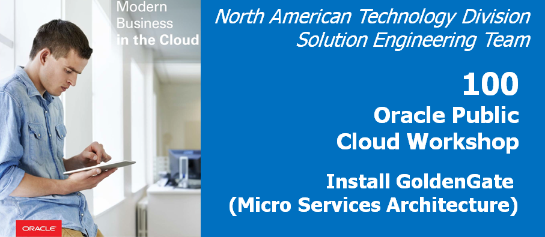
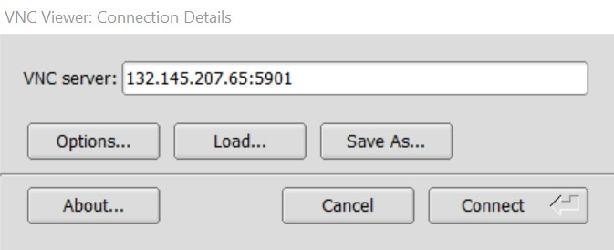
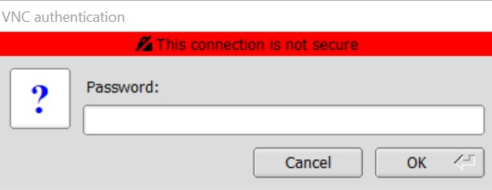
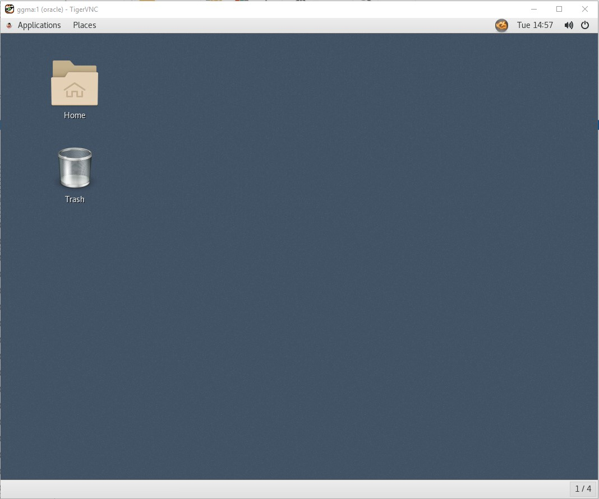
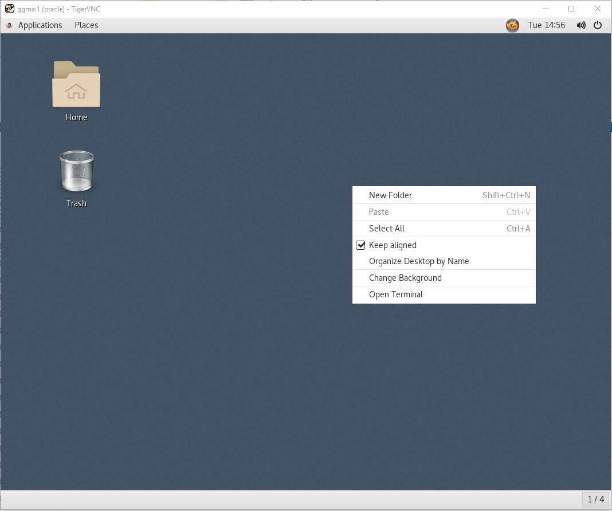
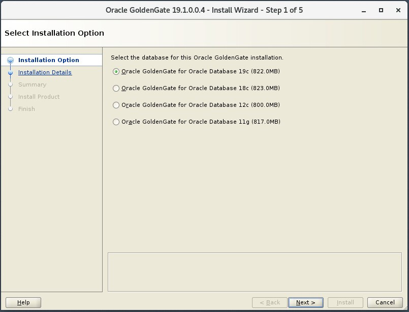
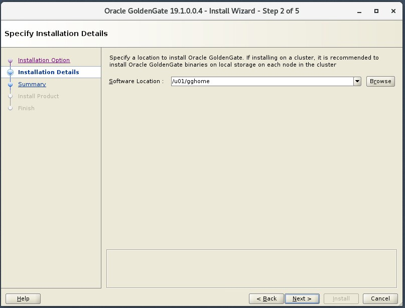
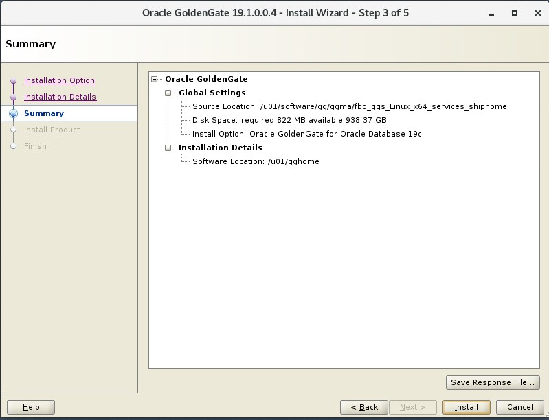
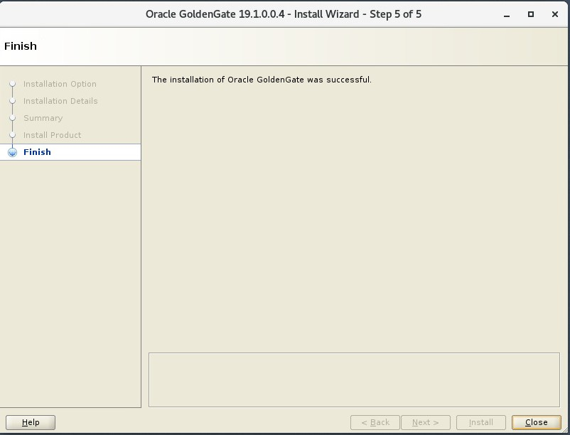

Update Dec 17, 2019

#### Introduction

This is the first of a series of labs to introduce you to the capabilities of GoldenGate Microservices for Oracle Database.   It is a significant release that changes the underlying architecture of GoldenGate to enable it to be administered, monitored, managed and configured through a series of common services.   Each service supports a standard web-based user interface, REST (Representational State Transfer) APIs and a command line client, that allow all configuration to be done remotely in an agile manner. 

In this first lab you will walk through the process of installing this new version of GoldenGate and configuring a deployment for the target environment.

## Objectives

-	Install the GoldenGate Microservces for Oracle edition for the target environment using the Oracle Universal Installer (OUI) tool

## Required Artifacts

-   SSH keys for source and target servers

### **STEP 1**: Access Cloud Server via Putty

For this lab, Source and Target will have Oracle GoldenGate 19c and the Oracle Database 19c . All user interactions will be through a browser (Firefox or Chrome) and Putty that is installed on your laptop, which was a prerequisite for this workshop. 

**Your instructor will provide the SSH and IP address for Oracle Cloud Server**

In this step you will use VNC client to connect with Source Server, to get started with the installation of Oracle GoldenGate Mircoservices Architecture.

-	Log in to the oracle Source Server, using TigerVNC.
-	In the VNC server field, enter the hostname assigned to you by the hands-on lab staff and port 5901 e.g. {hostname or IP}:5901 , then press Connect.

-	Sign on with the following password: oracle

-	Once the VNC client has connected, you should see a console that looks similar to this:

-	On the desktop, right-click and select “Open Terminal”.

### **STEP 2 **: From the same terminal window, install the GoldenGate Microservices Edition

In this step you will install **the GoldenGate Microservices edition package** in new **"GoldenGate Home"** directory.

-	From the terminal screen change to the **/u01/software/gg/ggma** directory and unzip the **GoldenGate Microservices software package**:
 
		[oracle@ggma ~] cd /u01/software/gg/ggma
		[oracle@ggma ggma]$ ll
		total 340
		drwxr-xr-x. 3 oracle oinstall   4096 Oct 18 13:29 fbo_ggs_Linux_x64_services_shiphome
		-rw-r--r--. 1 oracle oinstall   1413 May 29  2019 OGG-19.1.0.0-README.txt
		-rw-r--r--. 1 oracle oinstall 332523 Oct 21 11:01 OGG_WinUnix_Rel_Notes_19.1.0.0.4.pdf

-	Go to the unzipped folder (fbo_ggs_Linux_x64_services_shiphome/Disk1) and execute the **runInstaller** executable:

		oracle@ggma ggma]$ cd fbo_ggs_Linux_x64_services_shiphome/Disk1
		[oracle@ggma Disk1]$ ./runInstaller 

- The following screen should appear:

	

- Keep the first option for **"Oracle GoldenGate for Oracle Database 19c (822.0MB)"** and click the **"Next >"** button.

- The path **"/u01/gghome"** entered into the **"Software Location"** field.  Then click on the **"Next"** button.

    

- You will see the installation summary screen.   Review the summary and click on the **"Install"** button.

    

- Once the installation is complete, you will end up on the Finish page. At this point, you
can click the Close button to exit the installation wizard.

	
	

- You should now be complete with **the GoldenGate Microservices for Oracle software installation**.

Testing done.

You have completed lab 100! Great Job!

