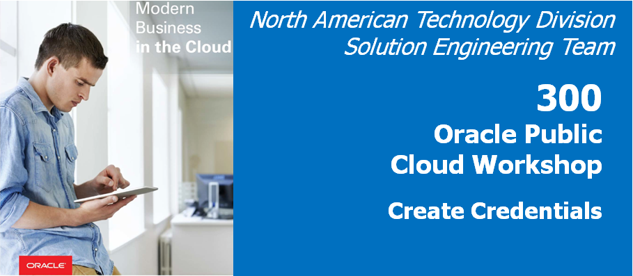
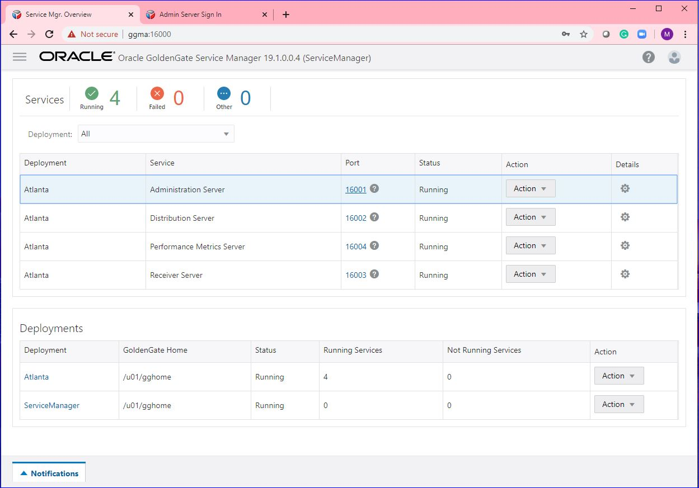
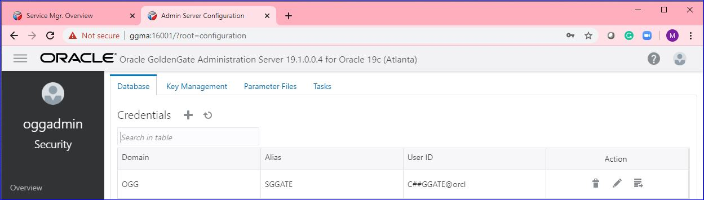
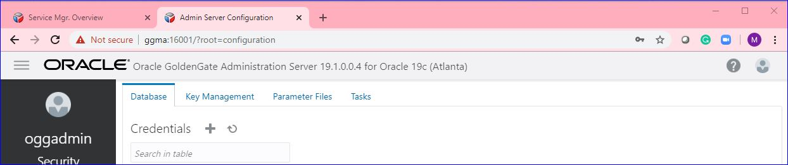
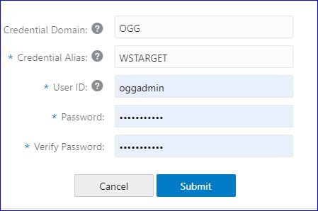
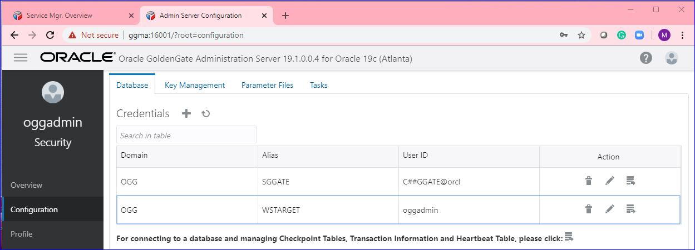
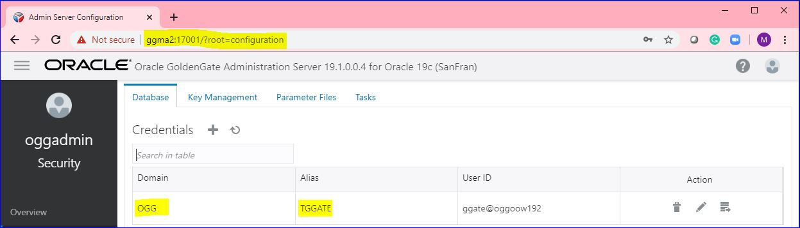
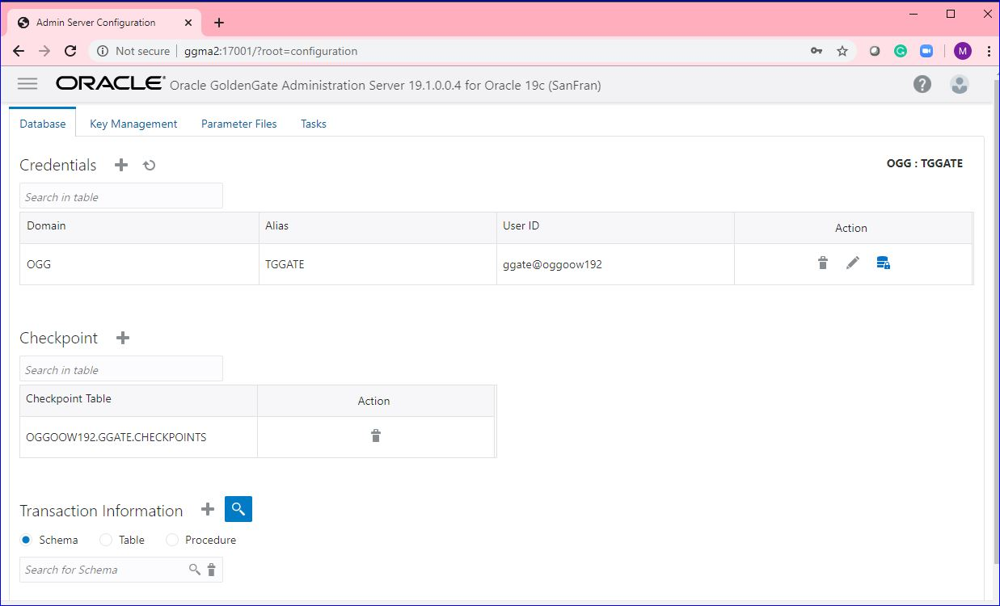

Update February 01, 2020

## Creating Credentials in GoldenGate Microservices Architecture
## Introduction

In this Lab, you will configure the database and protocol user credentials entries needed for replication. 

## Objectives

-   Create Source Database and Protocol User Credentials for setting up the Goldengate Processes.
-   Create Target Database User Credentials

### **STEP 1**: Create the root CDB user credential and the GoldenGate Protocol credential.

- 	Open up a browser window on your laptop using a browser (like Chrome or Firefox) and enter the following URL and port: **http://ggma:16000** . 	
- 	You should get a sign on page.   Sign in using the username: **"oggadmin"** and password **"Welcome1"**.

-   After logging in, find and open the Administration Server for your first deployment. In this example, the first deployment is Atlanta. Go to Atlanta administration server page by clicking on 16001.

-   Click on hamburger symbol on top left corner of the page, select Configuration and select "+" sign beside credentials.

-   Here will create the root container database credentials.  Enter the credential details as given below and click on submit. Password is "ggate".  You will need to add the alias for a user that will connect to CDB. The CDB alias will be used to connect to the database to read the required files for extraction operations, and the PDB1 user SGGATE will be used to add TRANDATA to the schemas used in replication.

| Field/Checkbox				|	Setting	|
|-------------------------------|-----------|
|Credential Domain|	OGG|
|Credential Alias|	SGGATE|
|User ID|	C##GGATE@orcl|
|Password|	ggate|
|Verify Password| 	 ggate|

Since you are configuring an non-SSL replication environment, you will need to create a “Protocol User”. A protocol user is simply a credential that uses the target ServiceManager login to allow the Distribution Service to access the Receiver Service.

-   Click the plus sign ( + ) next to the word Credentials. Then provide the connection information needed, notice that you will be using the Service Manager login in this credential.

 

| Field/Checkbox				|	Setting	|
|-------------------------------|-----------|
|Credential Domain|	OGG|
|Credential Alias|	WSTARGET|
|User ID|	oggadmin|
|Password|	Welcome123#|
|Verify Password| 	 Welcome123#|

 
 
 -  Refresh the Administration Service Configuration page to see if Credential was created.

  

### **STEP 2**: Create the target database user credentials using the REST API.
Next, you will create a target database User Alias which is very similar to the one that you created earlier, the difference being that this alias will be called TGGATE and will reside in the second Deployment (SanFran).  This will be the GoldenGate admin user for the target database.

Below are the parameters that will be used in executing the scripts.

| Field/Checkbox				|	Setting	|
|-------------------------------|-----------|
|Credential Domain|	OGG|
|Credential Alias|	TGGATE|
|User ID|	GGATE@OGGOOW192|
|Password|	ggate|
|Verify Password| 	 ggate|

To create the TGGATE connection follow the below steps:

-	If you don't have a terminal window opened yet, right click on the Desktop of the VNC session and select **Open Terminal**

-   In the terminal window and change directory to Lab3 and review the script that has the JSON information used to add the database credentials.

        [oracle@OGG181DB183 ~]$ cd ~/OGG181_WHKSHP/Lab3
        [oracle@OGG181DB183 Lab3]$ cat create_credential_GGAlias.sh 
        #!/bin/bash

        #variables
        vPass=$1
        vASHost=$6
        vASPort=$2
        vGGUser=$3
        vGGPass=$4
        vGGAlias=$5

        function _createAlias {
            curl -X POST \
            http://$vASHost:$vASPort/services/v2/credentials/OGG/$vGGAlias \
            --user "oggadmin:"$vPass   \
            -H 'Cache-Control: no-cache' \
            -d '{
                "userid":"'$vGGUser'",
                "password":"'$vGGPass'"
            }' | python -mjson.tool
        }

        function _main {
            _createAlias
        }

        _main

-   Run the **create_credential_GGAlias.sh** script.

        [oracle@ggma Lab3]$ ./create_credential_GGAlias.sh oracle 17001 ggate@oggoow192 ggate TGGATE ggma2
        % Total    % Received % Xferd  Average Speed   Time    Time     Time  Current
                                        Dload  Upload   Total   Spent    Left  Speed
        100   799  100   726  100    73   4298    432 --:--:-- --:--:-- --:--:--  4295
        {
            "$schema": "api:standardResponse",
            "links": [
                {
                    "href": "http://ggma2:17001/services/v2/credentials/OGG/TGGATE",
                    "mediaType": "application/json",
                    "rel": "canonical"
                },
                {
                    "href": "http://ggma2:17001/services/v2/credentials/OGG/TGGATE",
                    "mediaType": "application/json",
                    "rel": "self"
                }
            ],
            "messages": [
                {
                    "$schema": "ogg:message",
                    "code": "OGG-15116",
                    "issued": "2019-12-24T14:54:47Z",
                    "severity": "INFO",
                    "title": "No information found in credential store.",
                    "type": "http://docs.oracle.com/goldengate/c1910/gg-winux/GMESG/oggus.htm#OGG-15116"
                },
                {
                    "$schema": "ogg:message",
                    "code": "OGG-15114",
                    "issued": "2019-12-24T14:54:47Z",
                    "severity": "INFO",
                    "title": "Credential store altered.",
                    "type": "http://docs.oracle.com/goldengate/c1910/gg-winux/GMESG/oggus.htm#OGG-15114"
                }
            ]
        }

 

### **STEP 3**: Create the target GoldenGate checkpoint table using the REST API.

-   In the same terminal window, review the script that has the JSON information to to add the checkpoint table.

        [oracle@OGG181DB183 ~]$ cat add_CheckpointTable.sh
        [oracle@OGG181DB183 Lab3]$ cat add_CheckpointTable.sh 
        #!/bin/bash

        #variables
        vPass=$1
        vASHost=$2
        vASPort=$3
        vGGAlias=OGG.TGGATE

        function _createCkptTbl {
            curl -X POST \
            http://$vASHost:$vASPort/services/v2/connections/$vGGAlias/tables/checkpoint \
            --user "oggadmin:"$vPass   \
            -H 'Cache-Control: no-cache' \
            -d '{
                    "operation":"add",
                    "name":"ggate.checkpoints"
            }' | python -mjson.tool
        }

        function _main {
            _createCkptTbl
        }

        _main

-   Run the **add_CheckpointTable.sh** script.

        [oracle@ggma Lab3]$ ./add_CheckpointTable.sh oracle ggma2 17001
        % Total    % Received % Xferd  Average Speed   Time    Time     Time  Current
                                        Dload  Upload   Total   Spent    Left  Speed
        100   684  100   600  100    84   1645    230 --:--:-- --:--:-- --:--:--  1648
        {
            "$schema": "api:standardResponse",
            "links": [
                {
                    "href": "http://ggma2:17001/services/v2/connections/OGG.TGGATE/tables/checkpoint",
                    "mediaType": "application/json",
                    "rel": "canonical"
                },
                {
                    "href": "http://ggma2:17001/services/v2/connections/OGG.TGGATE/tables/checkpoint",
                    "mediaType": "application/json",
                    "rel": "self"
                }
            ],
            "messages": [
                {
                    "$schema": "ogg:message",
                    "code": "OGG-08100",
                    "issued": "2019-12-24T15:10:08Z",
                    "severity": "INFO",
                    "title": "Logon catalog name OGGOOW192 will be used for table specification OGGOOW192.ggate.checkpoints.",
                    "type": "http://docs.oracle.com/goldengate/c1910/gg-winux/GMESG/oggus.htm#OGG-08100"
                }
            ]
        }

The Checkpoint Table can also be viewed under the TTGATE alias from the SanFran Deployment’s Administration Service > Configuration page. This is done by clicking the “log in” button and then looking under Checkpoint.

 

 

You have completed lab 300!   **Great Job!**

<a href="https://oraclecps.github.io/GGMicroservices/index.html" target="_blank">Click here to return</a>

