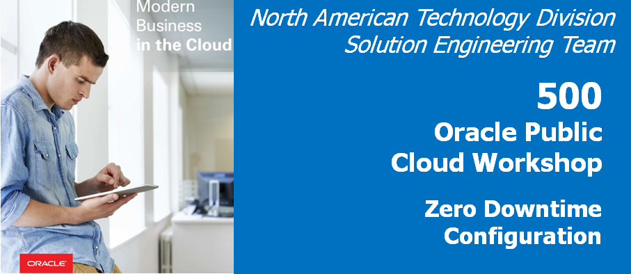

Update February 27, 2019

## Zero Downtime Lab using REST API
## Introduction

GoldenGate allows you to perform what we call **Zero Downtime Migrations (ZDT)**.  By using GoldenGate you can keep your source database up and operational while you perform a bulk instantiation of data to the new platform.

- There are multiple ways to perform the bulk data movement, if you are going to the same database (i.e. Oracle to Oracle), then it's advised to use native tools to move the data.  In the case of Oracle, we have integration with the data pump export/import utility, which makes it easy to sync the data with the delta information when the bulk data movement is complete.

- For this lab, even though we are going Oracle to Oracle, we will show you a method to do what we call file based data migration (GoldenGate initial load) using the MicroServices architecture and the REST API for automation.

- This lab, will contains four parts and covers how access the services from Oracle GoldenGate MicroServices using the REST APIs. 

### **Part 1:** Remove the previous lab replication processes with via the REST API.

-	If you don't have a terminal window opened yet, right click on the Desktop of the VNC session and select **Open Terminal**

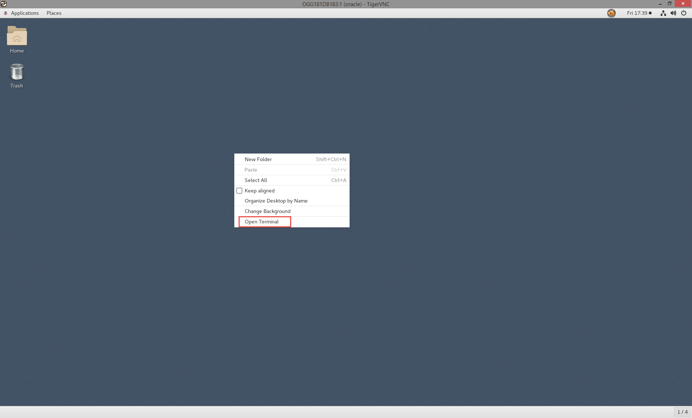

-   In the terminal window and change directory to Lab5 and run the following command to remove the Extract EXT1: curl -X DELETE http://localhost:16001/services/v2/extracts/EXT1 --user "oggadmin:"Welcome1 -H 'Cache-Control: no-cache' | python -mjson.tool
		
		[oracle@OGG181DB183 ~]$ cd ~/OGG181_WHKSHP/Lab5/
		[oracle@OGG181DB183 Lab5]$ curl -X DELETE http://localhost:16001/services/v2/extracts/EXT1 --user "oggadmin:"Welcome1 -H 'Cache-Control: no-cache' | python -mjson.tool
		% Total    % Received % Xferd  Average Speed   Time    Time     Time  Current
										Dload  Upload   Total   Spent    Left  Speed
		100   951  100   951    0     0     32      0  0:00:29  0:00:29 --:--:--   239
		{
			"$schema": "api:standardResponse",
			"links": [
				{
					"href": "http://localhost:16001/services/v2/extracts/EXT1",
					"mediaType": "application/json",
					"rel": "canonical"
				},
				{
					"href": "http://localhost:16001/services/v2/extracts/EXT1",
					"mediaType": "application/json",
					"rel": "self"
				}
			],
			"messages": [
				{
					"$schema": "ogg:message",
					"code": "OGG-08100",
					"issued": "2019-02-27T18:28:50Z",
					"severity": "INFO",
					"title": "Sending STOP request to EXTRACT EXT1",
					"type": "http://docs.oracle.com/goldengate/c1810/gg-winux/GMESG/oggus.htm#OGG-08100"
				},
				{
					"$schema": "ogg:message",
					"code": "OGG-01750",
					"issued": "2019-02-27T18:29:11Z",
					"severity": "INFO",
					"title": "Successfully unregistered EXTRACT EXT1 from database.",
					"type": "http://docs.oracle.com/goldengate/c1810/gg-winux/GMESG/oggus.htm#OGG-01750"
				},
				{
					"$schema": "ogg:message",
					"code": "OGG-08100",
					"issued": "2019-02-27T18:29:11Z",
					"severity": "INFO",
					"title": "Deleted EXTRACT EXT1.",
					"type": "http://docs.oracle.com/goldengate/c1810/gg-winux/GMESG/oggus.htm#OGG-08100"
				}
			]
		}

-	Next, run the following command to remove the Replicat REP1: curl -X DELETE http://localhost:17001/services/v2/replicats/REP1 --user "oggadmin:"Welcome1 -H 'Cache-Control: no-cache' | python -mjson.tool

		[oracle@OGG181DB183 ~]$ cd ~/OGG181_WHKSHP/Lab5/
		[oracle@OGG181DB183 Lab5]$ curl -X DELETE http://localhost:17001/services/v2/replicats/REP1 --user "oggadmin:"Welcome1 -H 'Cache-Control: no-cache' | python -mjson.tool
		% Total    % Received % Xferd  Average Speed   Time    Time     Time  Current
										Dload  Upload   Total   Spent    Left  Speed
		100   752  100   752    0     0    163      0  0:00:04  0:00:04 --:--:--   209
		{
			"$schema": "api:standardResponse",
			"links": [
				{
					"href": "http://localhost:17001/services/v2/replicats/REP1",
					"mediaType": "application/json",
					"rel": "canonical"
				},
				{
					"href": "http://localhost:17001/services/v2/replicats/REP1",
					"mediaType": "application/json",
					"rel": "self"
				}
			],
			"messages": [
				{
					"$schema": "ogg:message",
					"code": "OGG-02529",
					"issued": "2019-02-27T19:55:18Z",
					"severity": "INFO",
					"title": "Successfully unregistered REPLICAT REP1 inbound server OGG$REP1 from database",
					"type": "http://docs.oracle.com/goldengate/c1810/gg-winux/GMESG/oggus.htm#OGG-02529"
				},
				{
					"$schema": "ogg:message",
					"code": "OGG-08100",
					"issued": "2019-02-27T19:55:18Z",
					"severity": "INFO",
					"title": "Deleted REPLICAT REP1.",
					"type": "http://docs.oracle.com/goldengate/c1810/gg-winux/GMESG/oggus.htm#OGG-08100"
				}
			]
		}

-	Lastly we'll remove the Distribution Path with the following command: curl -X DELETE http://localhost:16002/services/v2/sources/SOE2SOE --user "oggadmin:"Welcome1 -H 'Cache-Control: no-cache' -d '{"distpath":"SOE2SOE"}' | python -mjson.tool 

		[oracle@OGG181DB183 Lab5]$ curl -X DELETE http://localhost:16002/services/v2/sources/SOE2SOE --user "oggadmin:"Welcome1 -H 'Cache-Control: no-cache' -d '{"distpath":"SOE2SOE"}' | python -mjson.tool
		% Total    % Received % Xferd  Average Speed   Time    Time     Time  Current
										Dload  Upload   Total   Spent    Left  Speed
		100   523  100   501  100    22    261     11  0:00:02  0:00:01  0:00:01   261
		{
			"$schema": "api:standardResponse",
			"links": [
				{
					"href": "http://localhost:16002/services/v2/sources/SOE2SOE",
					"mediaType": "application/json",
					"rel": "canonical"
				},
				{
					"href": "http://localhost:16002/services/v2/sources/SOE2SOE",
					"mediaType": "application/json",
					"rel": "self"
				}
			],
			"messages": [
				{
					"$schema": "ogg:message",
					"code": "OGG-08516",
					"issued": "2019-02-27T20:02:13Z",
					"severity": "INFO",
					"title": "The path 'SOE2SOE' has been deleted.",
					"type": "http://docs.oracle.com/goldengate/c1810/gg-winux/GMESG/oggus.htm#OGG-08516"
				}
			]
		}

### **Part 2:** Create new credentials with the REST API.

-	In the same terminal window run the script **create_credential_GGAlias.sh**, to create the source DB credentials.

		[oracle@OGG181DB183 Lab5]$ ./create_credential_GGAlias.sh Welcome1 16001 c##ggate@orcl ggate SGGATE
		% Total    % Received % Xferd  Average Speed   Time    Time     Time  Current
										Dload  Upload   Total   Spent    Left  Speed
		100   832  100   761  100    71  23496   2192 --:--:-- --:--:-- --:--:-- 23781
		{
			"$schema": "api:standardResponse",
			"links": [
				{
					"href": "http://localhost:16001/services/v2/credentials/OracleGoldenGate/SGGATE",
					"mediaType": "application/json",
					"rel": "canonical"
				},
				{
					"href": "http://localhost:16001/services/v2/credentials/OracleGoldenGate/SGGATE",
					"mediaType": "application/json",
					"rel": "self"
				}
			],
			"messages": [
				{
					"$schema": "ogg:message",
					"code": "OGG-15114",
					"issued": "2019-02-27T20:08:56Z",
					"severity": "INFO",
					"title": "Credential store altered.",
					"type": "http://docs.oracle.com/goldengate/c1810/gg-winux/GMESG/oggus.htm#OGG-15114"
				},
				{
					"$schema": "ogg:message",
					"code": "OGG-15116",
					"issued": "2019-02-27T20:08:56Z",
					"severity": "INFO",
					"title": "No information found in credential store.",
					"type": "http://docs.oracle.com/goldengate/c1810/gg-winux/GMESG/oggus.htm#OGG-15116"
				}
			]
		}

-	Next, run the script **create_credential_Protcol.sh** to create a new protocol alias.

		[oracle@OGG181DB183 Lab5]$ ./create_credential_Protcol.sh Welcome1 16001 oggadmin Welcome1 WSTARGET
		% Total    % Received % Xferd  Average Speed   Time    Time     Time  Current
										Dload  Upload   Total   Spent    Left  Speed
		100   603  100   534  100    69  23852   3082 --:--:-- --:--:-- --:--:-- 24272
		{
			"$schema": "api:standardResponse",
			"links": [
				{
					"href": "http://localhost:16001/services/v2/credentials/OracleGoldenGate/WSTARGET",
					"mediaType": "application/json",
					"rel": "canonical"
				},
				{
					"href": "http://localhost:16001/services/v2/credentials/OracleGoldenGate/WSTARGET",
					"mediaType": "application/json",
					"rel": "self"
				}
			],
			"messages": [
				{
					"$schema": "ogg:message",
					"code": "OGG-15114",
					"issued": "2019-02-27T20:09:33Z",
					"severity": "INFO",
					"title": "Credential store altered.",
					"type": "http://docs.oracle.com/goldengate/c1810/gg-winux/GMESG/oggus.htm#OGG-15114"
				}
			]
		}

-	Lastly, run the script **create_credential_GGAlias.sh**, to create the target DB credentials.

		[oracle@OGG181DB183 Lab5]$ ./create_credential_GGAlias.sh Welcome1 17001 ggate@oggoow182 ggate TGGATE
		% Total    % Received % Xferd  Average Speed   Time    Time     Time  Current
										Dload  Upload   Total   Spent    Left  Speed
		100   834  100   761  100    73  30784   2953 --:--:-- --:--:-- --:--:-- 31708
		{
			"$schema": "api:standardResponse",
			"links": [
				{
					"href": "http://localhost:17001/services/v2/credentials/OracleGoldenGate/TGGATE",
					"mediaType": "application/json",
					"rel": "canonical"
				},
				{
					"href": "http://localhost:17001/services/v2/credentials/OracleGoldenGate/TGGATE",
					"mediaType": "application/json",
					"rel": "self"
				}
			],
			"messages": [
				{
					"$schema": "ogg:message",
					"code": "OGG-15114",
					"issued": "2019-02-27T20:20:15Z",
					"severity": "INFO",
					"title": "Credential store altered.",
					"type": "http://docs.oracle.com/goldengate/c1810/gg-winux/GMESG/oggus.htm#OGG-15114"
				},
				{
					"$schema": "ogg:message",
					"code": "OGG-15116",
					"issued": "2019-02-27T20:20:15Z",
					"severity": "INFO",
					"title": "No information found in credential store.",
					"type": "http://docs.oracle.com/goldengate/c1810/gg-winux/GMESG/oggus.htm#OGG-15116"
				}
			]
		}

- 	Open up a browser window in your client VM environment in Ravello or on your laptop using a browser (like Chrome or Firefox) and enter the following URL and port: **http://localhost:16000** .  

- 	If you're using the browser on your laptop, change **localhost** to the **Ravello URL or IP Address** your instructor gave out at the beginning of the workshop (**same one you used for the VNC Session**).

- 	You should get a sign on page.   Sign in using the username: **"oggadmin"** and password **"Welcome1"**.

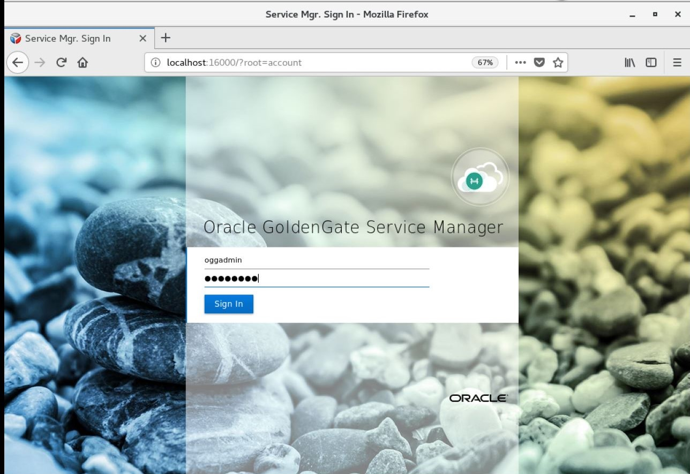 
 
-   After logging in, find and open the Administration Server for your first deployment.  In this example, the first deployment is Atlanta.  Click on the link with the port number for the Admin Service for Atlanta.

Note: You will be required to login again.  Use the same Administrator account that was used with the Service Manager.

 
 
-   Check for the new credentials for the GoldenGate user (C##GGATE) and also the Protocol credentials (WSTARGET) by selecting the Hamburger menu and then selecting **Configuration**.

| Field/Checkbox				|	Setting	|
|-------------------------------|-----------|
|Credential Domain|	OracleGoldenGate|
|Credential Alias|	SGGATE|
|User ID|	C##GGATE@orcl|

| Field/Checkbox				|	Setting	|
|-------------------------------|-----------|
|Credential Domain|	OracleGoldenGate|
|Credential Alias|	WSTARGET|
|User ID|	oggadmin|

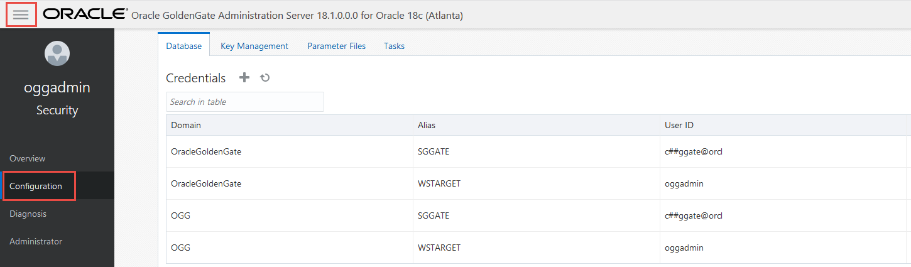 

-	Next we'll check the credentials on the target deployment (SanFran). Click on the link with the port number for the Admin Service for SanFran.

- 	Note: You will be required to login again.  Use the same Administrator account that was used with the Service Manager.

-   Check for the new credentials for the GoldenGate user (ggate@oggoow182) by selecting the Hamburger menu and then selecting **Configuration**.

| Field/Checkbox				|	Setting	|
|-------------------------------|-----------|
|Credential Domain|	OracleGoldenGate|
|Credential Alias|	TGGATE|
|User ID|	ggate@oggoow182|

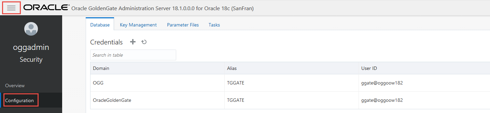

### **Part 3:** Create the normal CDC processes.

#### **STEP 1: Create and start the Change Data Capture (CDC) Extract process using curl commands.**

For ZDT we always install the normal CDC processes first and start the capture process and leave the delivery process stopped.  This way we will have stored any transactions that have been added during the time we do the bulk data movement.

-	If you don't have a terminal window opened yet, right click on the Desktop of the VNC session and select **Open Terminal**

-   In the terminal window and change directory to Lab5 and review the ** ext2.json ** JSON file to add the CDC Extract.

        [oracle@OGG181DB183 ~]$ cd ~/OGG181_WHKSHP/Lab5
		[oracle@OGG181DB183 ~]$ cat ext2.json
		{
			"config":[
				"Extract     EXT2",
				"ExtTrail    X1",
				"UseridAlias SGGATE",
				"Table       oggoow181.soe.*;"
			],
			"source":{
				"tranlogs":"integrated"
			},
			"credentials":{
				"domain":"OracleGoldenGate",
				"alias":"SGGATE"
			},
			"registration":{
					"containers": ["oggoow181"],
					"optimized":false
		},
			"begin":"now",
			"targets":[
				{
					"name":"X1"
				}
			],
			"status":"running"
		}

-	Execute the following curl command to add the CDC Extract.

		[oracle@OGG181DB183 Lab5]$ curl -u oggadmin:Welcome1 -H "Content-Type: application/json" -H "Accept: application/json" -X POST http://localhost:16001/services/v2/extracts/EXT2 -d @ext2.json | python -mjson.tool
		
-	After the command is executed successfully, the command output looks like this:

		% Total    % Received % Xferd  Average Speed   Time    Time     Time  Current
										Dload  Upload   Total   Spent    Left  Speed
		100  1374  100   949  100   425     42     18  0:00:23  0:00:22  0:00:01   120
		{
			"$schema": "api:standardResponse",
			"links": [
				{
					"href": "http://localhost:16001/services/v2/extracts/EXT2",
					"mediaType": "application/json",
					"rel": "canonical"
				},
				{
					"href": "http://localhost:16001/services/v2/extracts/EXT2",
					"mediaType": "application/json",
					"rel": "self"
				}
			],
			"messages": [
				{
					"$schema": "ogg:message",
					"code": "OGG-08100",
					"issued": "2019-02-09T20:51:15Z",
					"severity": "INFO",
					"title": "EXTRACT (Integrated) added.",
					"type": "http://docs.oracle.com/goldengate/c1810/gg-winux/GMESG/oggus.htm#OGG-08100"
				},
				{
					"$schema": "ogg:message",
					"code": "OGG-02003",
					"issued": "2019-02-09T20:51:38Z",
					"severity": "INFO",
					"title": "Extract EXT2 successfully registered with database at SCN 9096500.",
					"type": "http://docs.oracle.com/goldengate/c1810/gg-winux/GMESG/oggus.htm#OGG-02003"
				},
				{
					"$schema": "ogg:message",
					"code": "OGG-08100",
					"issued": "2019-02-09T20:51:38Z",
					"severity": "INFO",
					"title": "EXTTRAIL added.",
					"type": "http://docs.oracle.com/goldengate/c1810/gg-winux/GMESG/oggus.htm#OGG-08100"
				}
			]
		}

#### **STEP 2: Create and start the CDC Distribution Path using curl commands.**

-   From the same terminal window review the JSON file to add the CDC Distribution Path.

		[oracle@OGG181DB183 Lab5]$ cat tpath.json 
		{
		"name": "TSTPATH",
		"status": "running",
		"source": {
		"uri": "trail://localhost:16002/services/v2/sources?trail=X1"
		},
		"target": {
		"uri": "ws://OracleGoldenGate+WSTARGET@localhost:17003/services/v2/targets?trail=X2"
		}
		}

-	Execute the following curl command to add the PATH to send data from Extract to replicat.

		[oracle@OGG181DB183 Lab5]$ curl -u oggadmin:Welcome1 -H "Content-Type: application/json" -H "Accept: application/json" -X POST http://localhost:16002/services/v2/sources/TSTPATH -d @tpath.json | python -mjson.tool
		% Total    % Received % Xferd  Average Speed   Time    Time     Time  Current
										Dload  Upload   Total   Spent    Left  Speed
		100   709  100   499  100   210    448    188  0:00:01  0:00:01 --:--:--   448
		{
			"$schema": "api:standardResponse",
			"links": [
				{
					"href": "http://localhost:16002/services/v2/sources/TSTPATH",
					"mediaType": "application/json",
					"rel": "canonical"
				},
				{
					"href": "http://localhost:16002/services/v2/sources/TSTPATH",
					"mediaType": "application/json",
					"rel": "self"
				}
			],
			"messages": [
				{
					"$schema": "ogg:message",
					"code": "OGG-08511",
					"issued": "2019-02-27T20:36:44Z",
					"severity": "INFO",
					"title": "The path 'TSTPATH' has been added.",
					"type": "http://docs.oracle.com/goldengate/c1810/gg-winux/GMESG/oggus.htm#OGG-08511"
				}
			]
		}

#### **STEP 3: Create the CDC Replicat using curl commands.  This will add it in a Stopped state.**

-   From the same terminal window review the JSON file to add the CDC Replicat.

		[oracle@OGG181DB183 Lab5]$ cat rep2.json 
		{
		"config":[
			"Replicat    REP2",
				"UseridAlias TGGATE",
			"HANDLECOLLISIONS",
			"END RUNTIME",
				"map oggoow181.soe.addresses,target soe.addresses, keycols(address_id);",
			"map oggoow181.soe.customers, target soe.customers, keycols(customer_id);",
			"map oggoow181.soe.orders, target soe.orders, keycols(order_id);",
			"map oggoow181.soe.order_items, target soe.order_items, keycols(order_id, line_item_id);",
			"map oggoow181.soe.card_details, target soe.card_details, keycols(card_id);",
			"map oggoow181.soe.logon, target soe.logon;",
			"map oggoow181.soe.product_information, target soe.product_information;",
			"map oggoow181.soe.inventories, target soe.inventories, keycols(product_id, warehouse_id);",
			"map oggoow181.soe.product_descriptions, target soe.product_descriptions;",
			"map oggoow181.soe.warehouses, target soe.warehouses;",
			"map oggoow181.soe.orderentry_metadata, target soe.orderentry_metadata;"
		],
		"source":{
		"name":"X1"
		},
		"credentials":{
		"alias":"TGGATE"
		},
		"checkpoint":{
		"table":"ggate.checkpoints"
		},
		"mode":{
		"type":"integrated"
		},
		"registration": "standard",
		"begin":"now",
		"status":"stopped"
		}

-	Execute the following curl command to add the Replicat.

		[oracle@OGG181DB183 Lab5]$ curl -u oggadmin:Welcome1 -H "Content-Type: application/json" -H "Accept: application/json" -X POST http://localhost:17001/services/v2/replicats/REP2 -d @rep2.json | python -mjson.tool

-	After the command is executed successfully, the command output looks like this:

		% Total    % Received % Xferd  Average Speed   Time    Time     Time  Current
										Dload  Upload   Total   Spent    Left  Speed
		100  2478  100  1382  100  1096    382    303  0:00:03  0:00:03 --:--:--   382
		{
			"$schema": "api:standardResponse",
			"links": [
				{
					"href": "http://localhost:17001/services/v2/replicats/REP2",
					"mediaType": "application/json",
					"rel": "canonical"
				},
				{
					"href": "http://localhost:17001/services/v2/replicats/REP2",
					"mediaType": "application/json",
					"rel": "self"
				}
			],
			"messages": [
				{
					"$schema": "ogg:message",
					"code": "OGG-08100",
					"issued": "2019-03-06T19:48:13Z",
					"severity": "INFO",
					"title": "REPLICAT (Integrated) added.",
					"type": "http://docs.oracle.com/goldengate/c1810/gg-winux/GMESG/oggus.htm#OGG-08100"
				},
				{
					"$schema": "ogg:message",
					"code": "OGG-02528",
					"issued": "2019-03-06T19:48:15Z",
					"severity": "INFO",
					"title": "REPLICAT REP2 successfully registered with database as inbound server OGG$REP2",
					"type": "http://docs.oracle.com/goldengate/c1810/gg-winux/GMESG/oggus.htm#OGG-02528"
				},
				{
					"$schema": "ogg:message",
					"code": "OGG-06594",
					"issued": "2019-03-06T19:48:15Z",
					"severity": "INFO",
					"title": "Replicat REP2 has been altered. Even the start up position might be updated, duplicate suppression remains active in next startup. To override duplicate suppression, start REP2 with NOFILTERDUPTRANSACTIONS option.",
					"type": "http://docs.oracle.com/goldengate/c1810/gg-winux/GMESG/oggus.htm#OGG-06594"
				},
				{
					"$schema": "ogg:message",
					"code": "OGG-08100",
					"issued": "2019-03-06T19:48:15Z",
					"severity": "INFO",
					"title": "REPLICAT (Integrated) altered.",
					"type": "http://docs.oracle.com/goldengate/c1810/gg-winux/GMESG/oggus.htm#OGG-08100"
				}
			]
		}

-	On the Goldengate Microservices Console, under the Admin Server for Atlanta you can see the Extract has been added and and the status is **Running**.

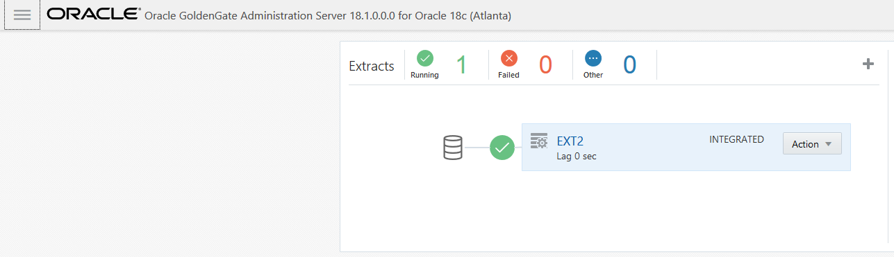

-	On the Goldengate Microservices Console, under the Distribution Server for Atlanta you will see that the PATH is created and the status is **Running**.

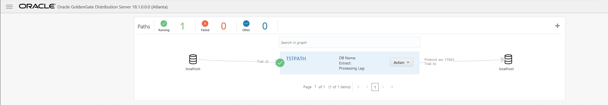

-	On the Goldengate Microservices Console, under the Admin Server for SanFran you can see the Replicat has been added and the status is **Stopped**.

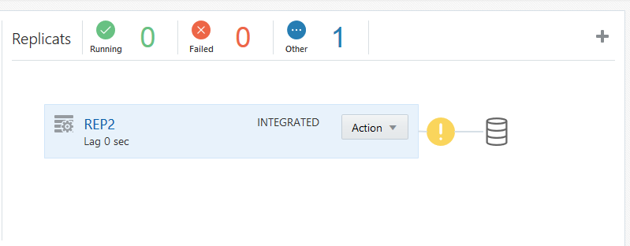

### **Part 4:** Initial Load by Automated Script

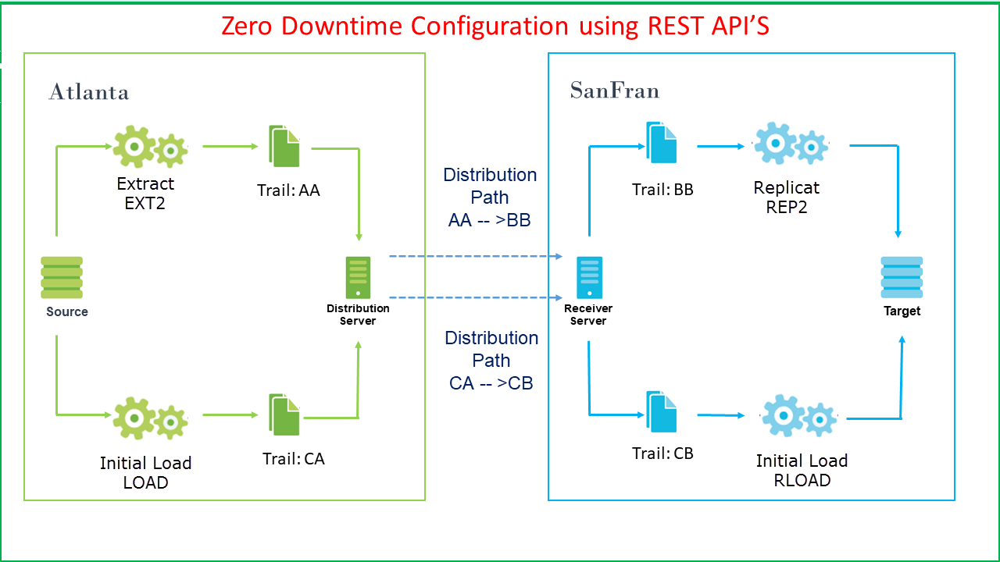

#### **STEP 1: Run a script to delete the current data in the target database.**

Before we begin we want to make sure the target database is empty.

-	If you don't have a terminal window opened yet, right click on the Desktop of the VNC session and select **Open Terminal**

-   Change directory to Lab5 and run script **truncate_trg.sh**.  

		[oracle@OGG181DB183 Lab5]$ ./truncate_trg.sh 
		Truncate Target
		Truncate Successful
		[oracle@OGG181DB183 Lab5]$ 

#### **STEP 2: Run a script to perform an initial load to the target database.**

This script does the following:

	-	Creates the Initial Load Replicat
	-	Creates the Initial Load Distribution Path
	-	Creates the Initial Load Extract Task

-   Change directory to Lab5 and review script **Initial_load_Automated.sh**.

        [oracle@OGG181DB183 ~]$ cd ~/OGG181_WHKSHP/Lab5
		[oracle@OGG181DB183 Lab5]$ ls
		Initial_load_Automated.sh
		[oracle@OGG181DB183 Lab5]$ less Initial_load_Automated.sh

-   Then, run the **Initial_load_Automated.sh** script:

		[oracle@OGG181DB183 Lab5]$ ./Initial_load_Automated.sh 

-	When the script is completed you'll have two Extracts, two Replicats and two Distribution Paths.  You can check in the Services to see the results.

#### **STEP 3: Run Swingbench script to apply data to the source database.**
-   While the script is running, we'll run Swingbench transactions to create activity on the the database during the initial load.

-	Open another terminal by right clicking on the Desktop of the VNC session and select **Open Terminal**

-   Change directory to Lab5 run script **start_swingbench_181.sh**.

        [oracle@OGG181DB183 ~]$ cd ~/OGG181_WHKSHP/Lab5
		[oracle@OGG181DB183 Lab5]$ ./start_swingbench_181.sh
		
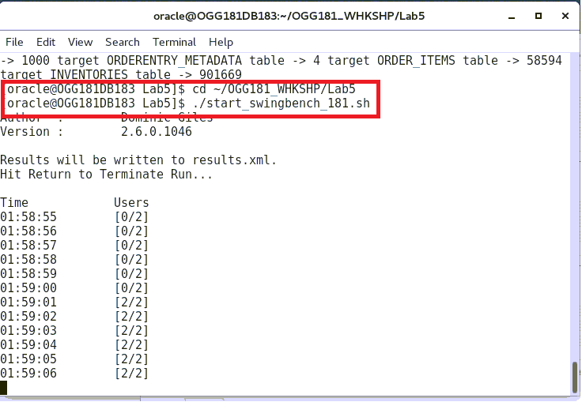

#### **STEP 4: Check Initial Load Extract to see if it's completed.**

-	On the Goldengate Microservices Console, under the Admin Server for Atlanta if the Initial Load Extract (LOAD) is finished status should be **Stopped**.

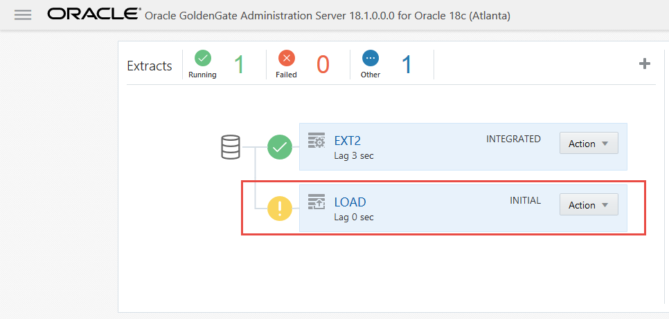

-	On the Goldengate Microservices Console, under the Admin Server for SanFran and check the detail page for the Initial Load Replicat (RLOAD) to see if it's completed the load.

-    Above script will create the initial load processes which are Extract (LOAD), Distribution Server (INITLOAD) and Replicat (RLOAD).You will need to logon on the Goldengate Microservices Console, under the Admin Server for SanFran. Right click on drop down of Replicat (RLOAD) and click on "Details"

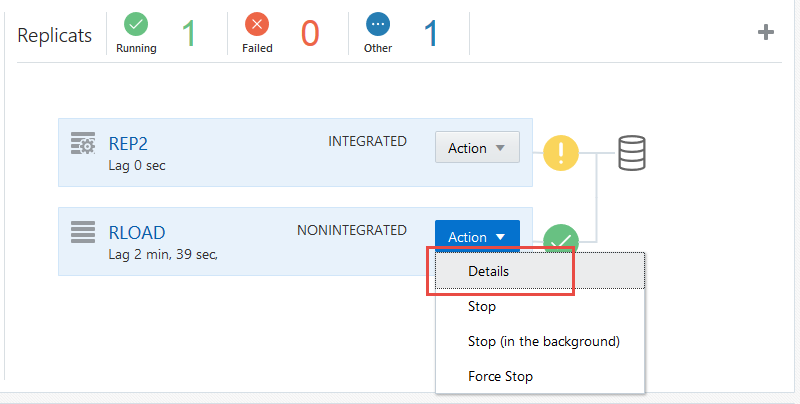

-    Click on tab "Checkpoint" and simultaneously click on "Refresh". Once you offset is has stopped moving, it means the initial load had been completed.(It will take 5-10 mins to complete)

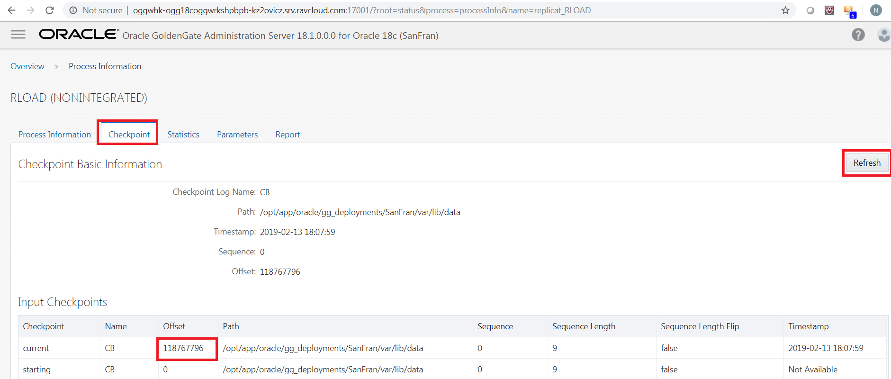

-   Now you can go back to your Goldengate Microservices Console, under the Admin Server for SanFran. Click on drop down of Replicat (RLOAD) and click on "Stop". Then, click on Replicat (REP2) and click "Start".

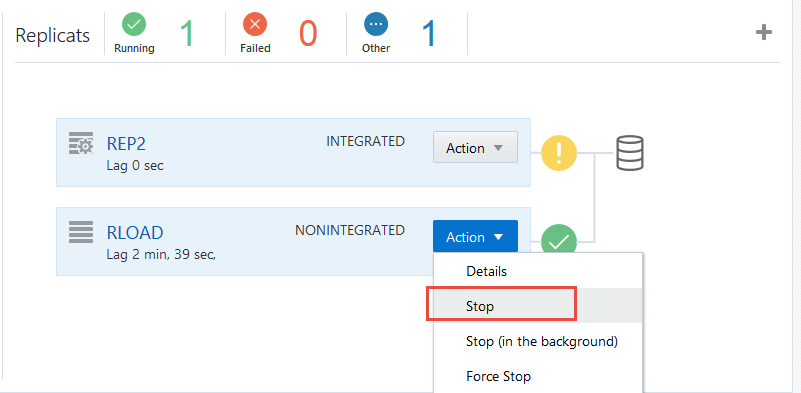

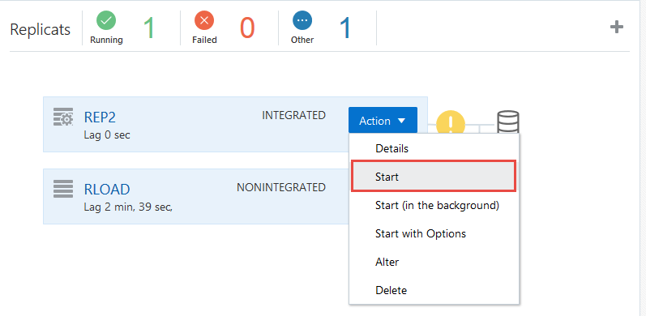

#### **STEP 5: Restart the CDC Replicat to sync the data.**

-	On the Goldengate Microservices Console, under the Admin Server for SanFran wait for the REP2 Replicat to stop.  The **END RUNTIME** parameter will do this for us.  Before starting Replicat (REP2) again, Select ** Details ** and then go to the ** Parameters ** tab.  Click on the ** Pencil ** icon to edit the file.  Comment out **END RUNTIME** and **HANDLECOLLISIONS** by putting two dashes in from of those parameters (see screenshot) and then click ** Apply **.  

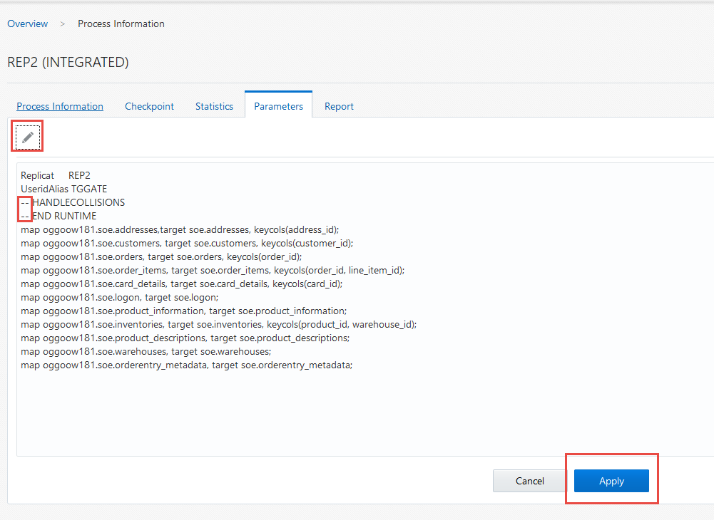

The **END RUNTIME** parameter causes Replicat to terminate when it reaches a record in the data source whosetimestamp exceeds the current date and clock time. All unprocessed records withtimestamps up to this point in time are processed.  
The **HANDLECOLLISIONS** parameter controls whether or not Replicat tries to resolve duplicate-record and missing-record errors when applying SQL on the target. These errors, called collisions, occur during an initial load, when data from source tables is being loaded to target tables while Oracle GoldenGate is replicating transactional changes that are being made to those tables.  After the Replicat stops from the End Runtime parameter, we can comment out these commands for ongoing replication.

-   Now you can go back to your Admin Service overview page and click on Replicat (REP2) and click "Start".

-	Check to see if the Swingbench script is completed.

-	Run the script **count_src_trg.sh** to see if the counts on both are the same.  You may have to run this a couple of times if the source transactions haven't replicated yet.

		[oracle@OGG181DB183 Lab5]$ ./count_src_trg.sh 
		Source Table - Min/Max
		source CUSTOMERS table -> 18203 source ADDRESSES table -> 23206 source CARD_DETAILS table -> 23203 source WAREHOUSES table -> 1000 source ORDERS table -> 30456 source PRODUCT_INFORMATION table -> 1000 source LOGON table -> 42770 source PRODUCT_DESCRIPTIONS table -> 1000 source ORDERENTRY_METADATA table -> 4 source ORDER_ITEMS table -> 91611 source INVENTORIES table -> 900058
		Target Table - Min/Max
		target CUSTOMERS table -> 18203 target ADDRESSES table -> 23206 target CARD_DETAILS table -> 23203 target WAREHOUSES table -> 1000 target ORDERS table -> 30456 target PRODUCT_INFORMATION table -> 1000 target LOGON table -> 42770 target PRODUCT_DESCRIPTIONS table -> 1000 target ORDERENTRY_METADATA table -> 4 target ORDER_ITEMS table -> 91611 target INVENTORIES table -> 900058
		[oracle@OGG181DB183 Lab5]$ 

Once the data is in sync you have completed lab 500!   **Great Job!**

<a href="https://oraclecps.github.io/GGMicroservices/index.html?version=Hands-On+Labs&page=README.md" target="_blank">Click here to return</a>
