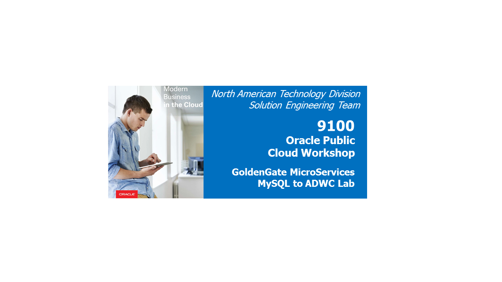
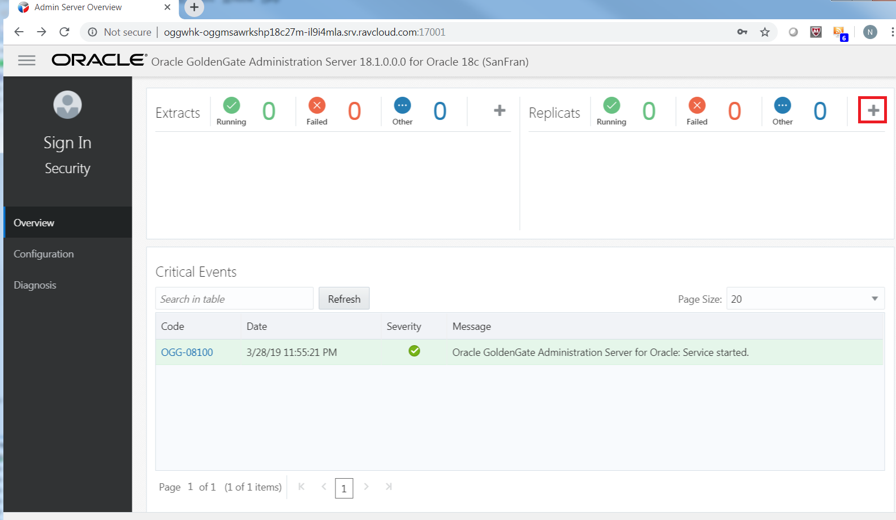
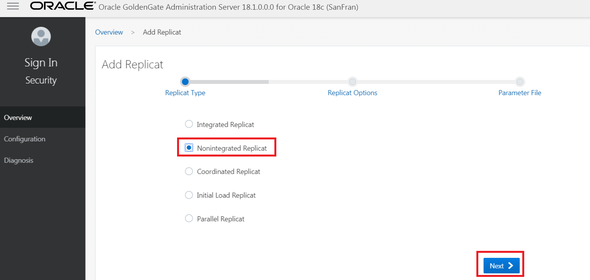
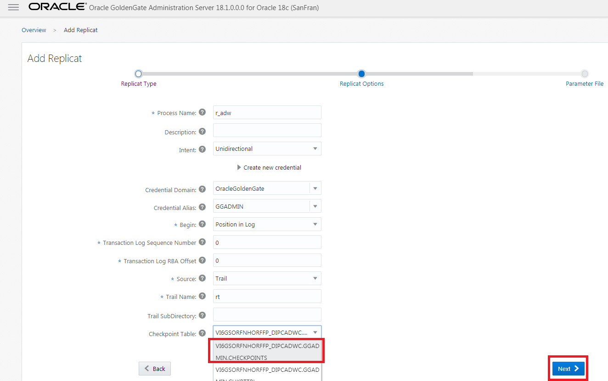
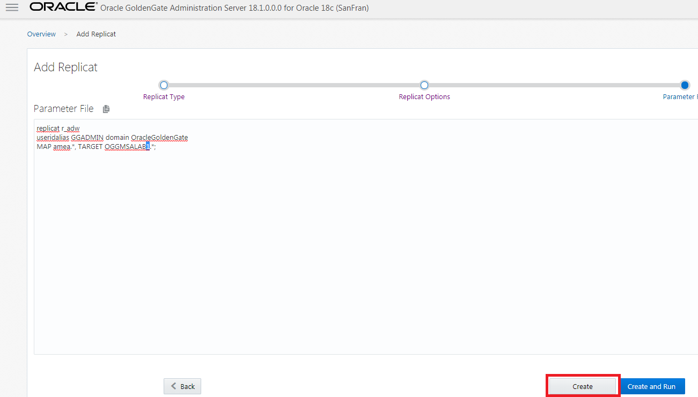
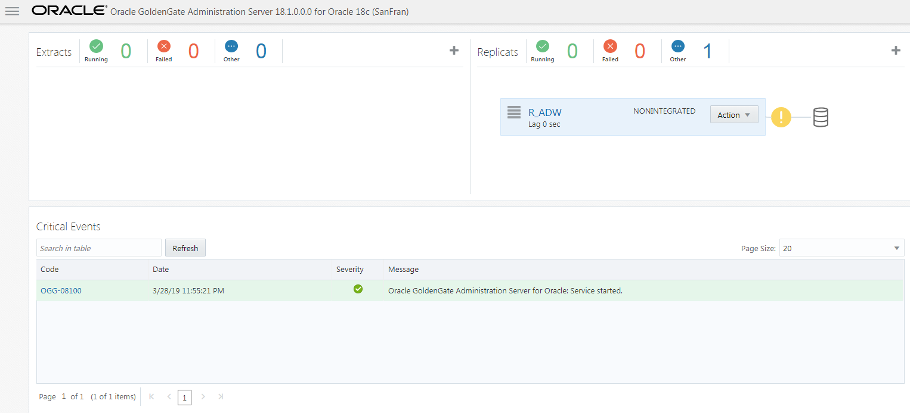
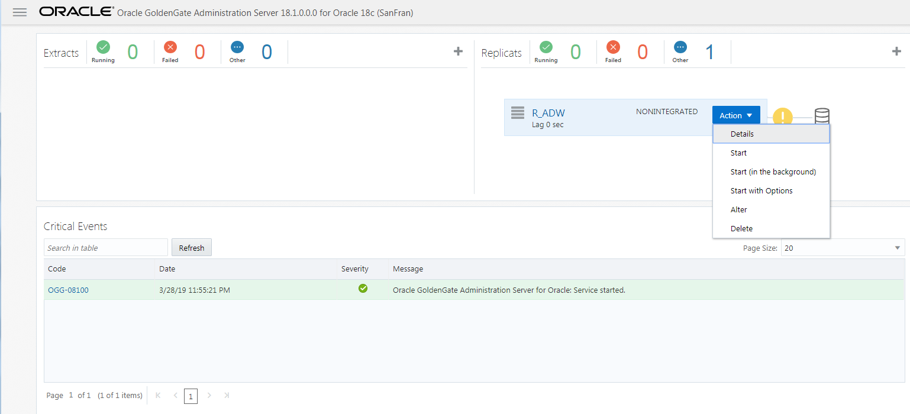
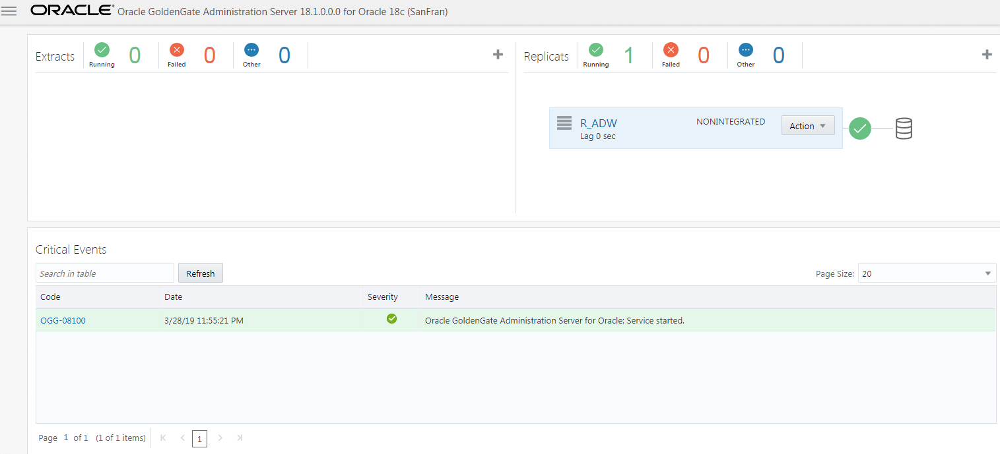
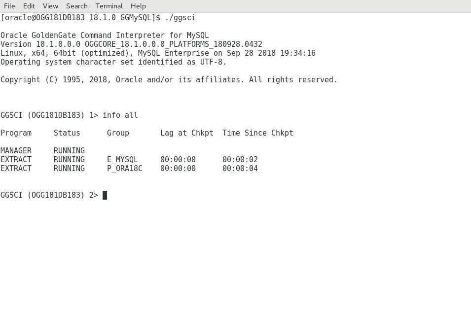
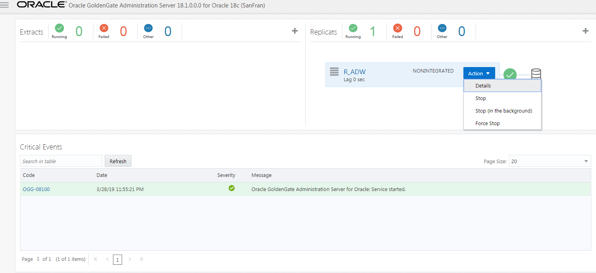

Update March 28, 2019

## Replicating into Oracle Autonomous Data Warehouse(ADWC) with Heterogeneous database
## Introduction

In this lab, you will take a look at how to set up replication from MySQL DB to Oracle Autonomous Data warehouse(ADWC) using Classic Goldengate for MySQL and Goldengate Microservices architecture.

This lab supports the following use cases:

- Setting up GoldenGate for MySQL.
- Setting up Replication in GoldenGate Microservices architecture for Oracle ADW (OGGMSALABX.* , where X is your participant ID assigned at the beging of the workshop).

## Objectives

Create a classic GoldenGate architecture capture process (Extract) for MySQL and a Microservices delivery process (non-Integrated Replicat) to receive the data to Oracle Autonomous Datawarehouse.  While MySQL isn’t supported as a deployment option for Microservices yet, you can still connect classic GoldenGate instances for MySQL to Microservices GoldenGate instances to replicate data.

**Please Note: Lab 1 and Lab2 are pre-requsite to complete for this Lab**

## Required Artifacts

### **STEP 1**: Create Replication Environment
This step sets up a clean GoldenGate Microservices source and target configuration.  This script will take a couple of minutes to complete.

- Open up a terminal window and change directory to Lab91 and run the script **build_all.sh**.
              
              [oracle@OGG181DB183 ~]$ cd ~/OGG181_WHKSHP/Lab91/
              [oracle@OGG181DB183 Lab91]$ ./build_all.sh 
             
- Make sure the target Schema is clear , run the command "reset_ADWC.sh **X**". Where X is your participant ID that was assigned during Lab. If the participant number was 1 then enter the following 

              [oracle@OGG181DB183 Lab91]$ cd /home/oracle/OGG181_WHKSHP/Lab91/Reset/db/
              [oracle@OGG181DB183 db]$ ./reset_ADWC.sh 1
              1

              SQL*Plus: Release 18.0.0.0.0 - Production on Fri Mar 29 06:50:59 2019
              Version 18.3.0.0.0

              Copyright (c) 1982, 2018, Oracle.  All rights reserved.

              Last Successful login time: Fri Mar 29 2019 06:30:49 +00:00

              Connected to:
              Oracle Database 18c Enterprise Edition Release 18.0.0.0.0 - Production
              Version 18.4.0.0.0

              SQL> SQL> 
              Table truncated.

              SQL> 
              Table truncated.

              SQL> 
              Table truncated.

              SQL> 
              Table truncated.

              SQL> 
              Table truncated.

              SQL> 
              Table truncated.

              SQL> 
              Table truncated.

              SQL> Disconnected from Oracle Database 18c Enterprise Edition Release 18.0.0.0.0 - Production
              Version 18.4.0.0.0
              Truncated Target tables
              [oracle@OGG181DB183 db]$ 

- This script performs the following:

                1.	Deletes any existing deployments, which will remove any current lab setups.

                2.	Creates the target deployments for this lab (SanFran).

                3.	Creates new credentials for the deployment.

                4.	Adds checkpoint table for the database. 

### **STEP 2**: MySQL Setup

GoldenGate for MySQL is already installed on the Ravello image.  You will be using another terminal session to run the MySQL transactions and GoldenGate processes

- Open a new Terminal window from the VNC Console.

- Sudo into the root user and when Prompted use the password 'Welcome1'

       oracle@OGG181DB183 ~]$ sudo su - root
      [sudo] password for oracle: 
      Last login: Thu Feb 14 18:10:24 UTC 2019 on pts/1
      Last failed login: Thu Feb 14 18:12:02 UTC 2019 from 73.163.148.213 on ssh:notty
      There were 6 failed login attempts since the last successful login. 
      
- Change to the MySQL GG home.
      
      [root@OGG181DB183 ~]# cd /opt/app/oracle/product/18.1.0_GGMySQL
    
- Run the GoldenGate command interpreter (GGSCI).

      [root@OGG181DB183 18.1.0_GGMySQL]# ./ggsci

      Oracle GoldenGate Command Interpreter for MySQL
      Version 18.1.0.0.0 OGGCORE_18.1.0.0.0_PLATFORMS_180928.0432
      Linux, x64, 64bit (optimized), MySQL Enterprise on Sep 28 2018 19:34:16
      Operating system character set identified as UTF-8.

      Copyright (C) 1995, 2018, Oracle and/or its affiliates. All rights reserved.

- Start the manager and check with info all command

      GGSCI (OGG181DB183) 1> start mgr
      Manager started.

      GGSCI (OGG181DB183) 2> info all

      Program     Status      Group       Lag at Chkpt  Time Since Chkpt

      MANAGER     RUNNING                                           

      GGSCI (OGG181DB183) 2> info all
      
      Program     Status      Group       Lag at Chkpt  Time Since Chkpt

      MANAGER     RUNNING                                           

- Run the OGG obey script to create the replication processes and check with info all command
       
       GGSCI (OGG181DB183) 3> obey ./dirprm/setup_mysql.oby
Output will as below :         

      GGSCI (OGG181DB183) 3> obey ./dirprm/setup_mysql.oby

      GGSCI (OGG181DB183) 4> -- This is a script(oby) file that executes GGSCI commands to initialize the GoldenGate environment. These commands can be run individually directly via the GGSCI interface.

      GGSCI (OGG181DB183) 5> 

      GGSCI (OGG181DB183) 5> -- CREATE THE CHANGE DATA CAPTURE EXTRACT,  AND LOCAL EXTRACT TRAIL OF 50MB

      GGSCI (OGG181DB183) 6> 

      GGSCI (OGG181DB183) 6> -- -- Add the E_MYSQL extract. This reads the mysql binary transaction logs directly. This command creates the extract checkpoint file. VAM indicates use of a Vendor Access Module to interface with the logs. BEGIN NOW captures any transactions from the redo log that are opened after this command is issued

      GGSCI (OGG181DB183) 7> 

      GGSCI (OGG181DB183) 7> ADD EXTRACT E_MYSQL, VAM, BEGIN NOW

      EXTRACT added.

      GGSCI (OGG181DB183) 8> 

      GGSCI (OGG181DB183) 8> ADD EXTTRAIL ./dirdat/eo, EXTRACT E_MYSQL, MEGABYTES 50

      EXTTRAIL added.

      GGSCI (OGG181DB183) 9> 

      GGSCI (OGG181DB183) 9> ADD EXTRACT P_ORA18C, EXTTRAILSOURCE ./dirdat/eo

      EXTRACT added.

      GGSCI (OGG181DB183) 10> 

      GGSCI (OGG181DB183) 10> ADD RMTTRAIL rt, EXTRACT P_ORA18C, MEGABYTES 50

      RMTTRAIL added.

- Check if the Extract and Pump processes have been added with "info all" as below :         

      GGSCI (OGG181DB183) 11> info all

      Program     Status      Group       Lag at Chkpt  Time Since Chkpt

      MANAGER     RUNNING                                           
      EXTRACT     STOPPED     E_MYSQL     00:00:00      00:02:57    
      EXTRACT     STOPPED     P_ORA18C    00:00:00      00:02:55    

### **STEP 3**: Setup Microservices Target 

We will use the web UI for the Administration Service of the SanFran Deployment (http://hostname:17001).

- Open a new browser tab and connect to http://hostname:17001 

- Login with the following oggadmin/Welcome1

- On the Overview page click the plus sign (+) opposite the Replicat status.

- On the next page click “Next” to create an Nonintegrated Replicat.

- Fill in the required parameters (See Screenshot).  Then click “Next”.

- The next page will show the parameter file.  Delete the "Map*.*, TARGET *.*;" statement and add the following "MAP amea.*, TARGET OGGMSALAB**X**.*;". Where **X** is equal to you partcipant id which as assigned to you.
          
                -- MAP *.*, TARGET *.*;
                MAP amea.*, TARGET OGGMSALAB**X**.*;
- Click **“Create”**.

- The delivery process is created. Now click on the Action drop down and select "Start".

- The replicat will be running , It might fail if you have not started the Pump process on the MySQL side

### **STEP 4**: Loading Data and validating the setup

- If not already done, Open a new Terminal window from the VNC Console.

- Sudo into the root user and when Prompted use the password 'Welcome1'

      [oracle@OGG181DB183 ~]$ sudo su - root
      [sudo] password for oracle: 
      Last login: Thu Feb 14 18:10:24 UTC 2019 on pts/1
      Last failed login: Thu Feb 14 18:12:02 UTC 2019 from 73.163.148.213 on ssh:notty
      There were 6 failed login attempts since the last successful login. 
      
- Change to the MySQL GG home.
      
      [root@OGG181DB183 ~]# cd /opt/app/oracle/product/18.1.0_GGMySQL
    
- Run the GoldenGate command interpreter (GGSCI).

      [root@OGG181DB183 18.1.0_GGMySQL]# ./ggsci

      Oracle GoldenGate Command Interpreter for MySQL
      Version 18.1.0.0.0 OGGCORE_18.1.0.0.0_PLATFORMS_180928.0432
      Linux, x64, 64bit (optimized), MySQL Enterprise on Sep 28 2018 19:34:16
      Operating system character set identified as UTF-8.

      Copyright (C) 1995, 2018, Oracle and/or its affiliates. All rights reserved.

-  Start MySQL Goldengate Extract and Pump processes in the terminal

  
       GGSCI (OGG181DB183) 12> start *

        Sending START request to MANAGER ...
        EXTRACT E_MYSQL starting

        Sending START request to MANAGER ...
        EXTRACT P_ORA18C starting

        GGSCI (OGG181DB183) 1> info all

        Program     Status      Group       Lag at Chkpt  Time Since Chkpt

        MANAGER     RUNNING                                           
        EXTRACT     RUNNING     E_MYSQL     00:00:01      00:00:06    
        EXTRACT     RUNNING     P_ORA18C    00:00:00      00:00:06    

        GGSCI (OGG181DB183) 2> 

-  To go terminal and change directory to "/home/oracle/OGG181_WHKSHP/Lab91/MySQL/dirsql"

       [oracle@OGG181DB183 ~]$ cd  /home/oracle/OGG181_WHKSHP/Lab91/MySQL/dirsql
       [oracle@OGG181DB183 dirsql]$ ls
       counts.sql  drop_database.sql  seed_database.sql  source_database.sql
   
- Log in into mysql database  using username "root" and password "Welcome1" 
  
       [oracle@OGG181DB183 dirsql]$ mysql -u root -p
       Enter password: 
       Welcome to the MySQL monitor.  Commands end with ; or \g.
       Your MySQL connection id is 10
       Server version: 8.0.13 MySQL Community Server - GPL

       Copyright (c) 2000, 2018, Oracle and/or its affiliates. All rights reserved.

       Oracle is a registered trademark of Oracle Corporation and/or its
       affiliates. Other names may be trademarks of their respective
       owners.

       Type 'help;' or '\h' for help. Type '\c' to clear the current input statement.

- Use "AMEA" schema 

       mysql> use amea
       Reading table information for completion of table and column names
       You can turn off this feature to get a quicker startup with -A
       Database changed

- Load the data in MySQL DB with the script present at /home/oracle/OGG181_WHKSHP/Lab91/MySQL/dirsql

                
      mysql> source /home/oracle/OGG181_WHKSHP/Lab91/MySQL/dirsql/seed_database.sql
      Database changed
      Query OK, 0 rows affected (0.00 sec)
      Query OK, 0 rows affected (0.25 sec)
      Query OK, 0 rows affected (0.15 sec)
      Query OK, 0 rows affected (0.14 sec)
      Query OK, 0 rows affected (0.16 sec)
      Query OK, 0 rows affected (0.16 sec)
      Query OK, 0 rows affected (0.24 sec)
      Query OK, 0 rows affected (0.20 sec)
      Query OK, 1 row affected (0.02 sec)
      Query OK, 1 row affected (0.02 sec)
      Query OK, 1 row affected (0.02 sec)
      Query OK, 1 row affected (0.03 sec)
      Query OK, 1 row affected (0.02 sec)
      Query OK, 0 rows affected (0.00 sec)
      Query OK, 0 rows affected (0.06 sec)
      Query OK, 0 rows affected (0.10 sec)
      Query OK, 0 rows affected (3 min 22.93 sec)
      mysql> 

-  It will take couple minutes to load the data. After that We can see the statstics from GGSCI CLI
      
        [root@OGG181DB183 18.1.0_GGMySQL]# cd /opt/app/oracle/product/18.1.0_GGMySQL
        [root@OGG181DB183 18.1.0_GGMySQL]# ./ggsci
        Oracle GoldenGate Command Interpreter for MySQL
        Version 18.1.0.0.0 OGGCORE_18.1.0.0.0_PLATFORMS_180928.0432
        Linux, x64, 64bit (optimized), MySQL Enterprise on Sep 28 2018 19:34:16
        Operating system character set identified as UTF-8.

        Copyright (C) 1995, 2018, Oracle and/or its affiliates. All rights reserved.

        GGSCI (OGG181DB183) 2> stats E_MYSQL,TOTAL

        Sending STATS request to EXTRACT E_MYSQL ...

        Start of Statistics at 2019-03-29 06:16:08.

        Output to ./dirdat/eo:

        Extracting from amea.account to amea.account:

        *** Total statistics since 2019-03-29 06:10:43 ***
          Total inserts                   	       10000.00
          Total updates                   	           0.00
          Total deletes                   	           0.00
          Total discards                  	           0.00
          Total operations                	       10000.00

        Extracting from amea.account_trans to amea.account_trans:

        *** Total statistics since 2019-03-29 06:10:43 ***

          No database operations have been performed.

        Extracting from amea.branch to amea.branch:

        *** Total statistics since 2019-03-29 06:10:43 ***
          Total inserts                   	          40.00
          Total updates                   	           0.00
          Total deletes                   	           0.00
          Total discards                  	           0.00
          Total operations                	          40.00

        Extracting from amea.teller to amea.teller:

        *** Total statistics since 2019-03-29 06:10:43 ***
          Total inserts                   	         800.00
          Total updates                   	           0.00
          Total deletes                   	           0.00
          Total discards                  	           0.00
          Total operations                	         800.00

        Extracting from amea.teller_trans to amea.teller_trans:

        *** Total statistics since 2019-03-29 06:10:43 ***

          No database operations have been performed.

        Extracting from amea.branch_atm to amea.branch_atm:

        *** Total statistics since 2019-03-29 06:10:43 ***

          No database operations have been performed.

        Extracting from amea.trans_type to amea.trans_type:

        *** Total statistics since 2019-03-29 06:10:43 ***
          Total inserts                   	           5.00
          Total updates                   	           0.00
          Total deletes                   	           0.00
          Total discards                  	           0.00
          Total operations                	           5.00

        End of Statistics.

        GGSCI (OGG181DB183) 3> 

-  Below is the statstics in the Replicat side

- It will take a few mins to Sync as we are doing remote delivery in ADW over internet where the bandwidht might be the bottleneck.

You have completed lab 9100!   **Great Job!**

<a href="https://oraclecps.github.io/GGMicroservices/workshops/gg/index.html?version=Hands-On+Labs&page=README.md" target="_blank">Click here to return</a>
