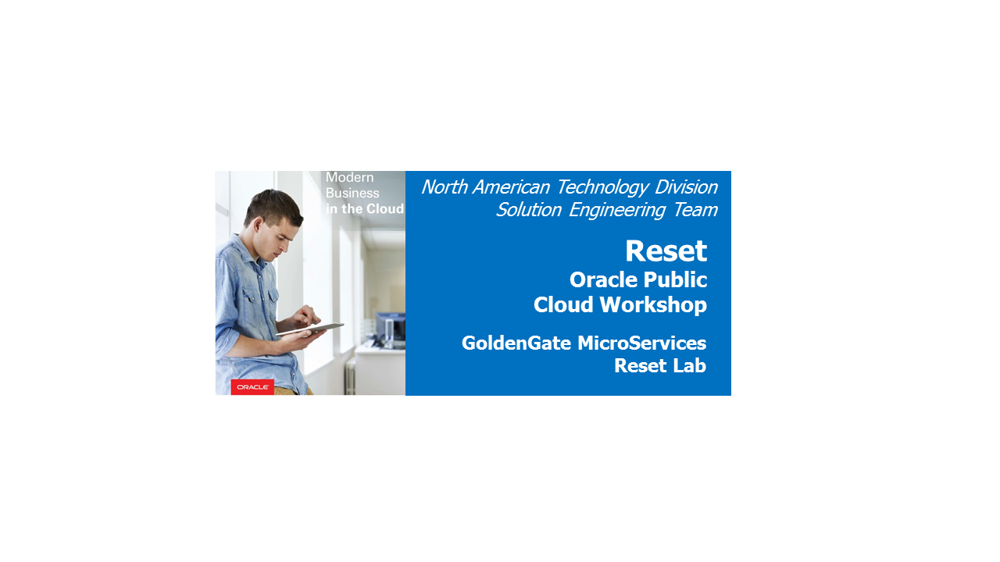

Update January 22, 2019

## GoldenGate Micro Services : Reset Lab

## Introduction

## Objective:

In this lab we will demostrate how to ***RESET*** the deployments, which will remove the deployments and any Extracts, Replicats and Distribution Paths that are under those deployments.
If needed there is a second step to recreate the deployments.  This will not create any Extracts, Replicats or Distribution Paths.
Also, if needed there is a third step to refresh the databases. 

### **STEP 1**: Remove Deployments.

-	If you don't have a terminal window opened yet, right click on the Desktop of the VNC session and select **Open Terminal**

-   From the Terminal window in the VNC Console, navigate to the Reset directory under ~/OGG181_WHKSHP.

        $ cd ~/OGG181_WHKSHP/Reset

-   From here you will run the script to delete deployment.  In order to do this, you will need to run the ***delete_deployment.sh*** script.  To run this script, you need to execute the following at the command line:

        $ sh delete_deployment.sh A1 A2 A3 A4 A5 A6 A6 A7 A8

Once the script is executed, you will see a statement saying that the ***“Successfully Setup Software.”*** indicates that deployment has been deleted.

Below example will guide to how to delete the deployment **"Target"** - (***SanFran***)

|    Arguement    | DESCRIPTION	       	        |       Example	      |
|-----------------|-----------------------------|---------------------|
|      A1         |Deployment Name	            |   SanFran           |
|      A2         |Admin User Password	        |   Welcome1          |
|      A3         |Service Manager Port     	|   16000             |
|      A4         |Administration Server Port	|   17001             |
|      A5         |Distribution Server Port 	|   17002             |
|      A6         |Receiver Server Port         |   17003             |
|      A7         |Metrics Server Port          |   17004             |
|      A8         |Metrics Server UDP Port      |   17005             |

-   From the terminal enter **"./delete_deployment.sh SanFran Welcome1 16000 17001 17002 17003 17004 17005"**

        [oracle@OGG181DB183 Reset]$ ./delete_deployment.sh SanFran Welcome1 16000 17001 17002 17003 17004 17005
        Successfully Setup Software.
        [oracle@OGG181DB183 Reset]$ 

Below example will guide to how to delete the deployment **"Source"** - (***Atlanta***).

|    Arguement    | DESCRIPTION	       	        |       VALUES	      |
|-----------------|-----------------------------|---------------------|
|      A1         |Deployment Name	            | 	Atlanta	          |
|      A2         |Admin User Password	        |	Welcome1          |
|      A3         |Service Manager Port     	| 	16000	          |
|      A4         |Administration Server Port	| 	16001	          |
|      A5         |Distribution Server Port 	|	16002	          |
|      A6         |Receiver Server Port         |   16003    	      |
|      A7         |Metrics Server Port          |   16004             |
|      A8         |Metrics Server UDP Port      |   16005             |

-   From the terminal enter **"./delete_deployment.sh Atlanta Welcome1 16000 16001 16002 16003 16004 16005"**

        [oracle@OGG181DB183 Reset]$ ./delete_deployment.sh Atlanta Welcome1 16000 16001 16002 16003 16004 16005
        Successfully Setup Software.
        [oracle@OGG181DB183 Reset]$ 

### **STEP 2**: Create Deployments (if needed)

-   Run the **build_deployments.sh** script.  This script does the following:

    -   Creates the ***Atlanta*** and  ***SanFran*** deployments using a response file for OGGCA.
    -   Creates the Credentials for the deployments for uni-directional replication (Atlanta to SanFran).

### **STEP 3**: Refresh Databases (if needed)

In this step you will run several scripts.

-   Run the **clone_pdb_reset.sh** script.  This script drops the source and target PDBs.

        [oracle@OGG181DB183 db]$ ./clone_pdb_reset.sh

-   Run the **clone_pdb_181.sh** script.  This script recreates the source by cloning a base PDB.

        [oracle@OGG181DB183 db]$ ./clone_pdb_181.sh

-   Run the **clone_pdb_182.sh** script.  This script recreates the target by cloning the source PDB.  
        ** NOTE: ** This is a clone of the 181 PDB, so you must run the ** clone_pdb_181.sh ** script first.

        [oracle@OGG181DB183 db]$ ./clone_pdb_182.sh

You have completed lab 1000!   **Great Job!**
