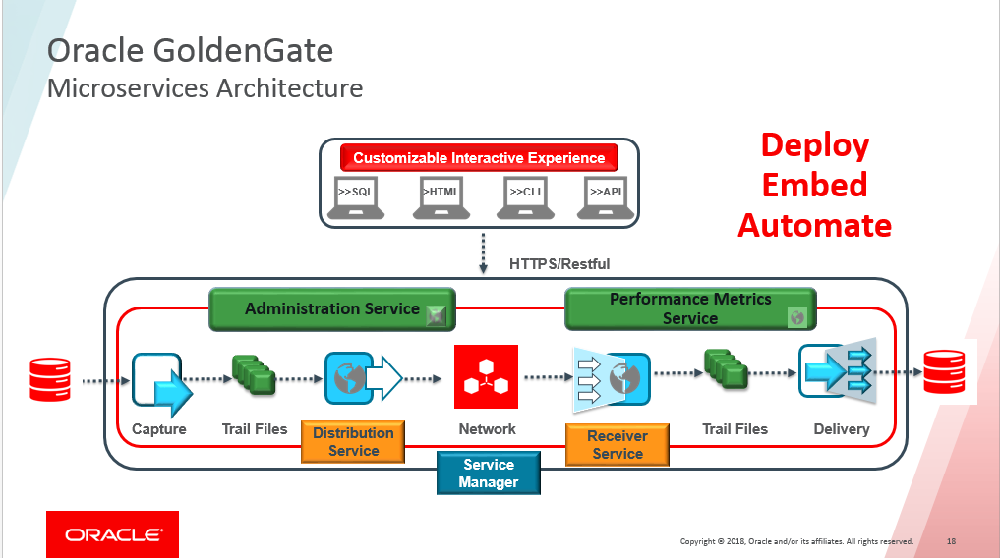

# GoldenGate Microservices Architecture Labs

Update April 03, 2019

## Introduction	1 hour 

- Oracle GoldenGate Microservices Archiecture Overview/updates Presentation. [>>Click<< to download presentation](https://github.com/OracleCPS/GGMicroservices/raw/master/workshops/gg/GG18.1_Workshop.pptx)

## Lab 100	[Install GoldenGate Microservices Architecture](https://oraclecps.github.io/GGMicroservices/workshops/gg/CloudWorkshop_GoldenGate%20Microservices_100.html)

- Install the Oracle GoldenGate Microservces for Oracle in the target environment using the Oracle Universal Installer (OUI) tool.

## Lab 200	[Creating Deployments](https://oraclecps.github.io/GGMicroservices/workshops/gg/CloudWorkshop_GoldenGate%20Microservices_200.html)
- After Installation create the Oracle GoldenGate Microservices Deployments

## Lab 300	[Creating Credentials](https://oraclecps.github.io/GGMicroservices/workshops/gg/CloudWorkshop_GoldenGate%20Microservices_300.html)
- Creating Database Credentials for Oracle GoldenGate Microservices setup

## Lab 400	[Uni Directional and DDL Replication](https://oraclecps.github.io/GGMicroservices/workshops/gg/CloudWorkshop_GoldenGate%20Microservices_400.html)
- Using Web interface of Oracle GoldenGate Microservices  (HTML5 Pages)

		
## Lab 500	[Zero Downtime Configuration](https://oraclecps.github.io/GGMicroservices/workshops/gg/CloudWorkshop_GoldenGate%20Microservices_500.html)
- Doing file based data migration using the MicroServices architecture and the REST API for automation

## Lab 600	[Bi-Directional and Auto Conflict Detection and Resolution(CDR)](https://oraclecps.github.io/GGMicroservices/workshops/gg/CloudWorkshop_GoldenGate%20Microservices_600.html)
- Use CDR functions to setup Auto-CDR in the database with Oracle GoldenGate Microservices
		
## Lab 700	[Heterogeneous Replication](https://oraclecps.github.io/GGMicroservices/workshops/gg/CloudWorkshop_GoldenGate%20Microservices_700.html)
- Setup Oracle GoldenGate for "MySQL" using classic Architecture and Oracle GoldenGate for "Oracle" using Microservices Architecture for Uni-directional replication
		
## Lab 800	[Data Transformations](https://oraclecps.github.io/GGMicroservices/workshops/gg/CloudWorkshop_GoldenGate%20Microservices_800.html)
- Demonstrate use of Oracle GoldenGate Microservices for transformation capabilities like column concatenating, data masking and use of environment variables/tokens
		
## Lab 900	[Performance Metrics](https://oraclecps.github.io/GGMicroservices/workshops/gg/CloudWorkshop_GoldenGate%20Microservices_900.html)		
- View the detailed replication statistics in real-time with the Oracle GoldenGate Metric Service in Microservices Architecture

## Lab 9100 	[Replicating into Oracle Autonomous Data Warehouse from Heterogeneous database](https://oraclecps.github.io/GGMicroservices/workshops/gg/CloudWorkshop_GoldenGate%20Microservices_9100.html)
- Setup Oracle GoldenGate for "MySQL" using classic Architecture and Oracle GoldenGate for "Oracle Autonomous Data Warehouse" using Microservices Architecture for Uni-directional replication
