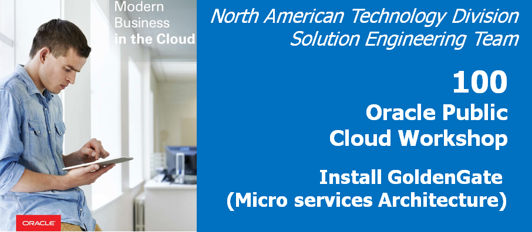
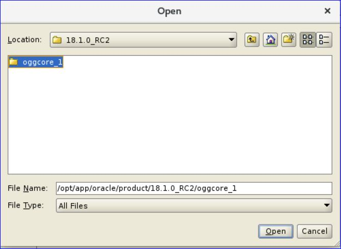
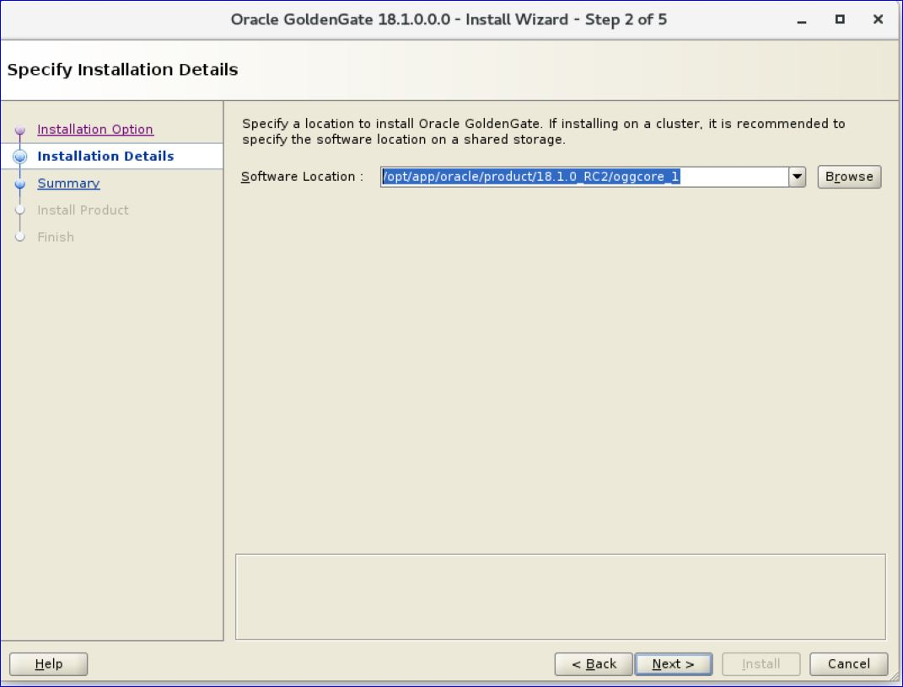
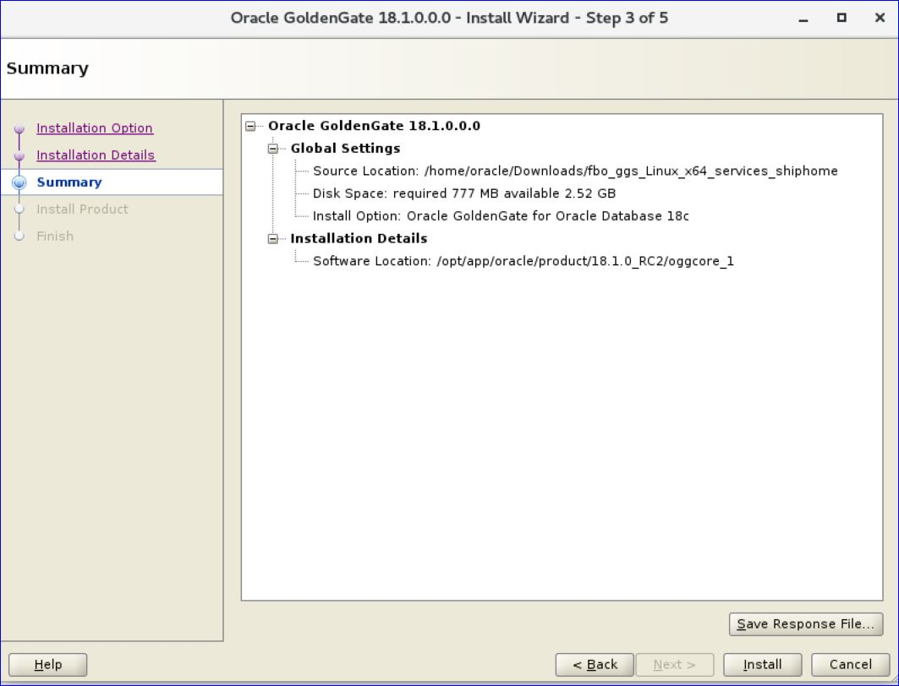
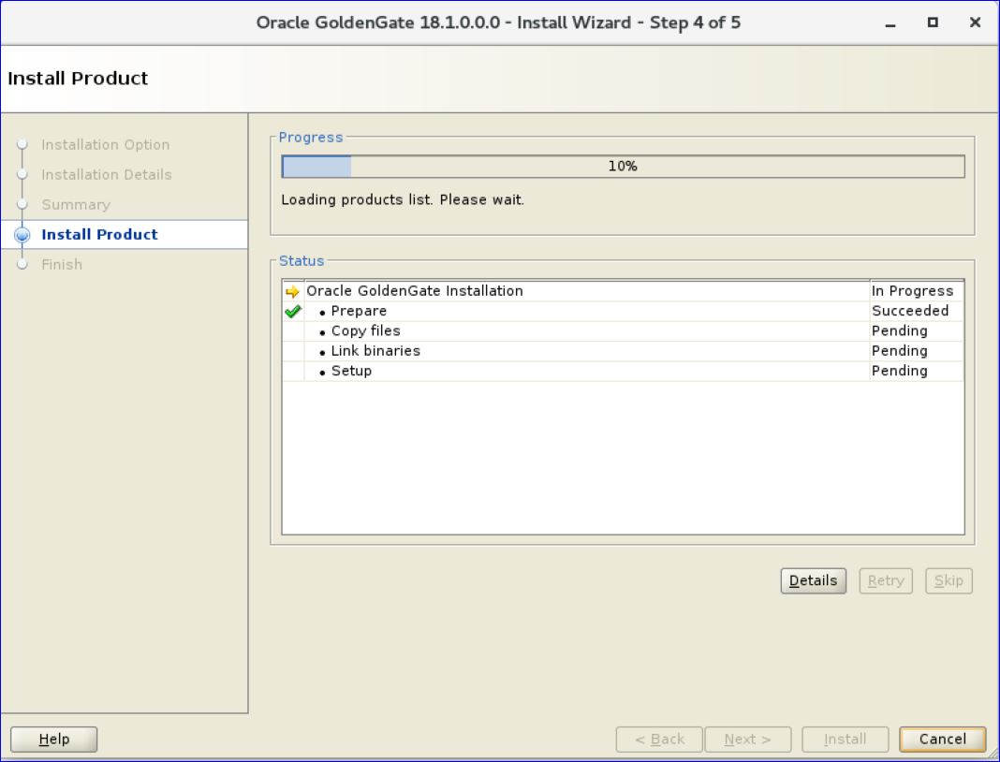
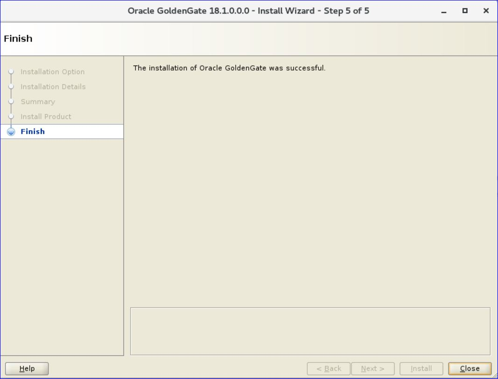

Update Jan 02, 2019

#### Introduction

This is the first of a series of labs to introduce you to the capabilities of GoldenGate Microservices for Oracle Database.   It is a significant release that changes the underlying architecture of GoldenGate to enable it to be administered, monitored, managed and configured through a series of common services.   Each service supports a standard web-based user interface and an REST (Representational State Transfer) APIs, that allow all configuration to be done remotely in an agile manner. 

In this first lab you will walk through the process of installing this new version of GoldenGate and configuring a deployment for the target environment.

## Objectives

-   Sign on to the Ravello cloud  to access the lab environment
-	Install the GoldenGate Microservces for Oracle edition for the target environment using the Oracle Universal Installer (OUI) tool

## Required Artifacts

-   The following lab can be done simply through a browser-based environment however VNC and the remote desktop client are also supported if you have them already installed on your labtop.
-   A client environment virtual machine that is running within the Ravello Cloud service is also provided with all of the necessary dependencies.

**Retrieve your Ravello details for each of the VMs that are used**

### **STEP 1**: Login to the target Ravello VM

In this step you will sign on to the Oracle 18c database environment to get started with the installation and configuration of the target environment.

-   Open a browser and go to the following URL:https://cloud.ravellosystems.com [make sure to change this URL for the deployed service]
-   Sign on with the following username/password:
	oracle/welcome1
### **STEP 2**: Open up a terminal window and install the GoldenGate Microservices Edition

In this step you will install **the GoldenGate Microservices edition package** in new **"GoldenGate Home"** directory.

-	Once you login into the ***Remote desktop***,traverse to **applications** and open up the **Terminal**
-   From the terminal screen change to the **Downloads** directory and unzip the **GoldenGate Microservices software package**:
 
		[oracle@OGG181DB183 ~] cd Downloads
		[oracle@OGG181DB183 Downloads]$ ls -lrth
		-rw-r--r--. 1 oracle oinstall 549M Dec  6 16:53 181000_fbo_ggs_Linux_x64_micro_services_shiphome.zip
		[oracle@OGG181DB183 Downloads]$ unzip 181000_fbo_ggs_Linux_x64_services_shiphome.zip -d .
 
-  Go into the software package and execute the **runInstaller** executable:

		oracle@OGG181DB183 Downloads]$ cd fbo_ggs_Linux_x64_services_shiphome/Disk1/
		[oracle@OGG181DB183 Disk1]$ ./runInstaller 

- The following screen should appear:

	

- Select the first option for **"Oracle GoldenGate for Oracle Database 18c (777.0MB)"** and click the **"Next >"** button.

	

- For the next screen click on the **"Browse"** button and navigate to the 
**"/opt/app/oracle/product/18.1.0_RC2/"** directory and click on the **"Open"** button.  
    
	

- Make sure the correct path is entered into the **"Software Location"** field.  Then click on the **"Next"** button.

    

- You will see the installation summary screen.   Review the summary and click on the **"Install"** button.

    

- Follow the progress screen until the **installation completes**.

   

- Once the installation is complete, you will end up on the Finish page. At this point, you
can click the Close button to exit the installation wizard.

	
	

- You should now be complete with **the GoldenGate Microservices for Oracle software installation**.

You have completed lab 100! Great Job!

