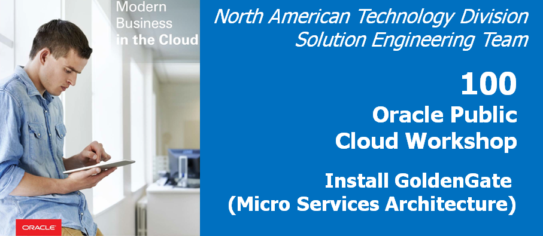

Update Feb 05, 2019

#### Introduction

This is the first of a series of labs to introduce you to the capabilities of GoldenGate Microservices for Oracle Database.   It is a significant release that changes the underlying architecture of GoldenGate to enable it to be administered, monitored, managed and configured through a series of common services.   Each service supports a standard web-based user interface, REST (Representational State Transfer) APIs and a command line client, that allow all configuration to be done remotely in an agile manner. 

In this first lab you will walk through the process of installing this new version of GoldenGate and configuring a deployment for the target environment.

## Objectives

-   Use VNC to sign on to your Ravello cloud instance to access the lab environment.
-	Start the Oracle database.
-	Install the GoldenGate Microservces for Oracle edition for the target environment using the Oracle Universal Installer (OUI) tool

## Required Artifacts

-   The following lab will use a VNC Viewer which was a prerequisite for this workshop. If you have not already downloaded TightVNC it can be downloaded from the following link : https://www.tightvnc.com/download.php
-   A client environment virtual machine that is running within the Ravello Cloud service is also provided with all of the necessary dependencies.

### **STEP 1**: Access Ravello Image via VNC

For this lab, Oracle GoldenGate and the Oracle Database sources and targets are contained within one Ravello Cloud image that you will be assigned to. All user interactions will be through a browser (Firefox or Chrome) and VNC Client (TigerVNC is recommended) that should be installed on your laptop since it was a prerequisite for this workshop. This will be used to connect to your Ravello Cloud image.

**Note: Your instructor will provide the Ravello DNS and IP address for your image**

In this step you will use VNC client to connect with Oracle 18c database environment (Ravello image), to get started with the installation of Oracle GoldenGate Mircoservices Architecture.

-	Log in to the Ravello image of your assigned host, using TigerVNC.
-	In the VNC server field, enter the hostname assigned to you by the hands-on lab staff and port 5901 e.g. {hostname or IP}:5901 , then press Connect.

-	Sign on with the following password: Welcome1

-	Once the VNC client has connected, you should see a console that looks similar to this:

### **STEP 2**: Open up a terminal window and start the database.

-	On the desktop, right-click and select “Open Terminal”.

-	From the terminal screen change to the OGG181_WHKSHP/Lab1 directory and execute the database startup script "./startup.sh". as shown below:

-	This will take about 5 minutes.

		[oracle@OGG181DB183 ~]$ cd OGG181_WHKSHP/Lab1
		[oracle@OGG181DB183 Lab1]$ ll
		total 4
		-rwxr-xr-x. 1 oracle oinstall 207 Dec 20 22:56 startup.sh
		[oracle@OGG181DB183 Lab1]$ ./startup.sh 
		/opt/app/oracle/product/18.3.0/dbhome_1

		LSNRCTL for Linux: Version 18.0.0.0.0 - Production on 05-FEB-2019 20:08:59

		Copyright (c) 1991, 2018, Oracle.  All rights reserved.

		Starting /opt/app/oracle/product/18.3.0/dbhome_1/bin/tnslsnr: please wait...

		TNSLSNR for Linux: Version 18.0.0.0.0 - Production
		System parameter file is /opt/app/oracle/product/18.3.0/dbhome_1/network/admin/listener.ora
		Log messages written to /opt/app/oracle/diag/tnslsnr/OGG181DB183/listener/alert/log.xml
		Listening on: (DESCRIPTION=(ADDRESS=(PROTOCOL=tcp)(HOST=OGG181DB183)(PORT=1521)))
		Listening on: (DESCRIPTION=(ADDRESS=(PROTOCOL=ipc)(KEY=EXTPROC1521)))

-	Once you get the message that the script completed, you can go on to the next step(takes 5 minutes, please dont press any button unless menu is return).

		The command completed successfully
		[oracle@OGG181DB183 Lab1]$ 

### **STEP 3**: From the same terminal window, install the GoldenGate Microservices Edition

In this step you will install **the GoldenGate Microservices edition package** in new **"GoldenGate Home"** directory.

-	From the terminal screen change to the **Downloads** directory and unzip the **GoldenGate Microservices software package**:
 
		[oracle@OGG181DB183 Lab1]$ cd ~/Downloads/
		[oracle@OGG181DB183 Downloads]$ ll
		total 627756
		-rw-r--r--. 1 oracle oinstall 575594529 Dec 19 17:40 181000_fbo_ggs_Linux_x64_services_shiphome.zip
		[oracle@OGG181DB183 Downloads]$ unzip 181000_fbo_ggs_Linux_x64_services_shiphome.zip -d .

-	Go to the unzipped folder (fbo_ggs_Linux_x64_services_shiphome/Disk1) and execute the **runInstaller** executable:

		oracle@OGG181DB183 Downloads]$ cd fbo_ggs_Linux_x64_services_shiphome/Disk1/
		[oracle@OGG181DB183 Disk1]$ ./runInstaller 

- The following screen should appear:

	

- Keep the first option for **"Oracle GoldenGate for Oracle Database 18c (777.0MB)"** and click the **"Next >"** button.

- For the next screen click on the **"Browse"** button and navigate to the 
**"/opt/app/oracle/product/18.1.0_RC2/"** directory and click on the **"Open"** button.  
    
	

- Make sure the correct path is entered into the **"Software Location"** field.  Then click on the **"Next"** button.

    

- You will see the installation summary screen.   Review the summary and click on the **"Install"** button.

    

- Follow the progress screen until the **installation completes**.

   

- Once the installation is complete, you will end up on the Finish page. At this point, you can click the **"Close"** button to exit the installation wizard.

	
	

- You should now be complete with **the GoldenGate Microservices for Oracle software installation**.

You have completed lab 100! Great Job!

<a href="https://oraclecps.github.io/GGMicroservices/workshops/gg/index.html" target="_blank">Click here to return</a>

[Click here to return](https://oraclecps.github.io/GGMicroservices/workshops/gg/readme.md)
