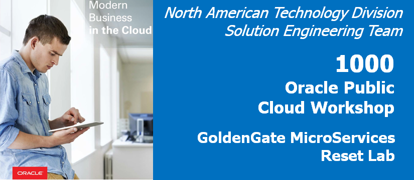
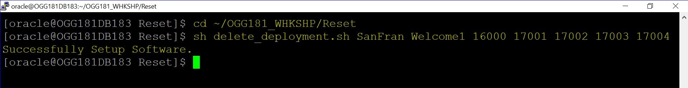
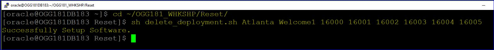

Update January 22, 2019

## GoldenGate Micro Services : Reset Lab

## Introduction

## Objective:

In this lab we will demostrate how to ***RESET*** deployment ,Extract and Replicat

1. From the Terminal window in the VNC Console, navigate to the Reset directory under ~/OGG181_WHKSHP.

        $ cd ~/OGG181_WHKSHP/Reset

2. From here you will run the script to delete deployment.  In order to do this, you will need to run the ***delete_deployment.sh*** script.  To run this script, you need to execute the following at the command line:

        $ sh delete_deployment.sh A1  A2 A3 A4 A5 A6 A6 A7 A8
Example :
        ***$ sh delete_deployment.sh SanFran Welcome1 16000 17001 17002 17003 17004 17005***

|    Arguement    | DESCRIPTION	       	        |       Example	      |
|-----------------|-----------------------------|---------------------|
|      A1         |Deployment Name	            | 	SanFran	          |
|      A2         |Admin User Password	        |	Welcome1          |
|      A3         |Service Manager Port     	| 	16000	          |
|      A4         |Administration Server Port	| 	17001	          |
|      A5         |Distribution Server Port 	|	17002	          |
|      A6         |Receiver Server Port         |       17003	      |
|      A7         |Metrics Server Port          |       17004         |
|      A8         |Metrics Server UDP Port      |       17005         |

Once the script is executed, you will see a statement saying that the ***“Successfully Setup Software.”*** indicates that deployment has been the deleted.

Below example will guide to how to delete the deployment **"Target"** - (***SanFran***)

Command :
          ***$ sh delete_deployment.sh SanFran Welcome1 16000 17001 17002 17003 17004 17005***

Below example will guide to how to delete the deployment **"Source"** - (***Atlanta***)

Command :
         ***$ sh delete_deployment.sh Atlanta Welcome1 16000 16001 16002 16003 16004 16005***

|    Arguement    | DESCRIPTION	       	        |       VALUES	      |
|-----------------|-----------------------------|---------------------|
|      A1         |Deployment Name	            | 	Atlanta	          |
|      A2         |Admin User Password	        |	Welcome1          |
|      A3         |Service Manager Port     	| 	16000	          |
|      A4         |Administration Server Port	| 	16001	          |
|      A5         |Distribution Server Port 	|	16002	          |
|      A6         |Receiver Server Port         |       16003	      |
|      A7         |Metrics Server Port          |       16004         |
|      A8         |Metrics Server UDP Port      |       16005         |

You have completed lab 1000!   **Great Job!**
