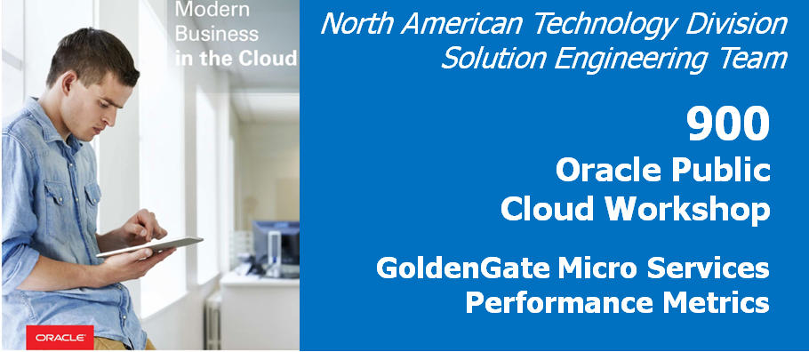

Update August 7, 2018

## Working with REST API
## Introduction

In this lab, you will take a look at how to pull a list of services from Oracle GoldenGate using the REST APIs. Replace <port> with the port number of the service you want to access.

Steps:
1. Open a command window (right mouse click – Open Terminal)

2. Try running the following CURL command.
curl -u oggadmin:welcome1 -H "Content-Type: application/json" -H "Accept:
application/json" -X GET
http://localhost:<port>/services/v2/deployments/SanFran_1/services/distsrvr/logs |
python -mjson.tool

3. Retrieve Log locations using the following CURL command
curl -u oggadmin:welcome1 -H "Content-Type:application/json" -H
"Accept:application/json" -X GET http://localhost:<port>/services/v2/logs | python - mjson.tool

Appendix:

A: Run Swingbench
Steps:
1. Open a command terminal and navigate to the Swingbench bin directory (Figure A-1)
$ cd /opt/app/oracle/product/swingbench/bin

2. Execute the swingbench command (Figure A-2)
$ ./swingbench

3. Once Swingbench starts, select the SOE_Server_Side_V2 configuration file.

4. Once Swingbench is open, update the Password, Connect String, and Benchmark Run
Time (Figure A-4)
Password: welcome1
Connect String: //ogg123rs/pdb1
Benchmark Run Time: 10 mins

5. Execute Swingbench (Figure A-5)

At this point you should see activity on the table by looking at the Extract/Replicats.
Correct any problems that may arise due.

At this point, you should have a fully functional REST Api environment. 