Update July 25, 2018

#### Introduction

This is the first of a series of labs to introduce you to the capabilities of GoldenGate Microservices for Oracle Database.   It is a significant release that changes the underlying architecture of GoldenGate to enable it to be administered, monitored, managed and configured through a series of common services.   Each service supports a standard web-based user interface and an REST (Representational State Transfer) APIs, that allow all configuration to be done remotely in an agile manner. 

In this first lab you will walk through the process of installing this new version of GoldenGate and configuring a deployment for the target environment.

## Objectives

-   Sign on to the Ravello cloud  to access the lab environment
-	Install the GoldenGate Microservces for Oracle edition for the target environment using the Oracle Universal Installer (OUI) tool
-	Configure the initial ServiceManager Deployment and the EURO target deployment
-	Connect to the target environment deployment through a web browser and confirm that the deployment succeeded and that the ServiceManager and core GoldenGate services are running.

## Required Artifacts

-   The following lab can be done simply through a browser-based environment however VNC and the remote desktop client are also supported if you ahve them already installed on your labtop.
-   A client environment virtual machine that is running within the Ravello Cloud service is also provided with all of the necessary dependencies.

**Retrieve your Ravello details for each of the VMs that are used**

### **STEP 1**: Login to the target Ravello VM

In this step you will sign on to the target EURO database environment to get started with the installation and configuration of the target environment.

-   Open a browser and go to the following URL: https://emeatargetdb-goldengatemicroser-s7k6yjyo.srv.ravcloud.com [make sure to change this URL for the deployed service]
-   Sign on with the following username/password:
	oracle/welcome1
### **STEP 2**: Open up a terminal window and install the GoldenGate Microservices Edition

In this step you will install the GoldenGate Microservices edition package in new "GoldenGate Home" directory.

-	Right click on the desktop environment and pick "Open Terminal" from the pop up menu.
-   From the terminal screen change to the Downloads directory and unzip the GoldenGate Microservices software package:

`[oracle@eurosrvr ~] cd Downloads`

`[oracle@eurosrvr Downloads] unzip 123014_fbo_ggs_Linux_X64_services_shiphome.zip`

-  Go into the software package and execute the runInstaller executable:

`[oracle@eurosrvr Downloads] cd fbo_ggs_Linux_x64_services_shiphome/Disk1`

`[oracle@eurosrvr Disk1] ./runInstaller`

- The following screen should appear:

	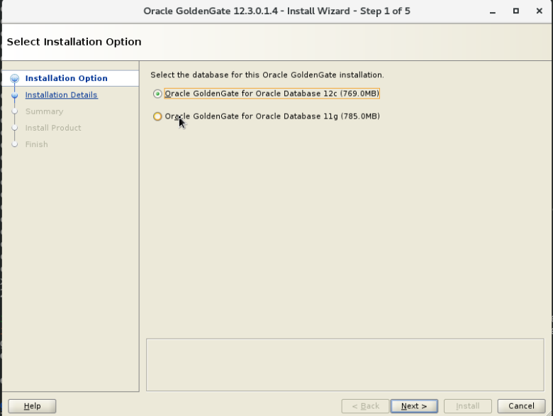

- Select the first option for "Oracle GoldenGate for Oracle Database 12c (769.0MB) and click the "Next >" button.

	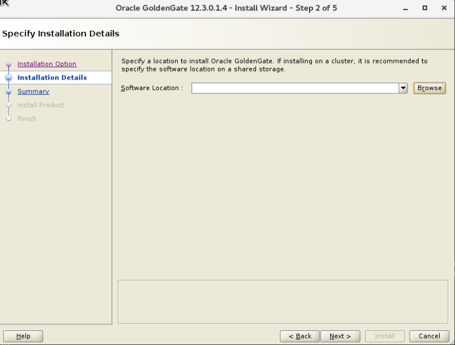

- For the next screen click on the "Browse" button and navigate to the 
"/u01/app/oggcore_1" directory and click on the "Open" button.

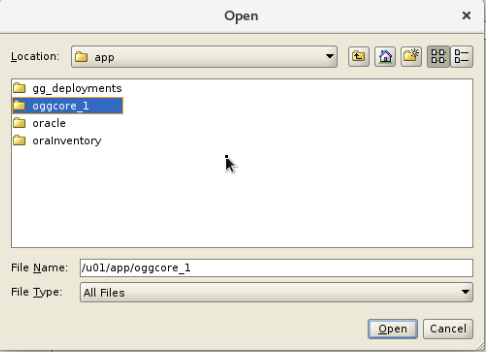

- Make sure the correct path is entered into the "Software Location" field.  Then click on the "Next" button.

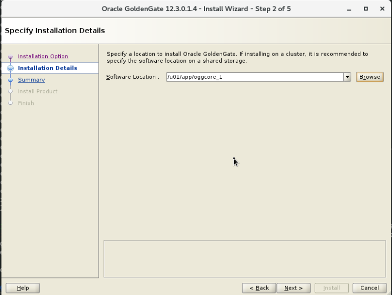

- You will see the installation summary screen.   Review the summary and click on the "Install" button.

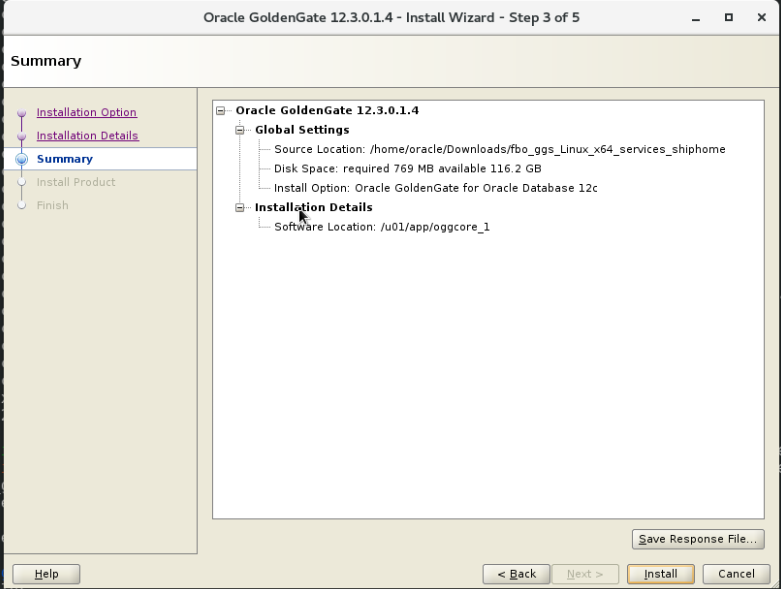

- Follow the progress screen until the installation completes.

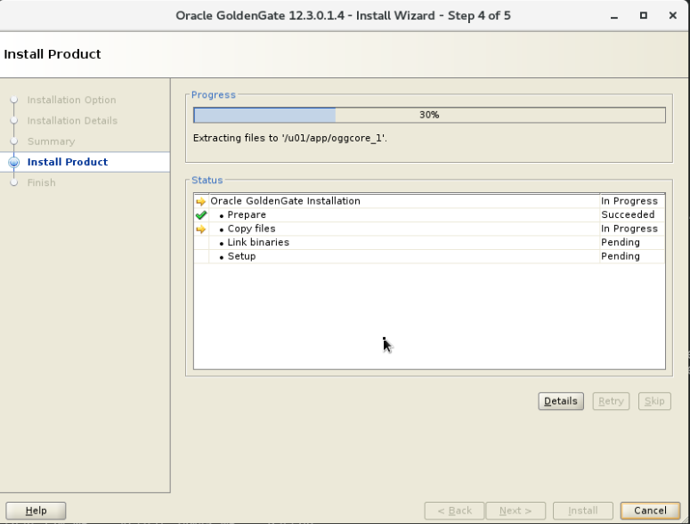

- You should now be complete with the GoldenGate Microservices for Oracle software installation.

### **STEP 3**: Open up a terminal window and create the ServiceManager and target "euro" GoldenGate deployment

In this step you will create the initial ServiceManager and the target GoldenGate deployment.   ServiceManager is the bootstrap process that can be configured as a daemon process in Unix and windows so that it can start and stop on system startup and shutdown.   It also is responsible for starting and stopping the other GoldenGate services and presents the initial web user interface and access point for the AdminClient command line interface.

-	Right click on the desktop environment and pick "Open Terminal" from the pop up menu unless you already have a terminal screen opened already.

-   From the terminal screen, set the Oracle environment for the target database.  ***Make sure to follow this step carefully to set up the proper environmental variables for the deployment***

`[oracle@eurosrvr ~] . oraenv`

`[oracle@eurosrvr ~] ORACLE_SID = [orcl] ? EURO`

-   Then, change to the /u01/app/oggcore_1/bin directory.

`cd /u01/app/oggcore_1/bin`

-   Then, run the oggca.sh script:

`[oracle@eurosrvr bin] ./oggca.sh`

- The following screen will appear.   Select the option to "Create New Service Manager" and click on the "Browse" button to help assign the correct deployment home directory for the Service Manager.

- For the directory selection dialog box navigate to the "/u01/app/gg_deployments/ServiceManager" directory and click on the "Select" button.

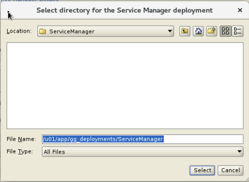

- For the ServiceManager details screen enter the hostname of "eurosrvr" for the listening hostname/address and enter "8890" for the listening port value.  Click on the "Register Service as a system service/daemon" checkbox. Click on "Next" to continue the configuration.   

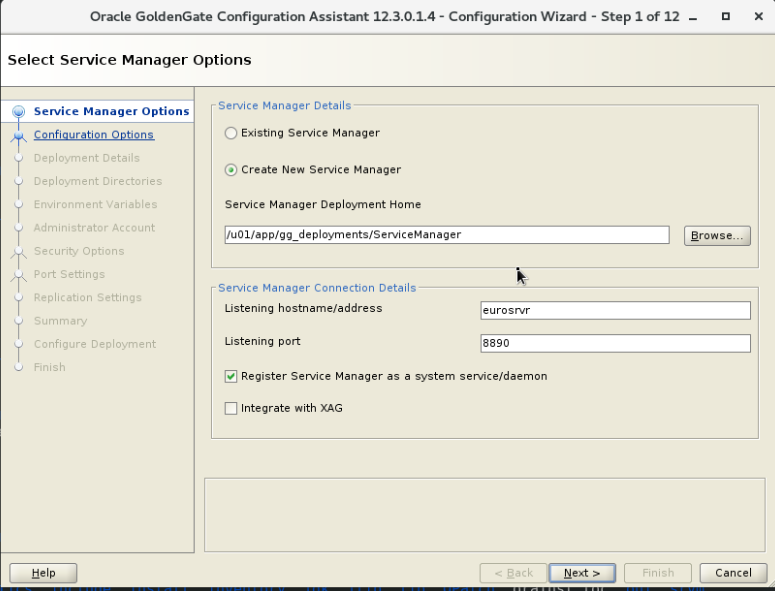

- For the "Specify Deployment Directories" screen review the default values to make sure that they will all be deployed within the /u01/app/gg_deployments/euro directory.  Click on "Next" to continue.

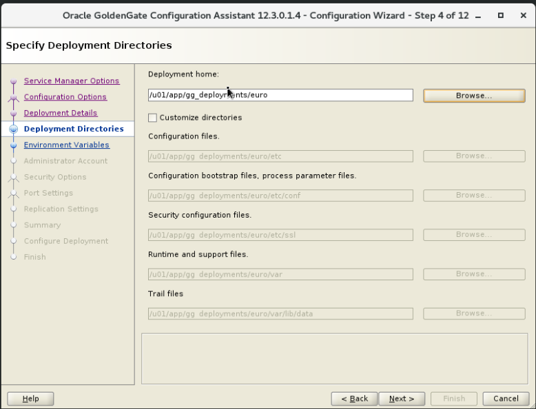

- For  the "Specify Enviroment Variables" screen, review the settings and click on "Next" to continue.  

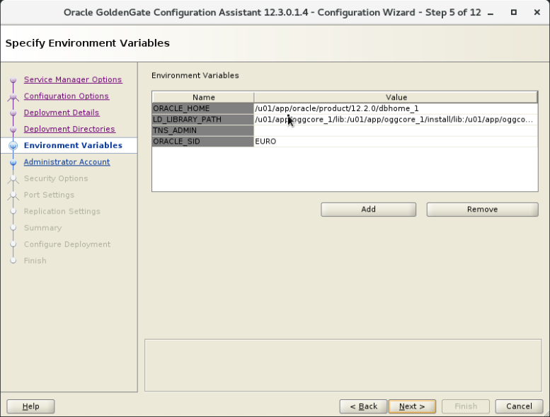

- For the "Specify Administrator Account" screen, enter "ggadmin" for the username field, and enter "welcome1" for the password field.  Enter the same value of "welcome1" for the confirm password field.   Click on "Next
 to continue.

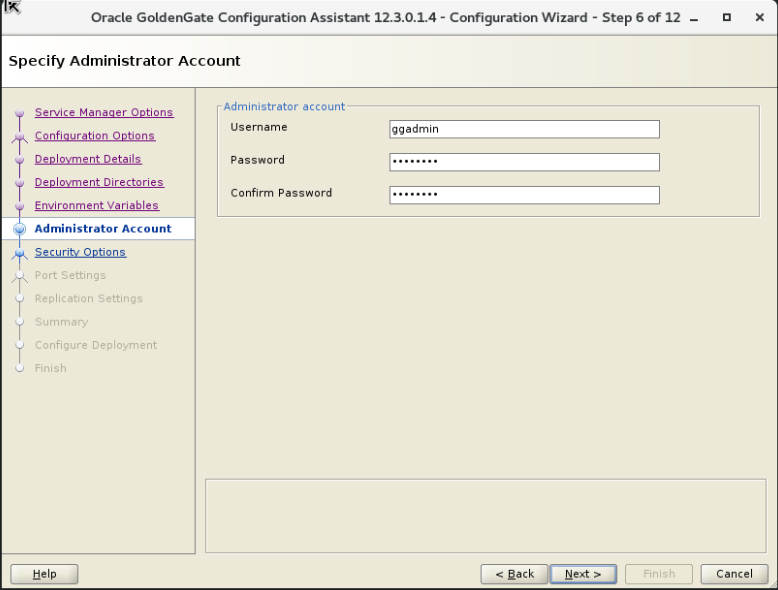

- For the "Specify Security Options" screen, make sure all the "SSL/TLS security" and "This nonsecure deployment will be used to send trail data to a secure deployemnt" checkboxes are ***unchecked***.  Click on "Next" to continue.

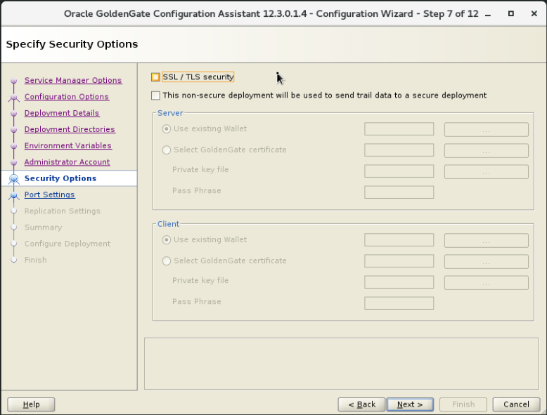

- For the "Specify Port Settings" screen, set the following field and checkbox values (you will note that they will autofill based on the first setting which is fine).   Then once confirmed click "Next" to continue.

| Field/Checkbox				|		Setting		|
|-------------------------------|-------------------|
|Administration Server Port"	| 	16000			|
|Distribution Server Port"		|	16001			|
|Receiver Server Port"			| 	16002			|
|Enable Monitoring"				| 	Checked			|
|Metrics Server Port			|	16003			|
|Metrics Server UDP Port (data) |   16004			|
|Metrics Server Datastore Type  |   BDB				|

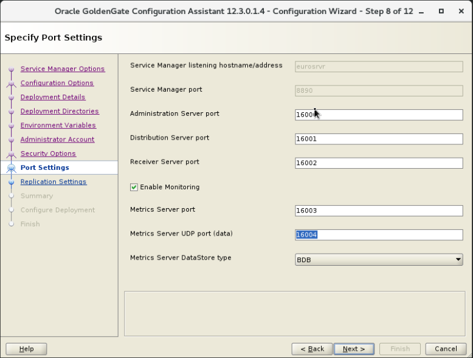

- For the "Specify OGG Replication Settings" screen, enter ggadmin for the "Default Schema" field.  Click on "Next" to continue.
 
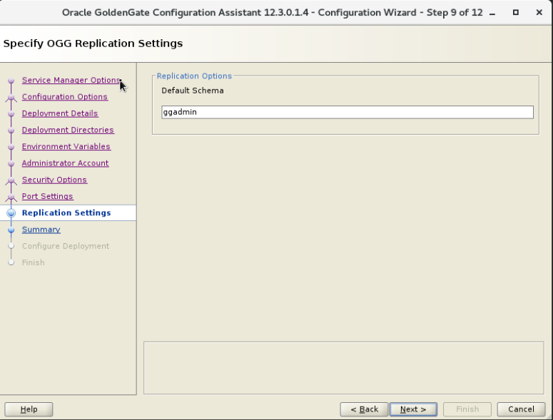

- For the "Summary" screen review the options carefully and then select the "Finish" button.

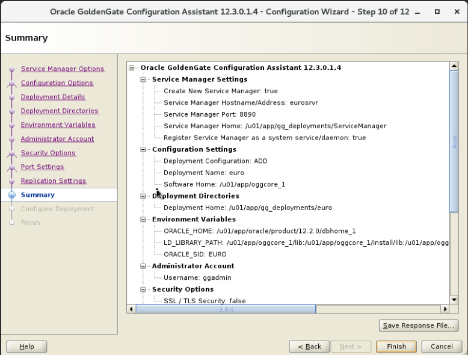

- Follow the progress carefully on the next screen.
- 
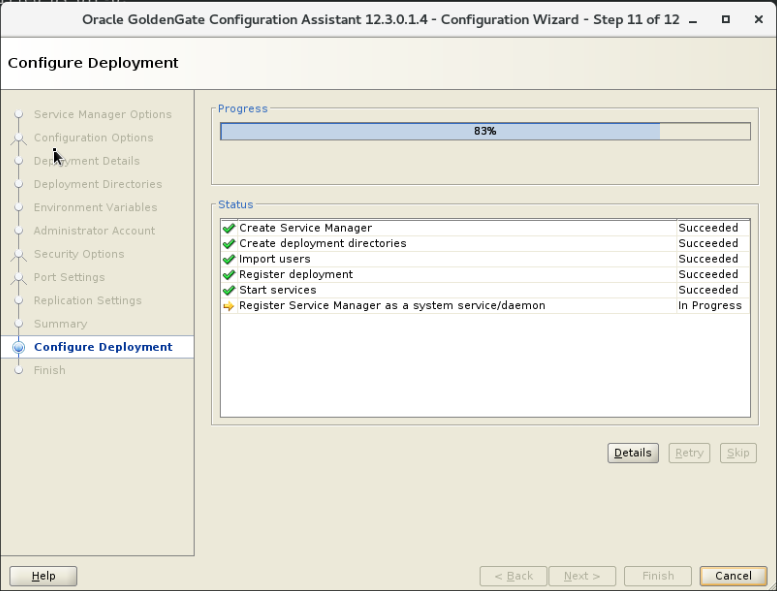

- For the "Execute Configuration Scripts" screen, you will be prompted to manually execute the registerServiceManager.sh script which will daemonize the SerivceManager executable to enable it to be started and stop on system shutdown and startup.

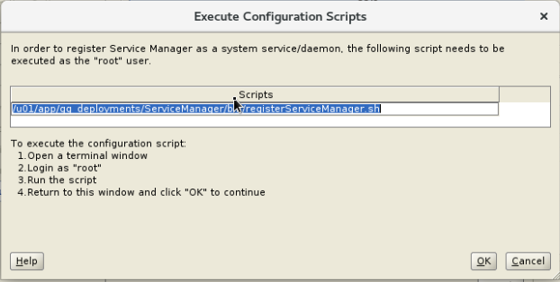

- At a terminal prompt login as root using the sudo su - command and execute the shell script as directed:

`[oracle@eurosrvr ~] sudo su -`

`[root@eurosrvr ~] /u01/app/gg_deployments/ServiceManager/bin/registerServiceManager.sh`

- The output should look like the following:

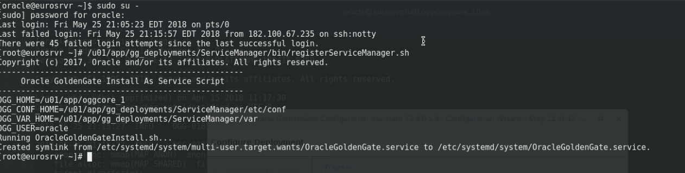

- When complete go back to the "Execute Configuration Scripts" screen and click on the "Ok" button

- For the "Finish" screen confirm the sucessful deployment status and click on the "Close" button.   

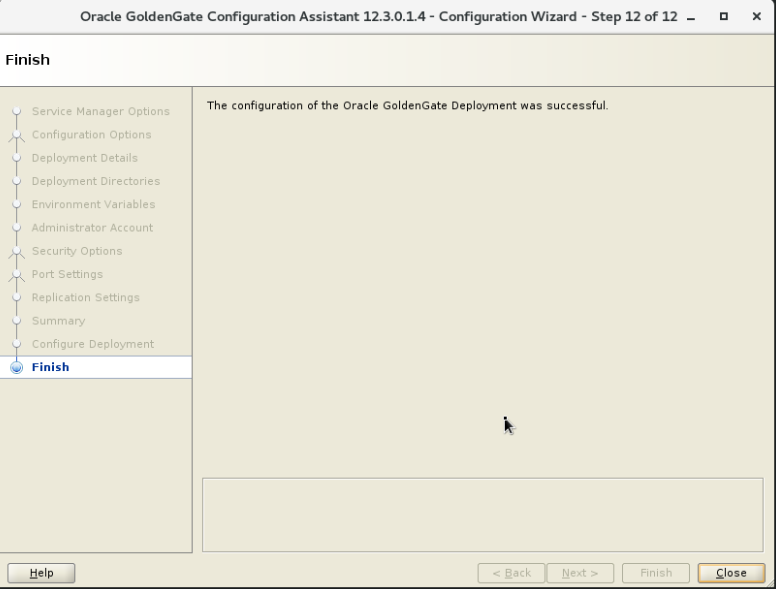

- The GoldenGate ServiceManager deployment and the "euro" deployment are now complete and ready to start using.   Lets now verify the deployment by connecting through the brower interface.  
- Open up a browser window in your client VM environment in Ravello or on your laptop using a browser (like Chrome or Firefox) and enter the following URL and port: https://emeatargetdb-goldengatemicroser-s7k6yjyo.srv.ravcloud.com:8890 [make sure to change this URL for the deployed service].  
- You should get a sign on page.   Sign in using the username: "ggadmin" and password "welcome1".

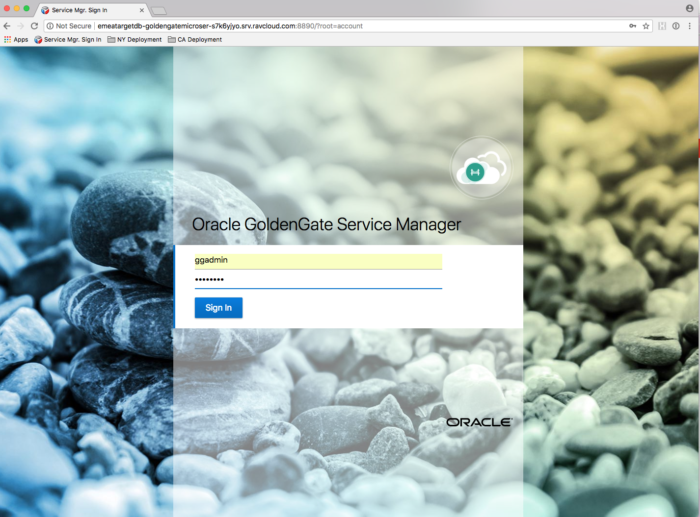

- You will then be taken to the following page.   Review that the Services for the "euro" deployment and the ServiceManager are all in a "Running" state. 

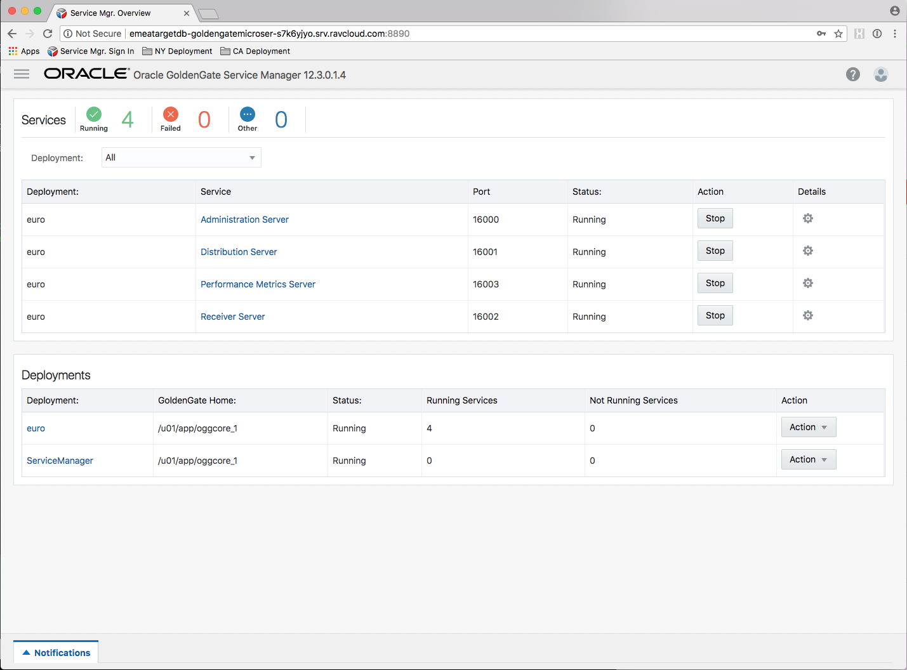

You have completed lab 100!   **Great Job!**