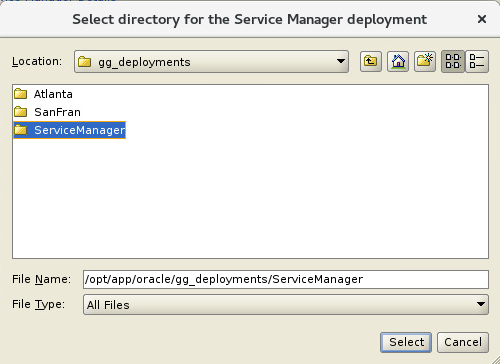
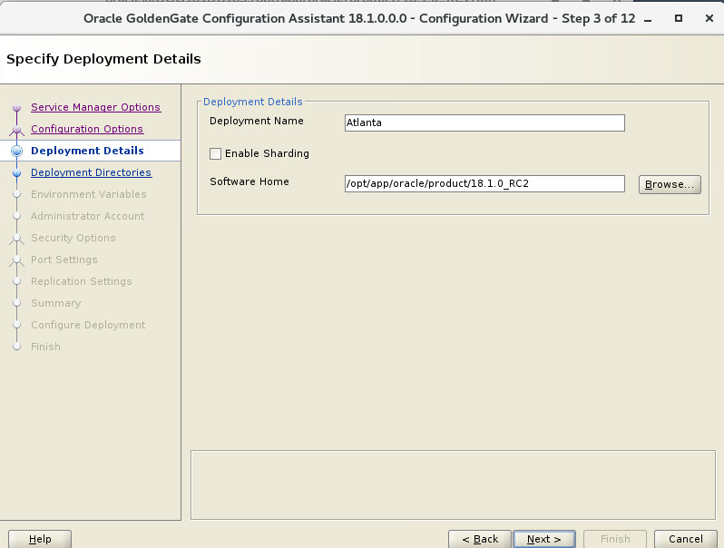
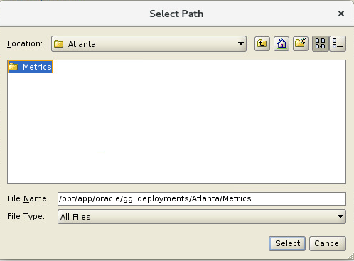

Update January 02, 2019

## Configuring ServiceManager, Atlanta and SanFran Deployments
## Introduction

This lab walks you through configuring ServiceManager, Atlanta and SanFran deployments using **Goldengate 18.1 MicroServices** web interface and the **Oracle GoldenGate Configuration Assistant (OGGCA)** silent install scripts in a Ravello environment.

## Objectives

-	Configure the initial ServiceManager and then the Atlanta and SanFran Deployments 
-	Connect to the Admin Service through a web browser and confirm that the deployments succeeded and that the ServiceManager and core GoldenGate services are running.

## Required Artifacts

-   VNC Client for the initial install and deployment. (Refer to Lab 100, for more information on using TightVNC connection)
-	Browser to check the deployment.

### **STEP 1**: Open up a terminal window and create the ServiceManager and Source(Atlanta) Deployment

In this step you will create the initial ServiceManager. ServiceManager is the bootstrap process that can be configured as a daemon process in Unix and windows so that it can start and stop on system startup and shutdown.   
It also is responsible for starting and stopping the other GoldenGate services and presents the initial web user interface and access point for the AdminClient command line interface.

-	On the desktop, right-click and select “Open Terminal”.

-   Then, change to the **/opt/app/oracle/product/18.1.0_RC2/bin** directory.

		cd /opt/app/oracle/product/18.1.0_RC2/bin

-   Then, run the **oggca.sh** script:

		[oracle@@OGG181DB183 bin] ./oggca.sh

-	The following screen will appear.   

-	Select the option to **"Create New Service Manager"** and click on the **"Browse"** to select the location for the Service Manager.

-	For the directory selection dialog box navigate to the **"/opt/app/oracle/gg_deployments/ServiceManager/"** directory and click on the **"Select"** button.

-	For the ServiceManager details screen enter the hostname of **"OGG181DB183"** for the listening hostname/address and enter **"16000"** for the listening port value.  Click on the **"Register Service as a system service/daemon"** checkbox. Click on **"Next"** to continue the configuration.   

- 	Since this is the **First deployment** on the system, you will only have ***one*** option. Take the default and click **Next**.

-	You will need to provide a **Deployment Name** which in this case is **Atlanta** and the **OGG_HOME** is selected by default. If the wrong OGG_HOME is listed; use the Browse button to correct it.

-	For the directory selection dialog box navigate to the **"/opt/app/oracle/gg_deployments/ServiceManager/Atlanta"** directory and click on the **"Select"** button.

-	For  the **"Specify Enviroment Variables"** screen, review the settings and click on **"Next"** to continue.  

- 	For the **"Specify Administrator Account"** screen, enter **"ggadmin"** for the username field, and enter **"Welcome1"** for the password field.  Enter the same value of **"Welcome1"** for the confirm password field.   Click on **"Next"** to continue.

- 	For the **"Specify Security Options"** screen, make sure all the **"SSL/TLS security"** and **"This nonsecure deployment will be used to send trail data to a secure deployement"** checkboxes are ***unchecked***.  Click on **"Next"** to continue.

- 	For the **"Specify Port Settings"** screen, set the following field and checkbox values (you will note that they will autofill based on the first setting which is fine).   

| Field/Checkbox				|	Setting	|
|-------------------------------|-----------|
|Administration Server Port"	| 	16000	|
|Distribution Server Port"		|	16001	|
|Receiver Server Port"			| 	16002	|
|Enable Monitoring"				| 	Checked	|
|Metrics Server Port			|	16003	|
|Metrics Server UDP Port (data) |   16004	|
|Metrics Server Datastore Type  |   BDB		|

-	For the **"Metrics Server Datastore home"** click on the button next to the option and the **Select Path** dialog box will appear.

-  Select the **New Folder** button and create a folder called **Metrics** then click **Select**

-	For the **Metrics Server Datastore home** you should now have the following:

|Metrics Server Datastore home  |   /opt/app/oracle/gg_deployment/Atlanta/Metrics	| 

-	Click **"Next"** to continue.

- 	For the "Specify OGG Replication Settings" screen, enter **GGATE** for the "Default Schema" field.  Click on **"Next"** to continue.
 

- 	For the **"Summary"** screen review the options carefully and then select the **"Finish"** button.

- 	Follow the progress carefully on the **next** screen.

- 	For the **"Execute Configuration Scripts"** screen, you will be prompted to manually execute the ***registerServiceManager.sh*** script which will daemonize the SerivceManager executable to enable it to be started and stop on system shutdown and startup.

- 	At a terminal prompt login as root using the ***sudo su*** - command and execute the shell script as directed:

		[oracle@OGG181DB183 ~]$ sudo su -
		[root@OGG181DB183 ~]# /opt/app/oracle/gg_deployments/ServiceManager/bin/registerServiceManager.sh

- 	The output should look like the following:

- 	When complete go back to the **"Execute Configuration Scripts"** screen and click on the **"Ok"** button

- 	For the **"Finish"** screen confirm the ***successful deployment status*** and click on the **"Close"** button.   

**The GoldenGate ServiceManager** deployment and the **"Atlanta"** deployment are now complete and ready to start using.   Lets now verify the deployment by connecting through the brower interface.  

- 	Open up a browser window in your client VM environment in Ravello or on your laptop using a browser (like Chrome or Firefox) and enter the following URL and port: **http://localhost:16000** .  
- 	If you're using the browser on your laptop, change **localhost** to the **Ravello URL or IP Address** your instructor gave out at the beginning of the workshop **same one you used for the VNC Session**.
- 	You should get a sign on page.   Sign in using the username: **"ggadmin"** and password **"Welcome1"**.

- You will then be taken to the following page.   Review that the Services for the ***"Atlanta"*** deployment and the ServiceManager are all in a ***"Running"*** state. 

### **STEP 2**: Configuring Target (SanFran) deployment using OGGCA silent install script

In this step you will configure the Target (SanFran) deployment. 

-	If you don't have a terminal windows open already, on the desktop, right-click and select “Open Terminal”.

-   Then, change to the **OGG181_WHKSHP/Lab2** directory.

		cd /opt/app/oracle/product/18.1.0_RC2/bin

-	Once you login into the ***Remote desktop***,traverse to **applications** and open up the **Terminal**.

-   Then, change current directory to the **Lab2** directory.

		[oracle@OGG181DB183 ~]$ cd ~/OGG181_WHKSHP/Lab2

-   You will run the **create_deployment.sh** script to create the SanFran deployment using a response file for OGGCA.

-	Review the **create_deployment.sh** script
		
		[oracle@OGG181DB183 Lab2]$ less create_deployment.sh 

-	The arguments for the script are:

	create_deployment.sh A1  A2 A3 A4 A5 A6 A6 A7 A8

|    Arguement    | DESCRIPTION	       	        |       VALUES	      |
|-----------------|-----------------------------|---------------------|
|      A1         |Deployment Name	            | 	    SanFran	      |
|      A2         |Admin User Password	        |	    Welcome1      |
|      A3         |Service Manager Port     	| 	    16000	      |
|      A4         |Administration Server Port	| 	    17001	      |
|      A5         |Distribution Server Port 	|	    17002	      |
|      A6         |Receiver Server Port         |       17003	      |
|      A7         |Metrics Server Port          |       17004         |
|      A8         |Metrics Server UDP Port      |       17005         |

-	Run the script

		[oracle@OGG181DB183 Lab2]$ ./create_deployment.sh SanFran Welcome1 16000 17001 17002 17003 17004 17005
		Successfully Setup Software.

-	Once the script is executed, you will see a statement saying that the ***“Successfully Setup Software.”*** indicates that deployment ***SanFran*** has been created.

-	Return to the browser and refresh (if it hasn't refreshed automatically already) and check to see that the ***SanFran*** deployment is displayed.
	

You have completed lab 200!   **Great Job!**
