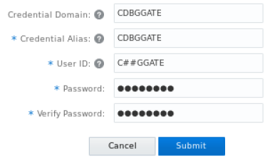
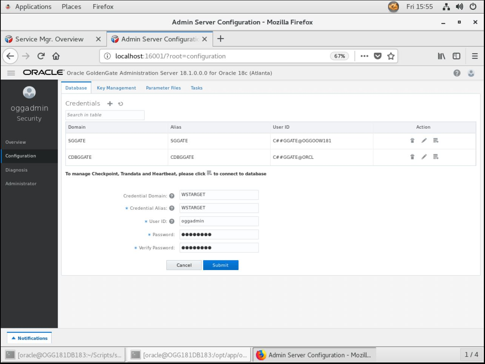
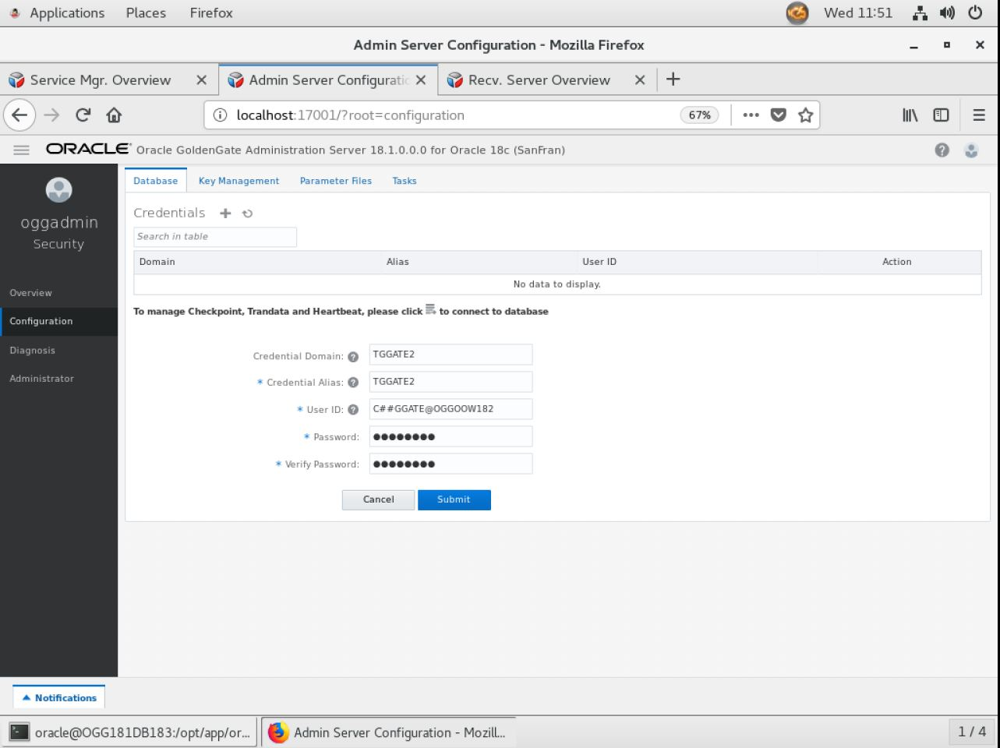
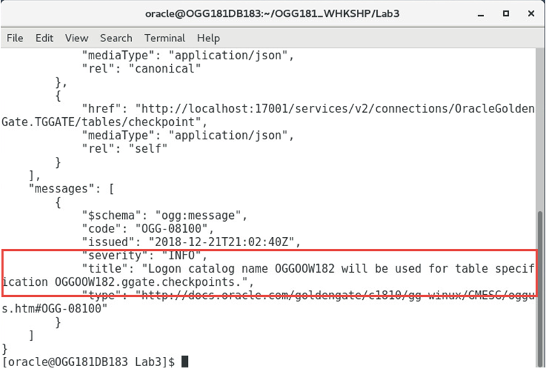

Update December 28, 2018

## Creating Credentials in GoldenGate Micro Services Architecture
## Introduction

In this Lab, you will configure the database user credentials entries needed for replication. 

## Objectives

-   Create Database User Credentials for setting up the Goldengate Processes.

## Required Artifacts

Lab 3: To begin this Lab, follow the below steps

Time: 25 minutes

Steps:

1.	Open the admin console page http://localhost:16000, provide the credentials and click on "Sign in".

 Figure 3-1:

2. After logging in, find and open the Administration Server for your first deployment. In this example, the first deployment is Atlanta. Go to Atlanta administration server page by click on 16001.

 Figure 3-2:

3. Click on hamburger symbol on top left corner of the page, select Configuration and select "+" sign beside credentials.

 Figure 3-3:

4. Enter the credentail details as given below and click on submit. Password is "ggate"

| Field/Checkbox				|	Setting	|
|-------------------------------|-----------|
|Credential Domain|	SGGATE|
|Credential Alias|	SGGATE|
|User ID|	C##GGATE@OGGOOW18|
|Password|	ggate|
|Verify Password| 	 ggate|

 Figure 3-4:

5.  On the Configuration page, select the plus ( + ) sign to begin adding a credential. You will need to add the alias for a user that will connect to CDB (ORCL). The CDB alias will be used to connect to the database to read the required files for extraction operations, and the PDB1 user SGGATE will be used to add TRANDATA to the schemas used in replication.

Figure 3-5:

 

6. Enter the CDB connection details as given below and click on submit. Password is Welcome1

Figure 3-6:

 

7.	Since you are configuring an non-SSL replication environment, you will need to create a “Protocol User”. A protocol user is simply a credential that uses the target ServiceManager login to allow the Distribution Service to access the Receiver Service.
In order to create this user, click the plus sign ( + ) next to the word Credentials. Then provide the connection information needed , notice that you will be using the Service Manager login in this credential.

Figure 3-7:

 
 

8.	Refresh the Administration Service Configuration page to see if Credential was created.

9.  Next, you will create a target database User Alias which is very similar to the one that you created earlier, the difference being that this alias will be called TGGATE2 and will reside in the second Deployment (SanFran).  This will be the GoldenGate admin user for the database for all labs.

To create the TGGATE2 connection follow the below steps:

a. Open the Administration Server for the second deployment by clicking on the 17001 link in the admin page. Login with the following credentials oggadmin/Welcome1

Figure 3-8:

b. Open the Configuration option to add your credentials needed to connect to PDB2 (OGGOOW182). After creating the credential, login and verify that it works. You will need to create 1 credential for the user to connect to PDB2. We will use the same common user as before, C##GGATE@OGGOOW182, with password ggate. Click Submit when finished.

Figure 3-9:

 
 

10.	Next, you will create a Checkpoint Table to be used by all the Replicats for the workshop. This will be done by using the add_CheckpointTable.sh script. Run the following command from the Lab6 directory:

            $ ./add_CheckpointTable.sh Welcome1 17001

Upon a successful run, the corresponding information will be displayed in the Terminal window.

Figure 3-10:

 

11. The Checkpoint Table can also be viewed under the TTGATE alias from the Boston Deployment’s Administration Service > Configuration page. This is done by clicking the “log in” button and then looking under Checkpoint.

Figure 3-11:

 

You have completed lab 300!   **Great Job!**

