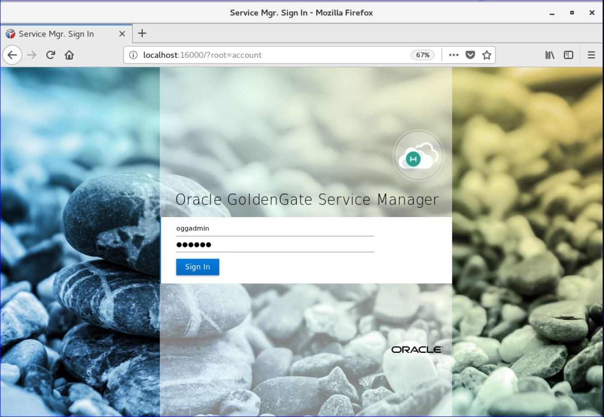

Update December 28, 2018

## Creating Credentials in GoldenGate Micro Services Architecture
## Introduction

In this Lab, you will configure the database and protocol user credentials entries needed for replication. 

## Objectives

-   Clone databases used for the credentials.
-   Create Source Database and Protocol User Credentials for setting up the Goldengate Processes.
-   Create Target Database User Credentials

### **STEP 1**: Clone Databases

In this step you will run several scripts.

-   Run the **clone_pdb_reset.sh** script.  This script drops the source and target PDBs.

        [oracle@OGG181DB183 db]$ ./clone_pdb_reset.sh

-   Run the **clone_pdb_181.sh** script.  This script recreates the source by cloning a base PDB.

        [oracle@OGG181DB183 db]$ ./clone_pdb_181.sh

-   Run the **clone_pdb_182.sh** script.  This script recreates the target by cloning the source PDB.

        [oracle@OGG181DB183 db]$ ./clone_pdb_182.sh

### **STEP 2**: Create the root CDB user credential and the GoldenGate Protocol credential.

- 	Open up a browser window in your client VM environment in Ravello or on your laptop using a browser (like Chrome or Firefox) and enter the following URL and port: **http://localhost:16000** .  
- 	If you're using the browser on your laptop, change **localhost** to the **Ravello URL or IP Address** your instructor gave out at the beginning of the workshop **same one you used for the VNC Session**.
- 	You should get a sign on page.   Sign in using the username: **"ggadmin"** and password **"Welcome1"**.

-   After logging in, find and open the Administration Server for your first deployment. In this example, the first deployment is Atlanta. Go to Atlanta administration server page by clicking on 16001.

-   Click on hamburger symbol on top left corner of the page, select Configuration and select "+" sign beside credentials.

-   Here will create the root container database credentials.  Enter the credential details as given below and click on submit. Password is "ggate".  You will need to add the alias for a user that will connect to CDB (ORCL). The CDB alias will be used to connect to the database to read the required files for extraction operations, and the PDB1 user SGGATE will be used to add TRANDATA to the schemas used in replication.

| Field/Checkbox				|	Setting	|
|-------------------------------|-----------|
|Credential Domain|	SGGATE|
|Credential Alias|	SGGATE|
|User ID|	C##GGATE@orcl|
|Password|	ggate|
|Verify Password| 	 ggate|

Since you are configuring an non-SSL replication environment, you will need to create a “Protocol User”. A protocol user is simply a credential that uses the target ServiceManager login to allow the Distribution Service to access the Receiver Service.

-   Click the plus sign ( + ) next to the word Credentials. Then provide the connection information needed, notice that you will be using the Service Manager login in this credential.

 

| Field/Checkbox				|	Setting	|
|-------------------------------|-----------|
|Credential Domain|	WSTARGET|
|Credential Alias|	WSTARGET|
|User ID|	oggadmin|
|Password|	Welcome1|
|Verify Password| 	 Welcome1|

 
 
 -  Refresh the Administration Service Configuration page to see if Credential was created.

### **STEP 3**: Create the target database user credentials using the REST API.
Next, you will create a target database User Alias which is very similar to the one that you created earlier, the difference being that this alias will be called TGGATE and will reside in the second Deployment (SanFran).  This will be the GoldenGate admin user for the target database.

Below are the parameters that will be used in exectuting the scripts.

| Field/Checkbox				|	Setting	|
|-------------------------------|-----------|
|Credential Domain|	TGGATE|
|Credential Alias|	TGGATE|
|User ID|	GGATE@OGGOOW182|
|Password|	ggate|
|Verify Password| 	 ggate|

To create the TGGATE connection follow the below steps:

-	If you don't have a terminal window opened yet, right click on the Desktop of the VNC session and select **Open Terminal**

-   In the terminal window and change directory to Lab3 and review the script that has the JSON information used to add the database credentials.

        [oracle@OGG181DB183 ~]$ cd ~/OGG181_WHKSHP/Lab3
        [oracle@OGG181DB183 Lab3]$ cat create_credential_GGAlias_target.sh 
        #!/bin/bash

        #variables
        vPass=$1
        vASHost=localhost
        vASPort=$2
        vGGUser=$3
        vGGPass=$4
        vGGAlias=TGGATE

        function _createAlias {
            curl -X POST \
            http://$vASHost:$vASPort/services/v2/credentials/OracleGoldenGate/$vGGAlias \
            --user "oggadmin:"$vPass   \
            -H 'Cache-Control: no-cache' \
            -d '{
                "userid":"'$vGGUser'",
                "password":"'$vGGPass'"
            }' | python -mjson.tool
        }

        function _main {
            _createAlias
        }

        _main

-   Run the **create_credential_GGAlias_target.sh** script.

        [oracle@OGG181DB183 Lab3]$ ./create_credential_GGAlias_target.sh Welcome1 17001 ggate@oggoow182 ggate TGGATE
        % Total    % Received % Xferd  Average Speed   Time    Time     Time  Current
                                        Dload  Upload   Total   Spent    Left  Speed
        100   834  100   761  100    73  34234   3283 --:--:-- --:--:-- --:--:-- 36238
        {
            "$schema": "api:standardResponse",
            "links": [
                {
                    "href": "http://localhost:17001/services/v2/credentials/OracleGoldenGate/TGGATE",
                    "mediaType": "application/json",
                    "rel": "canonical"
                },
                {
                    "href": "http://localhost:17001/services/v2/credentials/OracleGoldenGate/TGGATE",
                    "mediaType": "application/json",
                    "rel": "self"
                }
            ],
            "messages": [
                {
                    "$schema": "ogg:message",
                    "code": "OGG-15114",
                    "issued": "2019-02-12T23:16:17Z",
                    "severity": "INFO",
                    "title": "Credential store altered.",
                    "type": "http://docs.oracle.com/goldengate/c1810/gg-winux/GMESG/oggus.htm#OGG-15114"
                },
                {
                    "$schema": "ogg:message",
                    "code": "OGG-15116",
                    "issued": "2019-02-12T23:16:17Z",
                    "severity": "INFO",
                    "title": "No information found in credential store.",
                    "type": "http://docs.oracle.com/goldengate/c1810/gg-winux/GMESG/oggus.htm#OGG-15116"
                }
            ]
        }

### **STEP 4**: Create the target GoldenGate checkpoint table using the REST API.

-   In the same terminal window, review the script that has the JSON information to to add the checkpoint table.

        [oracle@OGG181DB183 ~]$ cat add_CheckpointTable.sh
        [oracle@OGG181DB183 Lab3]$ cat add_CheckpointTable.sh 
        #!/bin/bash

        #variables
        vPass=$1
        vASHost=localhost
        vASPort=$2
        vGGAlias=OracleGoldenGate.TGGATE

        function _createCkptTbl {
            curl -X POST \
            http://$vASHost:$vASPort/services/v2/connections/$vGGAlias/tables/checkpoint \
            --user "oggadmin:"$vPass   \
            -H 'Cache-Control: no-cache' \
            -d '{
                    "operation":"add",
                    "name":"ggate.checkpoints"
            }' | python -mjson.tool
        }

        function _main {
            _createCkptTbl
        }

        _main

-   Run the **add_CheckpointTable.sh** script.

        [oracle@OGG181DB183 Lab3]$ ./add_CheckpointTable.sh Welcome1 17001
        % Total    % Received % Xferd  Average Speed   Time    Time     Time  Current
                                        Dload  Upload   Total   Spent    Left  Speed
        100   719  100   635  100    84   1789    236 --:--:-- --:--:-- --:--:--  1793
        {
            "$schema": "api:standardResponse",
            "links": [
                {
                    "href": "http://localhost:17001/services/v2/connections/OracleGoldenGate.TGGATE/tables/checkpoint",
                    "mediaType": "application/json",
                    "rel": "canonical"
                },
                {
                    "href": "http://localhost:17001/services/v2/connections/OracleGoldenGate.TGGATE/tables/checkpoint",
                    "mediaType": "application/json",
                    "rel": "self"
                }
            ],
            "messages": [
                {
                    "$schema": "ogg:message",
                    "code": "OGG-08100",
                    "issued": "2019-02-12T23:16:45Z",
                    "severity": "INFO",
                    "title": "Logon catalog name OGGOOW182 will be used for table specification OGGOOW182.ggate.checkpoints.",
                    "type": "http://docs.oracle.com/goldengate/c1810/gg-winux/GMESG/oggus.htm#OGG-08100"
                }
            ]
        }

The Checkpoint Table can also be viewed under the TTGATE alias from the Deployment’s Administration Service > Configuration page. This is done by clicking the “log in” button and then looking under Checkpoint.

 

 

You have completed lab 300!   **Great Job!**

