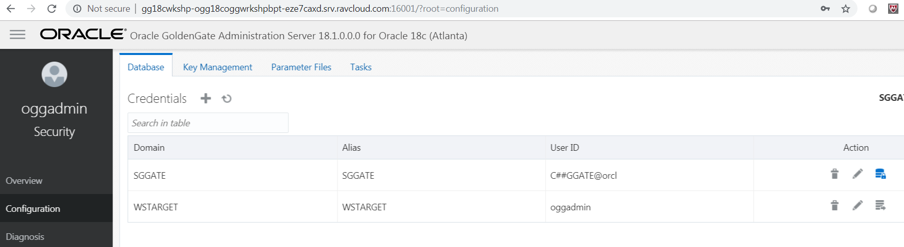

Update December 28, 2018

## Creating Credentials in GoldenGate Micro Services Architecture
## Introduction

In this Lab, you will configure the database user credentials entries needed for replication. This requires running the following scripts:

Create_credential_Protocol.sh

Create_credential_GGAlias.sh

After running these scripts, you will be able to establish connections for non-SSL replication between the source and target pluggable database.

## Objectives

-   Create Database User Credentials for setting up the Goldengate Processes.

## Required Artifacts

Lab 3: To begin this Lab, follow the below steps

Time: 25 minutes

Steps:

1.	From the Terminal window in the VNC Console, navigate to the Lab3 directory under /home/oracle/Scripts/Lab3.

        $ cd /home/oracle/Scripts/Lab3

2.	From here you will run the script to create the initial credentials for access to the database.  In order to create the required credentials, run the following:

        $ ./create_credential_GGAlias.sh Welcome1 16001 c##ggate@OGGOOW181 sggate

Upon a successful run, you should see a message that states, “Credential store created”.

 Figure 3-1:

 

3.	Now check in the web UI that the Credentials were created successfully in the Administration Service of the Atlanta Deployment (http://localhost:16001) from within the browser.

Figure 3-2:

     

 
4.	Since you are configuring an non-SSL replication environment, you will need to create a “Protocol User”. A protocol user is simply a credential that uses the target ServiceManager login to allow the Distribution Service to access the Receiver Service.
In order to create this user, you will need to run the create_credential_Protcol.sh script back in the Terminal window of the VNC Console.

            $ ./create_credential_Protcol.sh Welcome1 16001 oggadmin Welcome1

After running the script, you will see “Credential Store altered” in the resulting JSON output.

Figure 3-3:

 
 

5.	Refresh the Administration Service Configuration page to see that a second Credential was created.

Figure 3-4:

 

6.  On the Configuration page, select the plus ( + ) sign to begin adding a credential. At this point, you will be able to add a Credential Alias.  You will need to add the alias for a user that will connect to CDB (ORCL). The CDB alias will be used to connect to the database to read the required files for extraction operations, and the PDB1 user SGGATE will be used to add TRANDATA to the schemas used in replication.

Figure 3-5:

 

7. Enter the CDB connection details as given below and click on submit.

Figure 3-6:

 
 

8.  Next, you will create a target database User Alias which is very similar to the one that you created earlier, the difference being that this alias will be called TGGATE2 and will reside in the second Deployment (SanFran).  This will be the GoldenGate admin user for the database for all labs.

To create the TGGATE2 connection follow the below steps:

a. Open the Administration Server for the second deployment by clicking on the 17001 link in the admin page. Login with the following oggadmin/Welcome1

Figure 3-7:

b. Open the Configuration option to add your credentials needed to connect to PDB2 (OGGOOW182) (Figure 7e-3). After creating the credential, login and verify that it works. You will need to create 1 credential for the user to connect to PDB2. We will use the same common user as before, C##GGATE@OGGOOW182, with password ggate. Click Submit when finished.

Figure 3-8:

 
 

9.	Next, you will create a Checkpoint Table to be used by all the Replicats for the workshop. This will be done by using the add_CheckpointTable.sh script. Run the following command from the Lab6 directory:

            $ ./add_CheckpointTable.sh Welcome1 17001

Upon a successful run, the corresponding information will be displayed in the Terminal window.

Figure 3-9:

 

10. The Checkpoint Table can also be viewed under the TTGATE alias from the Boston Deployment’s Administration Service > Configuration page. This is done by clicking the “log in” button and then looking under Checkpoint.

Figure 3-10:

 

You have completed lab 300!   **Great Job!**

