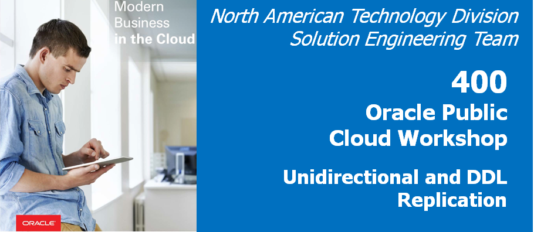

Update Feburary 26, 2019

## UniDirectional and DDL Replication
## Introduction

This lab walks you through uni-directional and DDL replication between to database schemas using Goldengate 18.1 Micro services web interface in a Ravello environment.

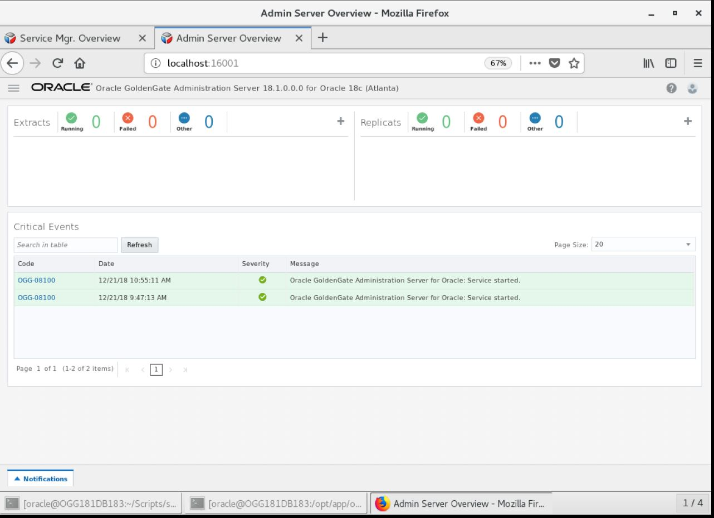

This lab supports the following use cases:
-	One way replication to target database where both databases are already in sync.
-   Simple DDL replication example.

## Objectives

This lab is in several parts.  The first part will setup the Integrated Extract for Oracle GoldenGate 18c Microservices Architecture for a uni-directional configuration using the SOE schema in the OGGOOW181 and OGGOOW182 PDBs. 

### **STEP 1**: Log into the Service Manager and check credentials.

- 	Open up a browser window in your client VM environment in Ravello or on your laptop using a browser (like Chrome or Firefox) and enter the following URL and port: **http://localhost:16000** .  

- 	If you're using the browser on your laptop, change **localhost** to the **Ravello URL or IP Address** your instructor gave out at the beginning of the workshop (**same one you used for the VNC Session**).

- 	You should get a sign on page.   Sign in using the username: **"oggadmin"** and password **"Welcome1"**.

 
 
-   After logging in, find and open the Administration Server for your first deployment.  In this example, the first deployment is Atlanta.  Click on the link with the port number for the Admin Service for Atlanta.

Note: You will be required to login again.  Use the same Administrator account that was used with the Service Manager.

 
 
-   Before you can create an Extract, you need to setup a credential alias for the GoldenGate user (C##GGATE).  This was done in lab 300.

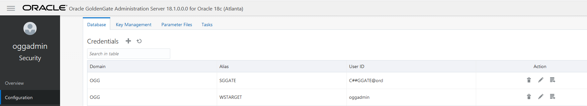 

-   Verify that the credentials you created work.  There is a little database icon under Action in the table.  Click on this for the database Credential Alias and you should be able to login to the database.

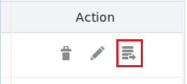 
 
### **STEP 2**: Add SCHEMATRANDATA to the SOE schema using the SGGATE Credential Alias.

-   After logging into the database as described for OGGOOW181, find the Trandata section.  Click on the plus ( + ) sign and make sure that the radio button for Schema is selected .  At this point, you provide the Schema Name(OGGOOW181.SOE), enable All Columns and Scheduling Columns, and click Submit.

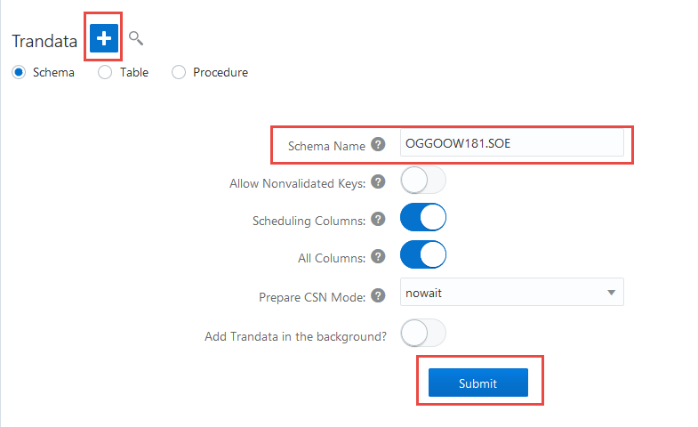 
 
-   You will notice that after you click Submit, there is no return message that states the operation was successful.  You can verify that SCHEMATRANDATA has been added by looking searching by Schema.  To do this, click on the magnifying glass and provide the Schema name.

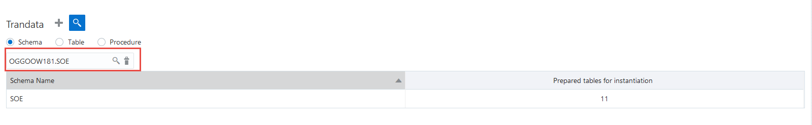 
 
### **STEP 3**: Add the Integrated Extract.

-   Navigate back to the Overview page of the Administration Server.  Then click on the plus sign ( + ) in the box for Extracts.

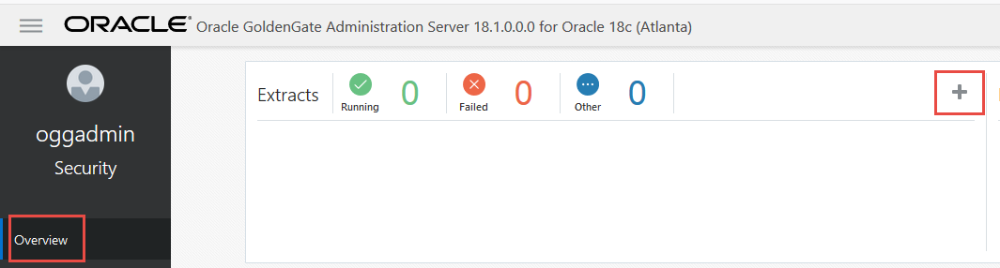 

-   After clicking the plus sign ( + ), you are taken to the Add Extract page.  Here you can choose from three different types of Extracts.  You will be installing an Integrated Extract.  Click Next.

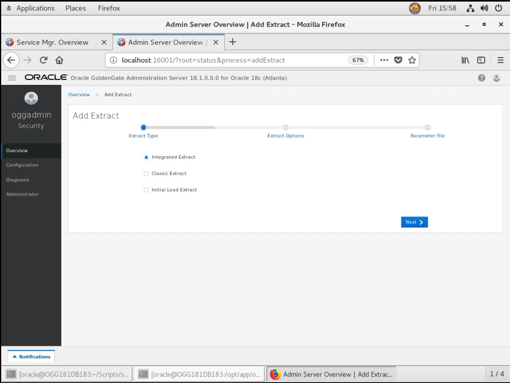 

-   The next page of the Add Extract process, is to provide the basic information for the Extract. Items required have a star ( * ) next to them.  Provide the required information and then click Next.  Keep in mind that the credentials needed to register the Extract need to be against the CDB (ORCL). Use the CDB domain and alias that you setup previously.

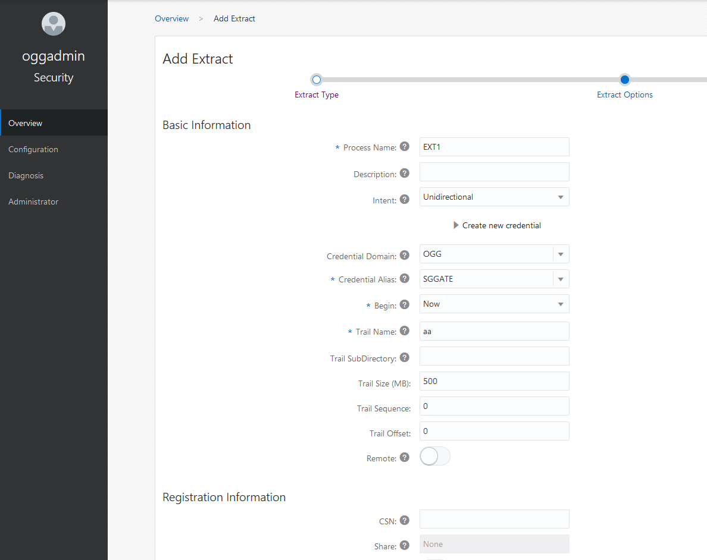 

-   When using the CDB credential, at the bottom of the page, you will be presented with a box where you can select the PDB that will be used. This will only appear when you have a valid credential for the CDB.  Once you see this box, make sure you select OGGOOW181, then click ** Next **.

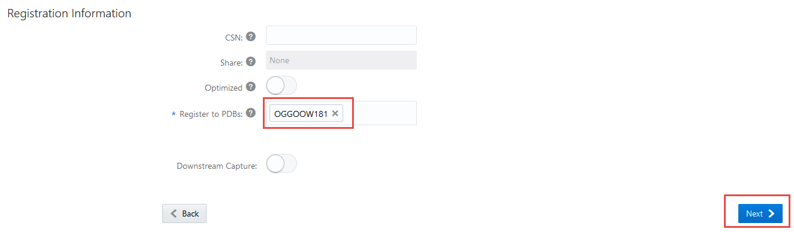 

On the last page of the Add Extract process, you are presented with a parameter file.  The parameter file is partially filled out, but missing the TABLE parameters. Insert the following list of TABLE parameter values into the parameter file.
   
    DDL INCLUDE ALL;
    SOURCECATALOG OGGOOW181
    TABLE SOE.*;

[Optional - For your information] You can also include specific table names for capturing the data changes, but extract will skip the create table DDLs. Sample TABLE parameter vales are given below.

    DDL INCLUDE ALL;
    SOURCECATALOG OGGOOW181
    TABLE SOE.ADDRESSES;
    TABLE SOE.CUSTOMERS;
    TABLE SOE.ORDERS;
    TABLE SOE.ORDER_ITEMS;
    TABLE SOE.CARD_DETAILS;
    TABLE SOE.LOGON;
    TABLE SOE.PRODUCT_INFORMATION;
    TABLE SOE.INVENTORIES;
    TABLE SOE.PRODUCT_DESCRIPTIONS;
    TABLE SOE.WAREHOUSES;
    TABLE SOE.ORDERENTRY_METADATA;

Once the TABLE statements are added, click Create and Run at the bottom of the page.
 
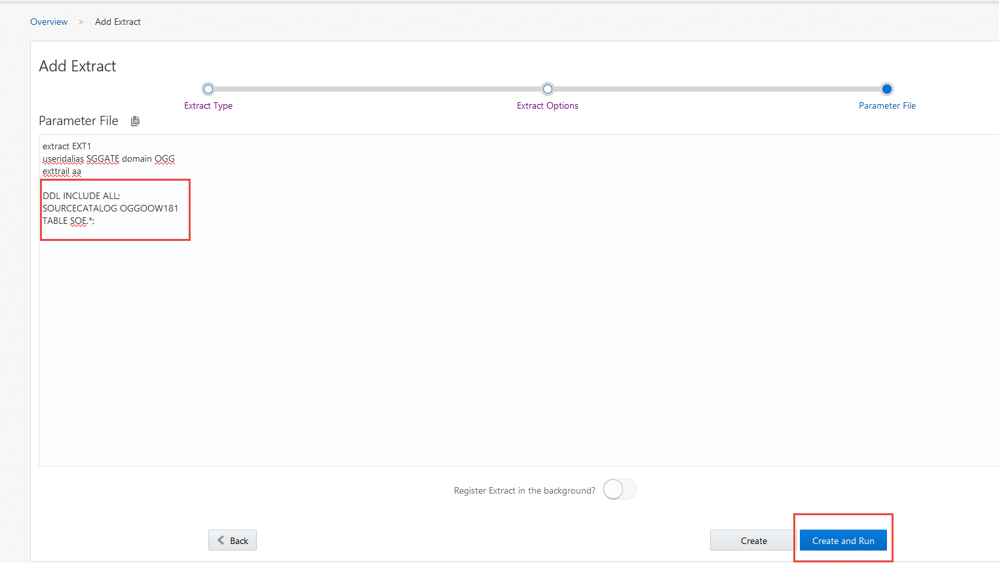 

The Administration Server page will refresh when the process is done registering the Extract with the database, and will show that the Extract is up and running

 

### **STEP 4**: Configure Uni-Directional Replication (Distribution Server).

This step will walk you through how to setup a Path within the Distribution Server.

-   Start from the Service Manager page.

 

-   Open the Distribution Server page for your first deployment (Atlanta).

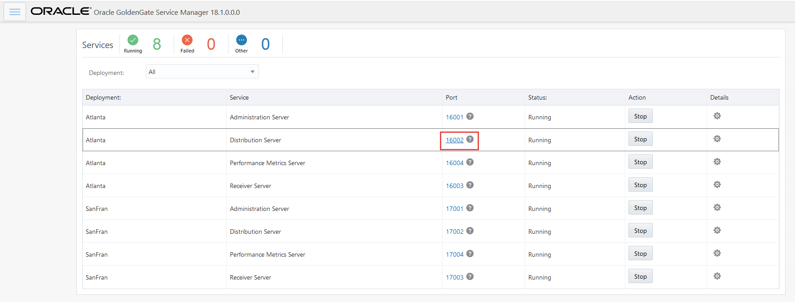

-   Click the plus sign ( + ) to add a new Distribution Path.

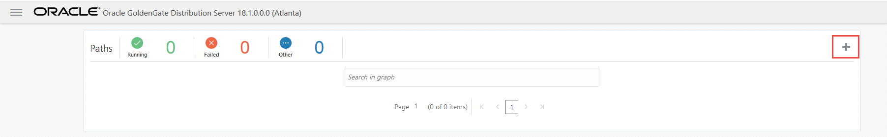 

-   On the Add Path page, fill in the required information.  Make note that the default protocol for distribution service is secure websockets **wss**.  You will need to change this to websockets **ws**.

Notice the drop down with the values WS, WSS, UDT and OGG.  These are the protocols you can select to use for transport.  Since you are setting up an unsecure uni-directional replication, make sure you select **WS**, then provide the following target information:

    Hostname: localhost
    Port: 17003
    Trail File: bb
    Domain: OGG
    Alias: WSTARGET

-   After filling out the form, click Create and Run at the bottom of the page.

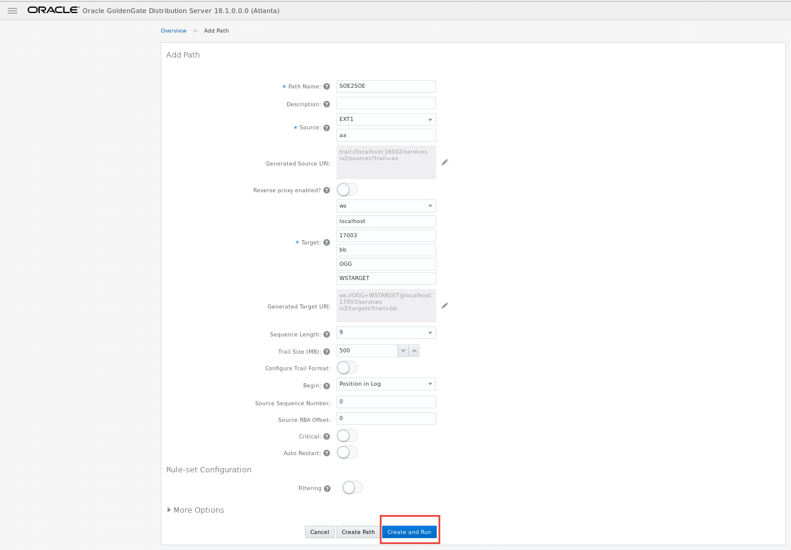 

-   Review the Distribution Service to see that the distribution path is created and running.
 
 

### **STEP 5**: Check Receiver Service.

## Objectives
Check the Receiver Server for the target database, which will receive the trail from the Distribution Path that you created on the source deployment.

-   Start from the Service Manager page for your second deployment.

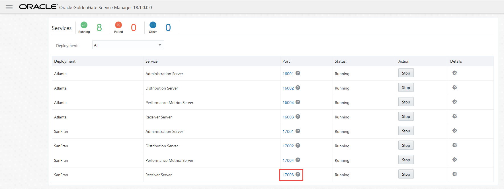 
 
-   Click on the Receiver Server link to open the Receiver Server page.  Verify that everything is configured.

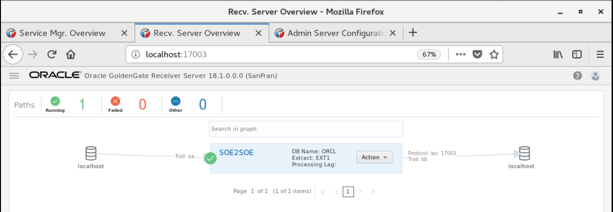 

### **STEP 6**: Configure Uni-Directional Replication (Integrated Replicat).

## Objectives
In this lab you will configure the Integrated Replicat for the second deployment.

-   Starting from the Service Manager page.
 
 
 
-   Open the Administration Server for the second deployment by clicking on the link.

 

-   This step requires a credential store for replicat to connect to target database. Use the TGGATE created in Lab300. 

-   Navigate back to the Overview page on the Administration Server.  Here you will begin to create your Integrated Replicat -   Click the plus sign ( + ) to open the Add Replicat process.
 
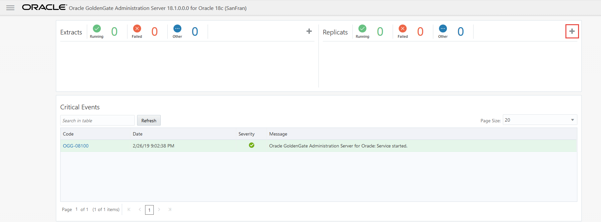 

-   With the Add Replicat page open, you want to create a Integrated Replicat.  Make sure the radio button is selected and click Next.

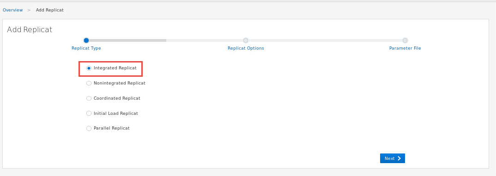 

-   Fill in the Replicat options form with the required information.  Your trail name should match the trail name you saw in the Receiver Server.  Once you are done filling everything out, click the Next button at the bottom of the screen.
** Ignore the CHECKPOINTTABLE warning message **
 
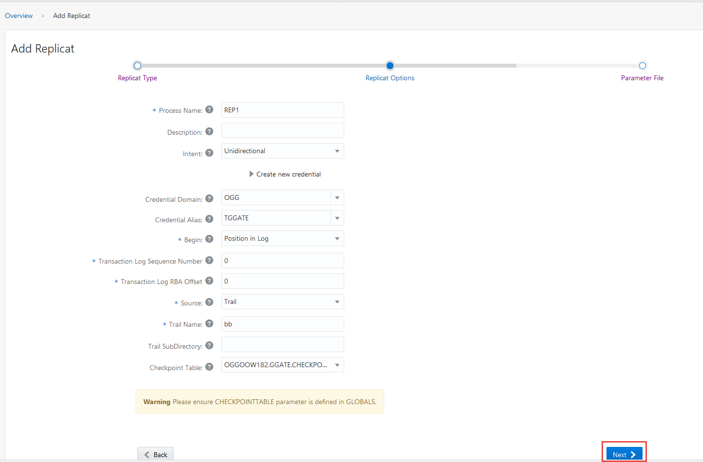 

-   You are next taken to the Parameter File page.  On this page, you will notice that a sample parameter file is provided -   You will have to remove the MAP statement (***MAP *.*, TARGET *.*;***) and replace it with the information below:

	    
	    MAP OGGOOW181.SOE.CUSTOMERS, TARGET SOE.CUSTOMERS, KEYCOLS(CUSTOMER_ID);
	    MAP OGGOOW181.SOE.ADDRESSES, TARGET SOE.ADDRESSES, KEYCOLS(ADDRESS_ID);
	    MAP OGGOOW181.SOE.ORDERS, TARGET SOE.ORDERS, KEYCOLS(ORDER_ID);
	    MAP OGGOOW181.SOE.ORDER_ITEMS, TARGET SOE.ORDER_ITEMS, KEYCOLS(ORDER_ID,LINE_ITEM_ID);
	    MAP OGGOOW181.SOE.CARD_DETAILS, TARGET SOE.CARD_DETAILS, KEYCOLS(CARD_ID);
	    MAP OGGOOW181.SOE.LOGON, TARGET SOE.LOGON;
	    MAP OGGOOW181.SOE.PRODUCT_INFORMATION, TARGET SOE.PRODUCT_INFORMATION;
	    MAP OGGOOW181.SOE.INVENTORIES, TARGET SOE.INVENTORIES, KEYCOLS(PRODUCT_ID,WAREHOUSE_ID);
	    MAP OGGOOW181.SOE.PRODUCT_DESCRIPTIONS, TARGET SOE.PRODUCT_DESCRIPTIONS;
	    MAP OGGOOW181.SOE.WAREHOUSES, TARGET SOE.WAREHOUSES;
	    MAP OGGOOW181.SOE.ORDERENTRY_METADATA, TARGET SOE.ORDERENTRY_METADATA;
	    
    	
-   Once the parameter file has been updated, click the Create and Run button at the bottom.

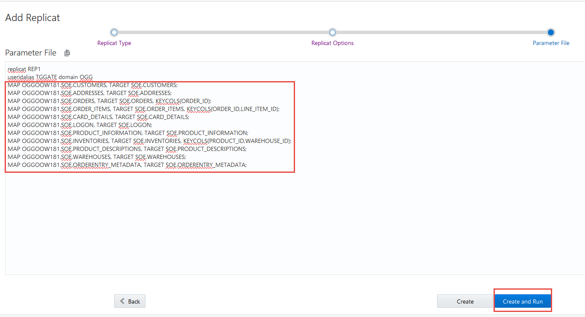 

-   At this point, you should have a fully functional uni-directional replication environment.

### **STEP 7**: Run Swingbench script to apply data to the source database.

-   Change directory to Lab4 run script **start_swingbench_181.sh**.  This will run for 1 min and you'll see the message ** Completed Run. ** when finished.

        [oracle@OGG181DB183 ~]$ cd ~/OGG181_WHKSHP/Lab4
		[oracle@OGG181DB183 Lab4]$ ./start_swingbench_181.sh 
        Author  :	 Dominic Giles
        Version :	 2.6.0.1046

        Results will be written to results.xml.
        Hit Return to Terminate Run...

        Time		Users
        23:41:06	[0/2]
        23:41:08	[0/2]
        23:41:09	[0/2]
        23:41:10	[0/2]
            .
            .
            .
        23:42:04	[2/2]
        23:42:05	[2/2]
        23:42:06	[2/2]
        23:42:07	[2/2]

        Completed Run.
        [oracle@OGG181DB183 Lab4]$ 

### **STEP 8**: Check Replication Results

-    From the Atlanta Admin Server Overview page, click the ** Action ** button by the Extract (EXT1) and click ** Details **.

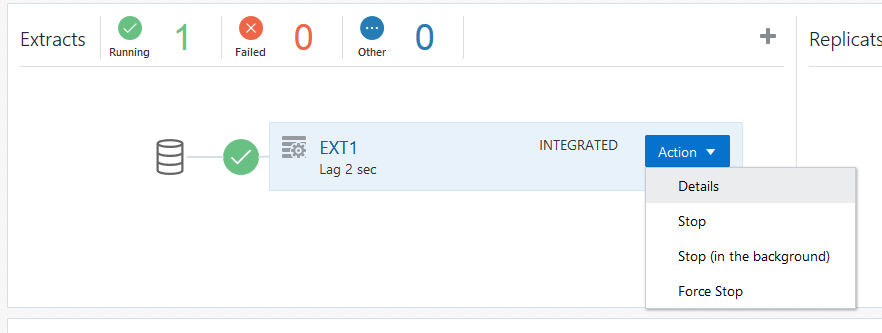 

-   Click on the Statistics Tab

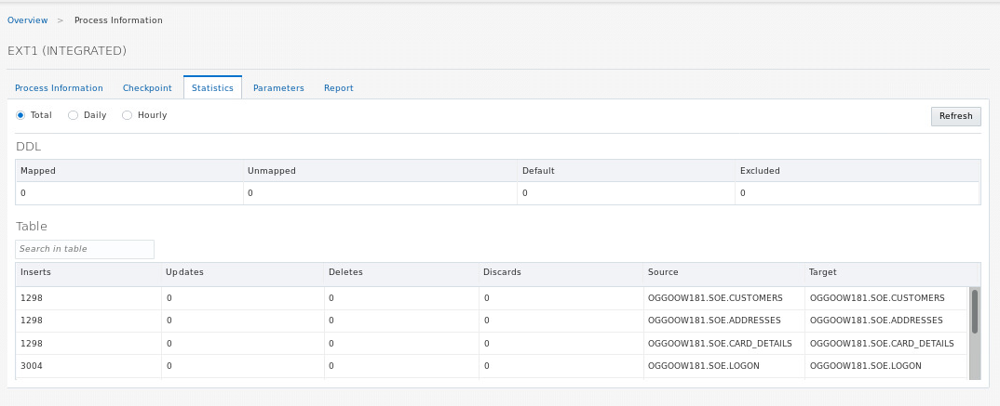 

-   From here you can see the counts and types of transactions against each table.  You can scroll through the list.

-   Next, from the SanFran Admin Server Overview page, click the ** Action ** button by the Replicat (REP1) and click ** Details **.

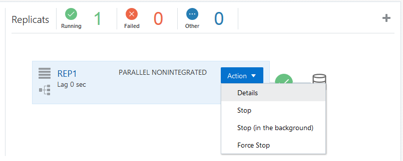 

-   Click on the Statistics Tab

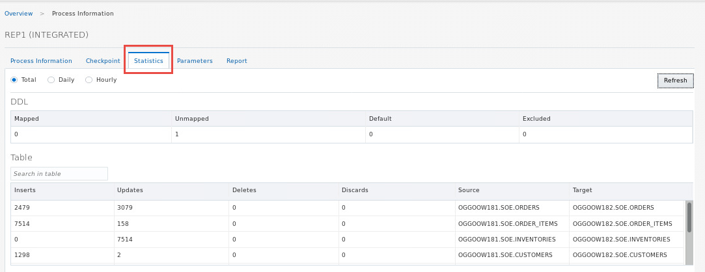 

-   Check to see if the counts match.

### **STEP 9**: DDL Replication.

## Objectives
In this lab we will perform a few DML and DDL operations on source pdb and check if those operations are properly replicated to target database.

Prerequisite: Source and target database should be in sync. Extract, Pump and Replicat should be up and running.

-   Logon to OGGOOW181 and OGGOOW182 pdbs using SOE user.  The password is ** soe **.

        [oracle@OGG181DB183 Lab4]$ sqlplus

        SQL*Plus: Release 18.0.0.0.0 - Production on Tue Feb 26 23:46:59 2019
        Version 18.3.0.0.0

        Copyright (c) 1982, 2018, Oracle.  All rights reserved.

        Enter user-name: SOE@OGGOOW181
        Enter password: 
        Last Successful login time: Tue Feb 26 2019 23:41:13 +00:00

        Connected to:
        Oracle Database 18c Enterprise Edition Release 18.0.0.0.0 - Production
        Version 18.3.0.0.0

        SQL> 

-   Create a employee table in OGGOOW181.

        SQL> CREATE TABLE EMPLOYEE (
           EMP_ID NUMBER(10),
           EMP_NAME VARCHAR2(30),
           DEPT VARCHAR2(20)
           );

        Table created.

        SQL> 

-   Go to target admin server page (SanFran), click ** Action ** on REP1 and select details option.

 

-   Click on statistics tab and check the DDL Mapped count.

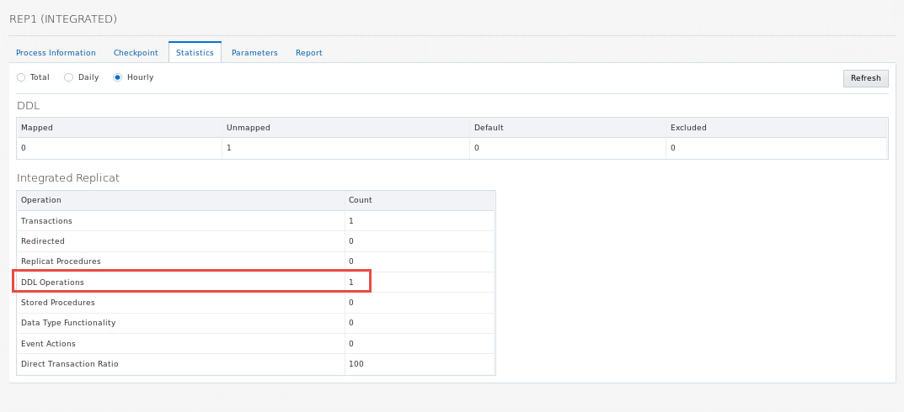 

-   Perform few insert operations on source tables in OGGOOW181 pdb database and check if the inserts are replicated to target tables.

        SQL> desc employee 
        Name					   Null?    Type
        ----------------------------------------- -------- ----------------------------
        EMP_ID 					    NUMBER(10)
        EMP_NAME					    VARCHAR2(30)
        DEPT						    VARCHAR2(20)

        SQL> insert into employee values(1,'John','Finance');

        1 row created.

        SQL> insert into employee values(2,'Jeff','Operations');

        1 row created.

        SQL> insert into employee values(3,'Ena','Marketing');

        1 row created.

        SQL> insert into employee values(4,'Nadia','IT');

        1 row created.

        SQL> insert into employee values(5,'Tom','Finance');

        1 row created.

        SQL> commit;

        Commit complete.

        SQL> 

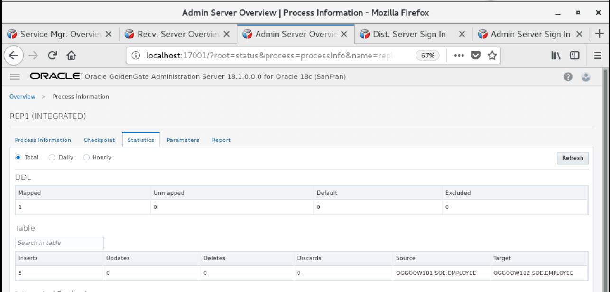 

-   Perform few updates and deletes operations on source table and check if the operations are replicated to target database.

        SQL> select * from employee;

            EMP_ID EMP_NAME			  DEPT
        ---------- ------------------------------ --------------------
            1 John 			  Finance
            2 Jeff 			  Operations
            3 Ena				  Marketing
            4 Nadia			  IT
            5 Tom				  Finance

        SQL> update employee set emp_name='Mark' where emp_id=5;

        1 row updated.

        SQL> delete from employee where emp_id=4;

        1 row deleted.

        SQL> commit;

        Commit complete.

        SQL> 

-   Execute the below alter commands and verify the statistics on extract and replicat.

        SQL> alter table employee rename column dept to dept_name;

        Table altered.

        SQL> desc employee
        Name					   Null?    Type
        ----------------------------------------- -------- ----------------------------
        EMP_ID 					    NUMBER(10)
        EMP_NAME					    VARCHAR2(30)
        DEPT_NAME					    VARCHAR2(20)

        SQL> alter table employee modify emp_name varchar2(40);

        Table altered.

        SQL> desc employee
        Name					   Null?    Type
        ----------------------------------------- -------- ----------------------------
        EMP_ID 					    NUMBER(10)
        EMP_NAME					    VARCHAR2(40)
        DEPT_NAME					    VARCHAR2(20)

        SQL> 

-   Execute truncate operation on employee table, verify the statistics and count in the target pdb.

        SQL> select * from employee;

            EMP_ID EMP_NAME				    DEPT_NAME
        ---------- ---------------------------------------- --------------------
            1 John 				    Finance
            2 Jeff 				    Operations
            3 Ena					    Marketing
            5 Mark 				    Finance

        SQL> truncate table employee;

        Table truncated.

        SQL> select count(*) from employee;

        COUNT(*)
        ----------
            0

        SQL> 

 

-   Execute drop command on the employee table.

	SQL> drop table employee;

Table dropped.

-   Connect to target database.  Password is ** soe **.

        SQL> connect soe@oggoow182
        Enter password: 
        Connected.

-   Execute select against the Employee table.

        SQL> select * from employee;
        select * from employee
                    *
        ERROR at line 1:
        ORA-00942: table or view does not exist

The above error is because employee table is not present in the target database. Drop command is executed successfully in target database.

### **STEP 10**: Stop delivery process.

-   Log on to Admin process screen of SanFran (http://localhost:17001) and stop the Integrared Replicat (REP1) process.
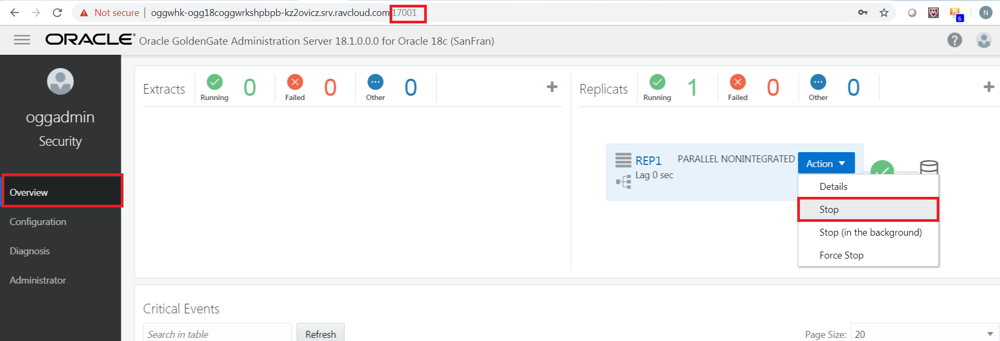

-   Log on to Admin process screen of Atlanta (http://localhost:16001) and stop the Integrared Extract (EXT1) and Distribution path (SOE2SOE) process.

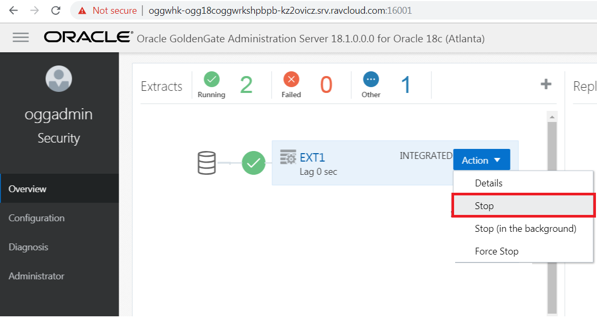
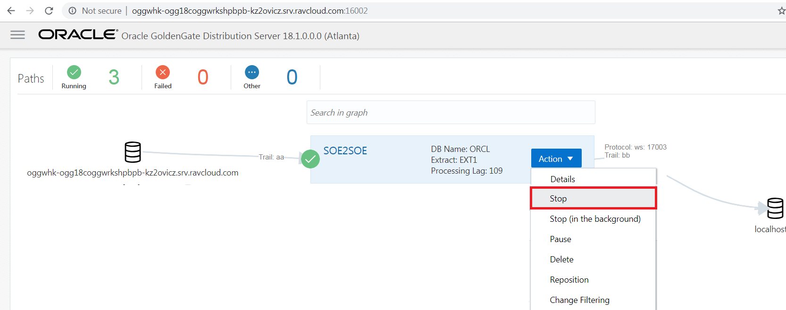

You have completed lab 400!   **Great Job!**
