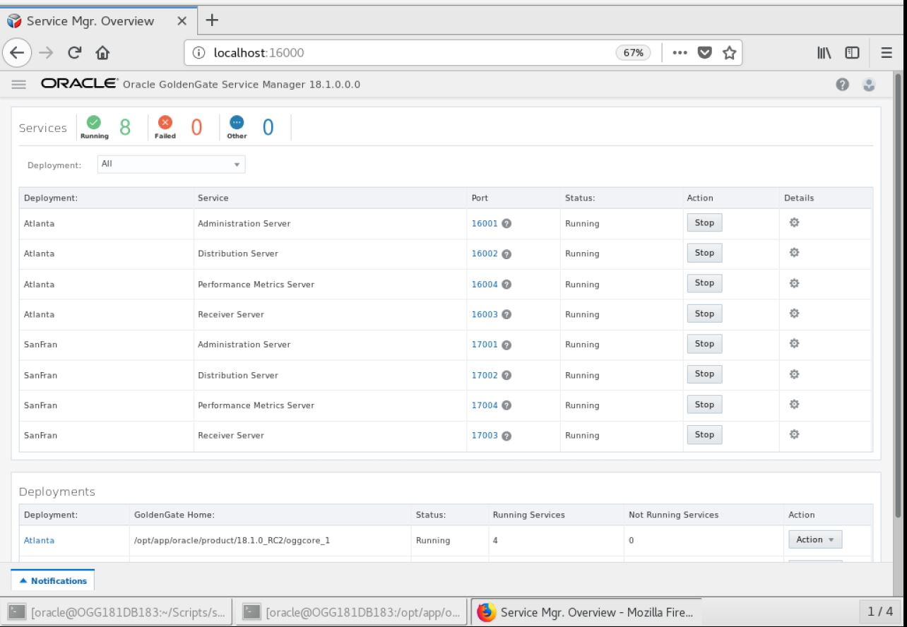
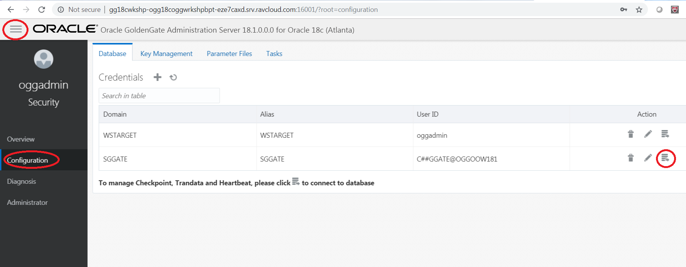
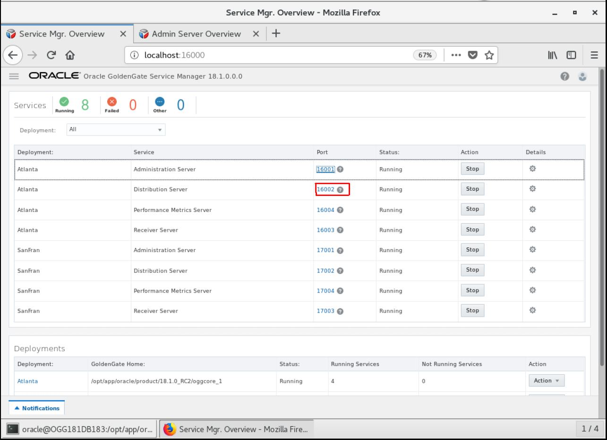
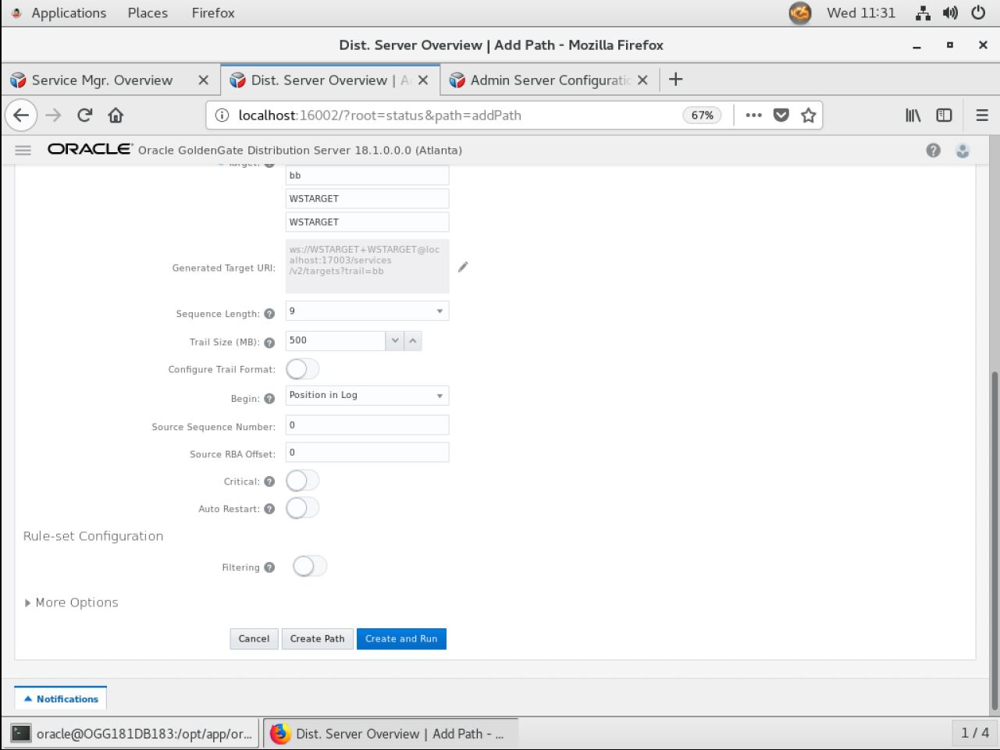
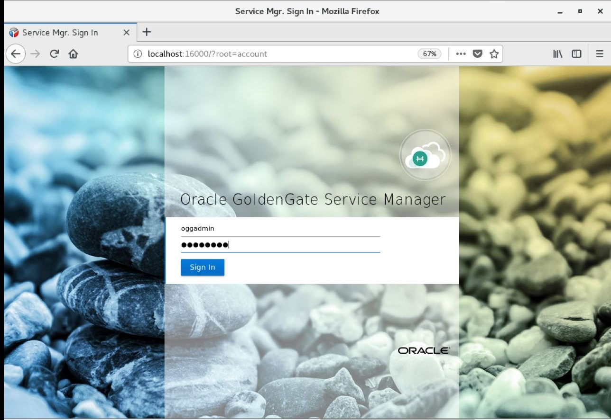
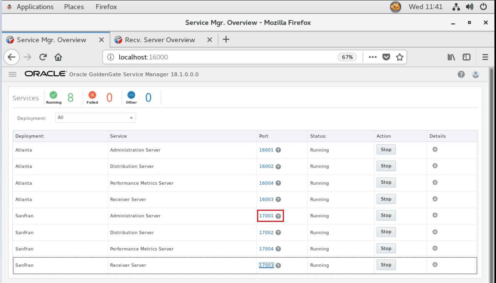
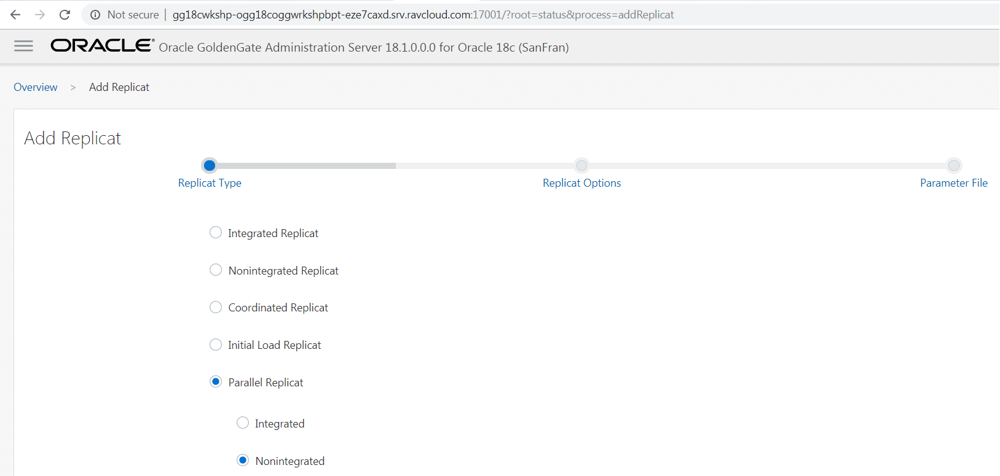
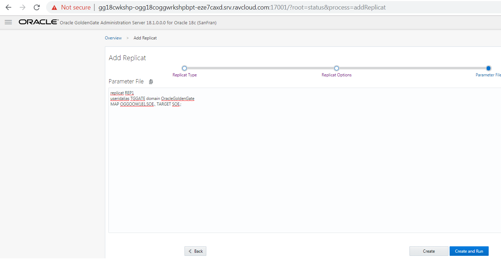
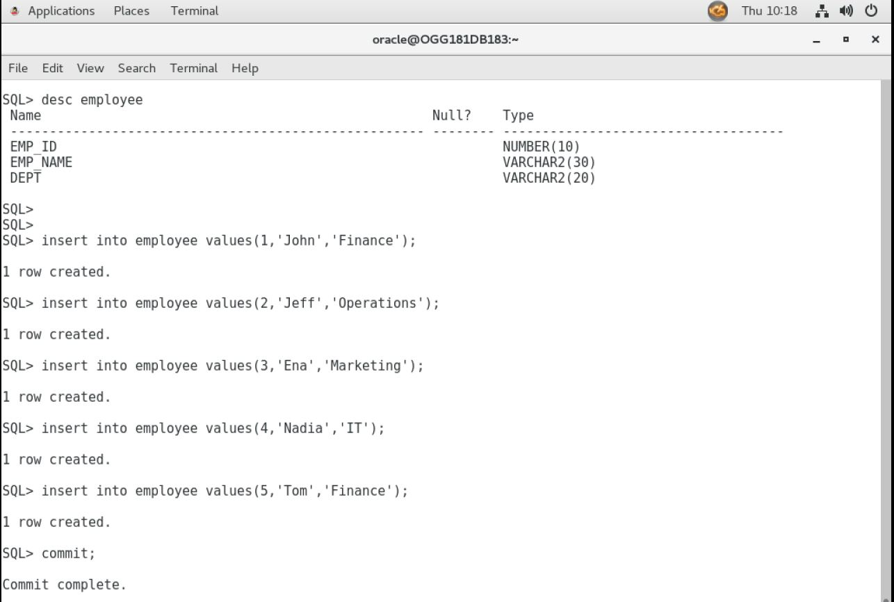

Update Feburary 12, 2019

## UniDirectional and DDL Replication
## Introduction

This lab walks you through uni-directional and DDL replication between to database schemas using Goldengate 18.1 Micro services web interface in a Ravello environment.

This lab supports the following use cases:
-	One way replication to target database where both databases are already in sync.
-   Simple DDL replication example.

## Objectives

This lab is in several parts.  The first part will setup the Integrated Extract for Oracle GoldenGate 18c Microservices Architecture for a uni-directional configuration using the SOE schema in the OGGOOW181 and OGGOOW182 PDBs. 

### **STEP 1**: Log into the Service Manager and check credentials.

- 	Open up a browser window in your client VM environment in Ravello or on your laptop using a browser (like Chrome or Firefox) and enter the following URL and port: **http://localhost:16000** .  

- 	If you're using the browser on your laptop, change **localhost** to the **Ravello URL or IP Address** your instructor gave out at the beginning of the workshop **same one you used for the VNC Session**.

- 	You should get a sign on page.   Sign in using the username: **"ggadmin"** and password **"Welcome1"**.

 
 
-   After logging in, find and open the Administration Server for your first deployment.  In this example, the first deployment is Atlanta.  Click on the link with the port number for the Admin Service for Atlanta.

Note: You will be required to login again.  Use the same Administrator account that was used with the Service Manager.

 
 
-   Before you can create an Extract, you need to setup a credential alias for the GoldenGate user (C##GGATE).  This is done in lab 300.

 

-   Verify that the credentials you just created work.  There is a little database icon under Action in the table.  Click on this for the database Credential Alias and you should be able to login to the database.

 
 
### **STEP 2**: Add SCHEMATRANDATA to the SOE schema using the SGGATE Credential Alias.

-   After logging into the database as described for OGGOOW181, find the Trandata section.  Click on the plus ( + ) sign and make sure that the radio button for Schema is selected .  At this point, you provide the Schema Name, enable All Columns and Scheduling Columns, and click Submit.

 
 
-   You will notice that after you click Submit, there is no return message that states the operation was successful.  You can verify that SCHEMATRANDATA has been added by looking searching by Schema.  To do this, click on the magnifying glass and provide the Schema name.

 
 
### **STEP 3**: Add the Integrated Extract.

-   Navigate back to the Overview page of the Administration Server.  Then click on the plus sign ( + ) in the box for Extracts.

 

-   After clicking the plus sign ( + ), you are taken to the Add Extract page.  Here you can choose from three different types of Extracts.  You will be installing an Integrated Extract.  Click Next.

 

-   The next page of the Add Extract process, is to provide the basic information for the Extract. Items required have a star ( * ) next to them.  Provide the required information and then click Next.  Keep in mind that the credentials needed to register the Extract need to be against the CDB (ORCL). Use the CDB domain and alias that you setup previously.

-   When using the CDB credential, at the bottom of the page, you will be presented with a box where you can select the PDB that will be used. This will only appear when you have a valid credential for the CDB.  Once you see this box, make sure you select OGGOOW181. 

 

 
 

On the last page of the Add Extract process, you are presented with a parameter file (Figure 7a-9).  The parameter file is partially filled out, but missing the TABLE parameters. Insert the following list of TABLE parameter values into the parameter file.
    DDL INCLUDE ALL;
    SOURCECATALOG OGOOW181
    TABLE SOE.*;

You can also include specific table names for capturing the data changes, but extract will skip the create table DDLs. Sample TABLE parameter vales are given below.

    DDL INCLUDE ALL;
    SOURCECATALOG OGGOOW181
    TABLE SOE.ADDRESSES;
    TABLE SOE.CUSTOMERS;
    TABLE SOE.ORDERS;
    TABLE SOE.ORDER_ITEMS;
    TABLE SOE.CARD_DETAILS;
    TABLE SOE.LOGON;
    TABLE SOE.PRODUCT_INFORMATION;
    TABLE SOE.INVENTORIES;
    TABLE SOE.PRODUCT_DESCRIPTIONS;
    TABLE SOE.WAREHOUSES;
    TABLE SOE.ORDERENTRY_METADATA;

Once the TABLE statements are added, click Create and Run at the bottom of the page.
 
 

The Administration Server page will refresh when the process is done registering the Extract with the database, and will show that the Extract is up and running

 

### **STEP 4**: Configure Uni-Directional Replication (Distribution Server).

This step will walk you through how to setup a Path within the Distribution Server.

-   Start from the Service Manager page.

 

-   Open the Distribution Server page for your first deployment (Atlanta).

 

-   Click the plus sign ( + ) to add a new Distribution Path (Figure 7b-3).

 

-   On the Add Path page, fill in the required information.  Make note that the default protocol for distribution service is secure websockets **wss**.  You will need to change this to websockets **ws**.

 

 

Notice the drop down with the values WS, WSS, UDT and OGG.  These are the protocols you can select to use for transport.  Since you are setting up an unsecure uni-directional replication, make sure you select **WS**, then provide the following target information:
Hostname: localhost
Port: <2nd deployment’s receiver server port>
Trail File: <any two letter value>
Domain: <credential you created in the Admin Server for WS>
Alias: <credential you created in the Admin Server for WS>
After filling out the form, click Create and Run at the bottom of the page.

5.	If everything works as expected, your Distribution Path should be up and running.  You should be able to see clearly the source and target on this page (Figure 7b-5).

Figure 7b-5:
 
 

Lab 7c: Cloning a PDB database using an existing PDB database

Objective:
In this lab, you will create a new PDB database OGGOOW182 by cloning an existing PDB database OGGOOW181.

Time: 5 minutes

Steps:
1.	Login to database using sys user.

            $ sqlplus / as sysdba

2. Execute below command to check the PDBs present in the database.

            sql> show pdbs

3. Alter the PDB database, which you are using for clone, to read only state.

            sql> alter pluggable database OGGOOW181 close;
            sql> alter pluggable database OGGOOW181 open read only;

Figure 7c-1:
 

4. Create the pluggable database using the below command.

            sql> CREATE PLUGGABLE DATABASE OGGOOW182 FROM OGGOOW181
            2  FILE_NAME_CONVERT=('/opt/app/oracle/oradata/ORCL/oggoow181/','/opt/app/oracle/oradata/ORCL/OGGOOW182/');

Figure 7c-2:
 

5. Close the pluggable database, which is in read only state and reopen the databases using below commands.

            sql> alter pluggable database OGGOOW181 close;
            sql> alter pluggable database OGGOOW181 open;
            sql> alter pluggable database OGGOOW182 open;

Execute "show pdbs" to check the available pdbs and their statuses.

Figure 7c-3:
 

This completes cloning a PDB database.

Lab 7d: Configure Uni-Directional Replication (Receiver Server)

Objective:
In this lab, you will configure the Receiver Server for the target database, which will receive the trail from the Distribution Path that you created on the source deployment.

Time: 5 minutes

Steps:
1.	Start from the Service Manager page for your second deployment (Figure 7c-1).

Figure 7d-1:
 
 

2.	Click on the Receiver Server link to open the Receiver Server page (Figure 7c-2).  Verify that everything is configured.

Figure 7d-2:

 

Lab 7e: Configure Uni-Directional Replication (Integrated Replicat)

Object:
In this lab you will configure the Integrated Replicat for the second deployment.

Time: 25 minutes

Steps:
1.	Starting from the Service Manager page (Figure 7e-1).

Figure 7e-1:
 
 
 
2.	Open the Administration Server for the second deployment by clicking on the link (Figure 7e-2).

Figure 7e-2:

 

3.	You require a credential store for replicat to connect to target database. Use the TGGATE2 created in Lab300. 

4.	Navigate back to the Overview page on the Administration Server.  Here you will begin to create your Integrated Replicat (Figure 7e-3).  Click the plus sign ( + ) to open the Add Replicat process.

Figure 7e-3:
 
 

5.	With the Add Replicat page open, you want to create an Integrated Replicat.  Make sure the radio button is selected and click Next (Figure 7e-4).

Figure 7e-4:
 
 

6.	Fill in the Replicat options form with the required information (Figure 7e-5).  Your trail name should match the trail name you saw in the Receiver Server.  Once you are done filling everything out, click the Next button at the bottom of the screen.

Figure 7e-5:
 
 

7.	You are next taken to the Parameter File page.  On this page, you will notice that a sample parameter file is provided (Figure 7e-6).  You will have to remove the MAP statement and replace it with the information below:

MAP OGGOOW181.SOE.*, TARGET SOE.*;  

Figure 7e-6:
 
 

You can also specify individual table name as given below.  

MAP PDB1.SOE.CUSTOMERS, TARGET SOE.CUSTOMERS;  
MAP PDB1.SOE.ADDRESSES, TARGET SOE.ADDRESSES;   
MAP PDB1.SOE.ORDERS, TARGET SOE.ORDERS; 
MAP PDB1.SOE.ORDER_ITEMS, TARGET SOE.ORDER_ITEMS;  
MAP PDB1.SOE.CARD_DETAILS, TARGET SOE.CARD_DETAILS;  
MAP PDB1.SOE.LOGON, TARGET SOE.LOGON;  
MAP PDB1.SOE.PRODUCT_INFORMATION, TARGET SOE.PRODUCT_INFORMATION;  
MAP PDB1.SOE.INVENTORIES, TARGET SOE.INVENTORIES;  
MAP PDB1.SOE.PRODUCT_DESCRIPTIONS, TARGET SOE.PRODUCT_DESCRIPTIONS;  
MAP PDB1.SOE.WAREHOUSES, TARGET SOE.WAREHOUSES;  
MAP PDB1.SOE.ORDERENTRY_METADATA, TARGET SOE.ORDERENTRY_METADATA;  
Notes: ~/Desktop/Software/replicat.prm has these contents for copying.
Once the parameter file has been updated, click the Create and Run button at the bottom.

At this point, you should have a fully functional uni-directional replication environment. You can start Swingbench and begin testing.  See Appendix A for further instructions.

Lab 7f: DML and DDL Replication Samples

Objective: In this lab we will perform few DML and DDL operations on source pdb and check if those operations are properly replicated to target database.

prerequisite: Source and target database should be in sync. Extract, pump and replicat should be up and running.

Time: 15 mins

Steps:

1. Logon to OGGOOW181 and OGGOOW182 pdbs using SOE user.

 

2. Verify whether tables are in sync between source and target databases.

 

 

3. Create a employee table in OGGOOW181.

 

4. Go to target admin server page, click on actions on replicate and select details option.

 

5. Click on statistics tab and check the DDL Mapped count.

 

6. Perform few insert operations on source tables in OGGOOW181 pdb database and check if the inserts are replicated to target tables.

 

 

7. Perform few updates and deletes operations on source table and check if the operations are replicated to target database.

 

8. Execute the below alter commands and verify the statistics on extract and replicat.

 

9. Execute truncate operation on employee table, verify the statistics and count in the target pdb.

 

 

10. Similarly, execute drop command on the employee table and check the results in the target database.

The above error is because employee table is not present in the target database. Drop command is executed successfully in target database.

You have completed lab 400!   **Great Job!**

