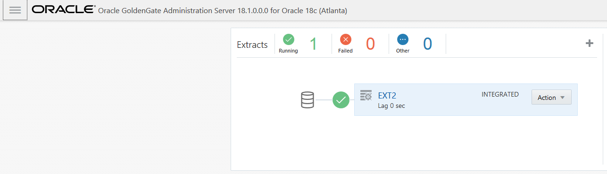
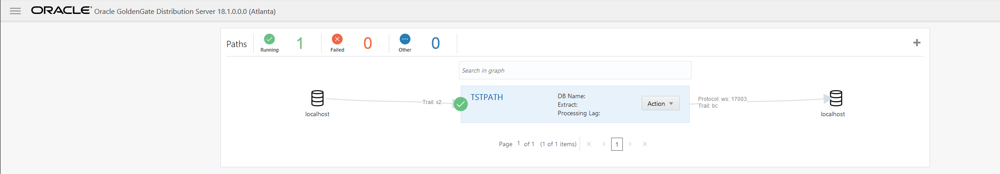

Update January 14, 2019

## Zero Downtime Lab using REST API
## Introduction

This lab, will contains three parts and covers how access the services from Oracle GoldenGate MicroServices using the REST APIs. 
# Part 1: Initial Load by Automated Script

### **STEP 1**: Run a script to delete the current data in the target database.

Before we begin we want to make sure the target database is empty.

-	If you don't have a terminal window opened yet, right click on the Desktop of the VNC session and select **Open Terminal**

-   Change directory to Lab5 and run script **truncate_trg.sh**.  

		[oracle@OGG181DB183 Lab5]$ ./truncate_trg.sh 
		Truncate Target
		Truncate Successful
		[oracle@OGG181DB183 Lab5]$ 

### **STEP 2**: Run a script to perform an initial load to the target database.

-   Change directory to Lab5 and review script **Initial_load_Automated.sh**.

        [oracle@OGG181DB183 ~]$ cd ~/OGG181_WHKSHP/Lab5
		[oracle@OGG181DB183 Lab5]$ ls
		Initial_load_Automated.sh
		[oracle@OGG181DB183 Lab5]$ less Initial_load_Automated.sh

-   Then, run the **Initial_load_Automated.sh** script:

		[oracle@OGG181DB183 Lab5]$ ./Initial_load_Automated.sh 

-   Once the script completes the execution. Source and Target will be in sync.

# Part 2: Initial Load by Manual Script

### **STEP 1**: Review the json file for building an integrated extract.

		[oracle@OGG181DB183 Lab5]$ cat ext2.json 
		{
			"config":[
				"Extract     EXT2",
				"ExtTrail    X1 Format Release 12.3",
				"UseridAlias CDBGGATE",
				"Table       oggoow181.soe.*;"
			],
			"source":{
				"tranlogs":"integrated"
			},
			"credentials":{
				"domain":"CDBGGATE",
				"alias":"CDBGGATE"
				
			},
			"registration":{
					"containers": ["oggoow181"],
					"optimized":false
		},
			"begin":"now",
			"targets":[
				{
					"name":"X1"
				}
			]
		}
		[oracle@OGG181DB183 Lab5]$ 

### **STEP 2**: Create and start the change-capture extract using the curl Command, which will start the extract with begin-now option.

-	Execute the following curl command to add the CDC Extract.

		[oracle@OGG181DB183 Lab5]$ curl -u oggadmin:Welcome1 -H "Content-Type: application/json" -H "Accept: application/json" -X POST http://localhost:16001/services/v2/extracts/EXT2 -d @ext2.json | python -mjson.tool
		
-	After the command is executed successfully, the command output looks like this:

  % Total    % Received % Xferd  Average Speed   Time    Time     Time  Current
                                 Dload  Upload   Total   Spent    Left  Speed
100  1374  100   949  100   425     42     18  0:00:23  0:00:22  0:00:01   120
{
    "$schema": "api:standardResponse",
    "links": [
        {
            "href": "http://localhost:16001/services/v2/extracts/EXT2",
            "mediaType": "application/json",
            "rel": "canonical"
        },
        {
            "href": "http://localhost:16001/services/v2/extracts/EXT2",
            "mediaType": "application/json",
            "rel": "self"
        }
    ],
    "messages": [
        {
            "$schema": "ogg:message",
            "code": "OGG-08100",
            "issued": "2019-02-09T20:51:15Z",
            "severity": "INFO",
            "title": "EXTRACT (Integrated) added.",
            "type": "http://docs.oracle.com/goldengate/c1810/gg-winux/GMESG/oggus.htm#OGG-08100"
        },
        {
            "$schema": "ogg:message",
            "code": "OGG-02003",
            "issued": "2019-02-09T20:51:38Z",
            "severity": "INFO",
            "title": "Extract EXT2 successfully registered with database at SCN 9096500.",
            "type": "http://docs.oracle.com/goldengate/c1810/gg-winux/GMESG/oggus.htm#OGG-02003"
        },
        {
            "$schema": "ogg:message",
            "code": "OGG-08100",
            "issued": "2019-02-09T20:51:38Z",
            "severity": "INFO",
            "title": "EXTTRAIL added.",
            "type": "http://docs.oracle.com/goldengate/c1810/gg-winux/GMESG/oggus.htm#OGG-08100"
        }
    ]
}

-	On the Goldengate Microservices Console, under the Admin Server you can see the Extract has been started and running .

### **STEP 3**: Review the json file for building the Distribution Path.

		[oracle@OGG181DB183 Lab5]$ cat tpath.json 
		{
		"name": "TSTPATH",
		"status": "stopped",
		"source": {
		"uri": "trail://localhost:16002/services/v2/sources?trail=x2"
		},
		"target": {
		"uri": "ws://OracleGoldenGate+WSTARGET@localhost:17003/services/v2/targets?trail=bc"
		}
		}

### **STEP 4**: Create and start the distribution path which sends the transactions from the Extract to the Receiver Service.

-	Execute the following curl command to add the PATH to send data from Extract to replicat.

		[oracle@OGG181DB183 Lab5]$ curl -u oggadmin:Welcome1 -H "Content-Type: application/json" -H "Accept: application/json" -X POST http://localhost:16002/services/v2/sources/TSTPATH -d @tpath.json | python -mjson.tool

-	After the command is executed successfully, the command output looks like this:

		% Total    % Received % Xferd  Average Speed   Time    Time     Time  Current
										Dload  Upload   Total   Spent    Left  Speed
		100   709  100   499  100   210    430    181  0:00:01  0:00:01 --:--:--   430
		{
			"$schema": "api:standardResponse",
			"links": [
				{
					"href": "http://localhost:16002/services/v2/sources/TSTPATH",
					"mediaType": "application/json",
					"rel": "canonical"
				},
				{
					"href": "http://localhost:16002/services/v2/sources/TSTPATH",
					"mediaType": "application/json",
					"rel": "self"
				}
			],
			"messages": [
				{
					"$schema": "ogg:message",
					"code": "OGG-08511",
					"issued": "2019-02-09T21:06:57Z",
					"severity": "INFO",
					"title": "The path 'TSTPATH' has been added.",
					"type": "http://docs.oracle.com/goldengate/c1810/gg-winux/GMESG/oggus.htm#OGG-08511"
				}
			]
		}

-	On the Goldengate Microservices Console, under the Distribution Server you will see that the PATH is created its Running Status.

### **STEP 5**: Review the json file for building the Replicat.

		[oracle@OGG181DB183 Lab5]$ cat rep2.json 
		{
			"config":[
				"Replicat    REP2",
				"UseridAlias TGGATE",
				"Map oggoow181.*, Target oggoow182.*;"
			],
			"source":{
				"name":"X2"
			},
			"credentials":{
				"alias":"TGGATE"
			},
			"checkpoint":{
				"table":"ggate.checkpoints"
			},
			"status":"stopped"
		}

### **STEP 6**: Create the CDC Replicat which sends the transactions to the target database.

-	Execute the following curl command to add the Replicat.

		[oracle@OGG181DB183 Lab5]$ curl -u oggadmin:Welcome1 -H "Content-Type: application/json" -H "Accept: application/json" -X POST http://localhost:17001/services/v2/replicats/REP2 -d @rep2.json | python -mjson.tool

-	After the command is executed successfully, the command output looks like this:
		% Total    % Received % Xferd  Average Speed   Time    Time     Time  Current
										Dload  Upload   Total   Spent    Left  Speed
		100   768  100   478  100   290    885    536 --:--:-- --:--:-- --:--:--   885
		{
			"$schema": "api:standardResponse",
			"links": [
				{
					"href": "http://localhost:17001/services/v2/replicats/REP2",
					"mediaType": "application/json",
					"rel": "canonical"
				},
				{
					"href": "http://localhost:17001/services/v2/replicats/REP2",
					"mediaType": "application/json",
					"rel": "self"
				}
			],
			"messages": [
				{
					"$schema": "ogg:message",
					"code": "OGG-08100",
					"issued": "2019-02-09T21:22:18Z",
					"severity": "INFO",
					"title": "REPLICAT added.",
					"type": "http://docs.oracle.com/goldengate/c1810/gg-winux/GMESG/oggus.htm#OGG-08100"
				}
			]
		}

*********** Need to change this part and add transactions to the lab  *****************************

11. Now it is time to get the current scn of the source database .So that all the  transactions after this particular CSN are only captured & Replicated (i.e we have to capture only those transactions that occur after the export Job)

SQL> select current_scn from v$database;

12. We need to create a JSON file to alter the Change-Capture Replicat at a particular CSN.

13. We finally need to start the replicat after the Export/import Job has finished successfully on target.We use the following Curl command to start the replicat, which refers to the JSON file created in last step.

14. Once the command is executed successfully you can crosscheck the status of the Replicat on Goldengate Microservices Web Console under the Admin Server of the Target.

You have completed lab 500!   **Great Job!**