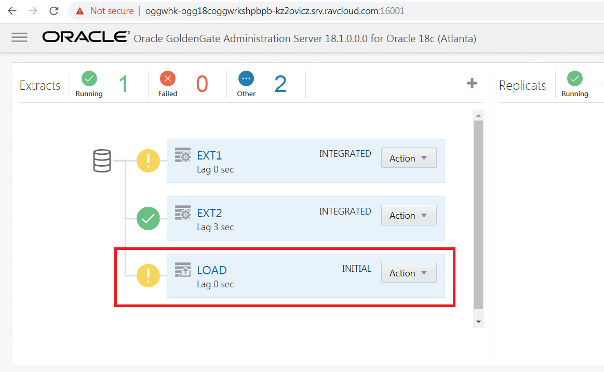
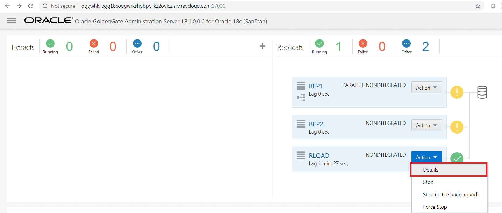
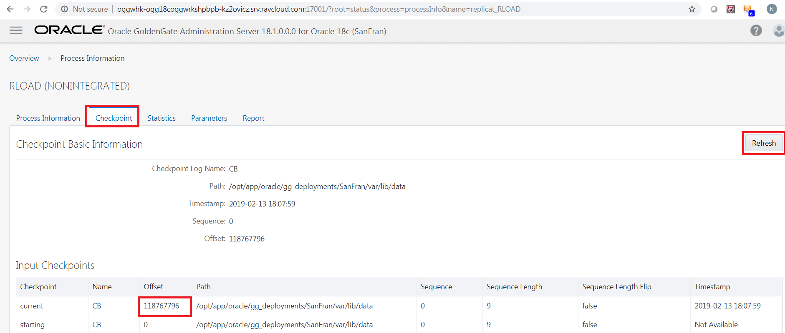
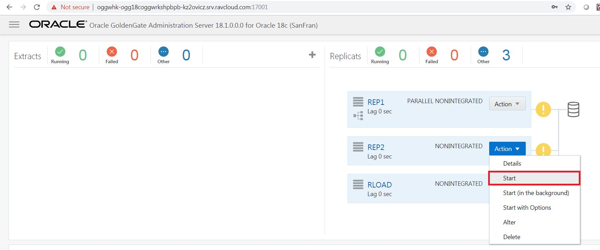
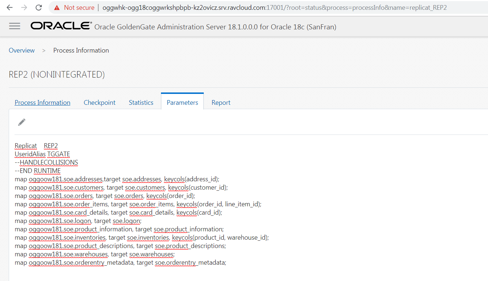
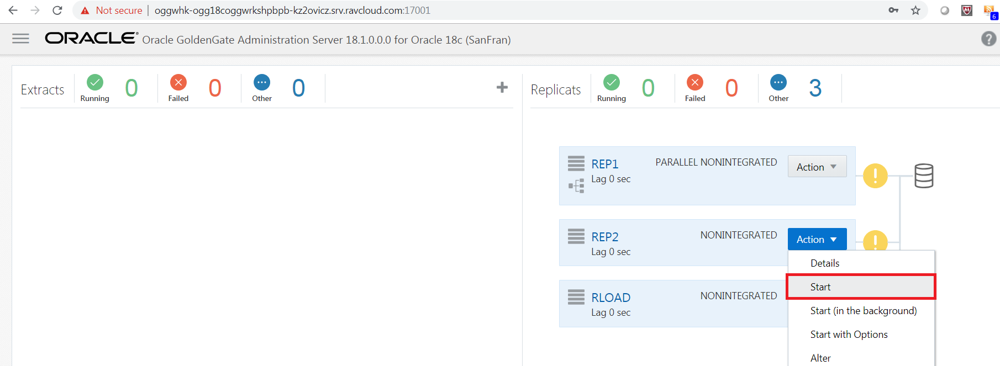

Update January 14, 2019

## Zero Downtime Lab using REST API
## Introduction

GoldenGate allows you to perform what we call **Zero Downtime Migrations (ZDT)**.  By using GoldenGate you can keep your source database up and operational while you perform a bulk instantiation of data to the new platform.

There are multiple ways to perform the bulk data movement, if you are going to the same database (i.e. Oracle to Oracle), then it's advised to use native tools to move the data.  In the case of Oracle, we have integration with the data pump export/import utility, which makes it easy to sync the data with the delta information when the bulk data movement is complete.

For this lab, even though we are going Oracle to Oracle, we will show you a method to do what we call file based data migration using the MicroServices architecture and the REST API for automation.

This lab, will contains three parts and covers how access the services from Oracle GoldenGate MicroServices using the REST APIs. 

# Pre-requisite : Create required credentails for replication.
- 	Open up a browser window in your client VM environment in Ravello or on your laptop using a browser (like Chrome or Firefox) and enter the following URL and port: **http://localhost:16000** .  
- 	If you're using the browser on your laptop, change **localhost** to the **Ravello URL or IP Address** your instructor gave out at the beginning of the workshop **same one you used for the VNC Session**.
- 	You should get a sign on page.   Sign in using the username: **"ggadmin"** and password **"Welcome1"**.

-   After logging in, find and open the Administration Server for your first deployment. In this example, the first deployment is Atlanta. Go to Atlanta administration server page by clicking on 16001.

-   Click on hamburger symbol on top left corner of the page, select Configuration and select "+" sign beside credentials.

-   Here will create the root container database credentials.  Enter the credential details as given below and click on submit. Password is "ggate".  You will need to add the alias for a user that will connect to CDB (ORCL). The CDB alias will be used to connect to the database to read the required files for extraction operations, and the PDB1 user SGGATE will be used to add TRANDATA to the schemas used in replication.

| Field/Checkbox				|	Setting	|
|-------------------------------|-----------|
|Credential Domain|	OracleGoldenGate|
|Credential Alias|	SGGATE|
|User ID|	C##GGATE@orcl|
|Password|	ggate|
|Verify Password| 	 ggate|

| Field/Checkbox				|	Setting	|
|-------------------------------|-----------|
|Credential Domain|	OracleGoldenGate|
|Credential Alias|	WSTARGET|
|User ID|	oggadmin|
|Password|	Welcome1|
|Verify Password| 	 Welcome1|

# Part 1: Create the normal CDC processes.

### **STEP 1**: Create and start the Change Data Capture (CDC) Extract process using curl commands.

For ZDT we always install the normal CDC processes first and start the capture process and leave the delivery process stopped.  This way we will have stored any transactions that have been added during the time we do the bulk data movement.

-	If you don't have a terminal window opened yet, right click on the Desktop of the VNC session and select **Open Terminal**

-   In the terminal window and change directory to Lab5 and Review JSON file to add the CDC Extract.

        [oracle@OGG181DB183 ~]$ cd ~/OGG181_WHKSHP/Lab5
		[oracle@OGG181DB183 ~]$ cat ext2.json
		{
			"config":[
				"Extract     EXT2",
				"ExtTrail    X1",
				"UseridAlias SGGATE",
				"Table       oggoow181.soe.*;"
			],
			"source":{
				"tranlogs":"integrated"
			},
			"credentials":{
				"domain":"OracleGoldenGate",
				"alias":"SGGATE"
				
			},
			"registration":{
					"containers": ["oggoow181"],
					"optimized":false
		},
			"begin":"now",
			"targets":[
				{
					"name":"X1"
				}
			],
			"status":"running"
		}

-	Execute the following curl command to add the CDC Extract.

		[oracle@OGG181DB183 Lab5]$ curl -u oggadmin:Welcome1 -H "Content-Type: application/json" -H "Accept: application/json" -X POST http://localhost:16001/services/v2/extracts/EXT2 -d @ext2.json | python -mjson.tool
		
-	After the command is executed successfully, the command output looks like this:

  % Total    % Received % Xferd  Average Speed   Time    Time     Time  Current
                                 Dload  Upload   Total   Spent    Left  Speed
100  1374  100   949  100   425     42     18  0:00:23  0:00:22  0:00:01   120
{
    "$schema": "api:standardResponse",
    "links": [
        {
            "href": "http://localhost:16001/services/v2/extracts/EXT2",
            "mediaType": "application/json",
            "rel": "canonical"
        },
        {
            "href": "http://localhost:16001/services/v2/extracts/EXT2",
            "mediaType": "application/json",
            "rel": "self"
        }
    ],
    "messages": [
        {
            "$schema": "ogg:message",
            "code": "OGG-08100",
            "issued": "2019-02-09T20:51:15Z",
            "severity": "INFO",
            "title": "EXTRACT (Integrated) added.",
            "type": "http://docs.oracle.com/goldengate/c1810/gg-winux/GMESG/oggus.htm#OGG-08100"
        },
        {
            "$schema": "ogg:message",
            "code": "OGG-02003",
            "issued": "2019-02-09T20:51:38Z",
            "severity": "INFO",
            "title": "Extract EXT2 successfully registered with database at SCN 9096500.",
            "type": "http://docs.oracle.com/goldengate/c1810/gg-winux/GMESG/oggus.htm#OGG-02003"
        },
        {
            "$schema": "ogg:message",
            "code": "OGG-08100",
            "issued": "2019-02-09T20:51:38Z",
            "severity": "INFO",
            "title": "EXTTRAIL added.",
            "type": "http://docs.oracle.com/goldengate/c1810/gg-winux/GMESG/oggus.htm#OGG-08100"
        }
    ]
}

### **STEP 2**: Create and start the CDC Distribution Path using curl commands.

-   From the same terminal window review the JSON file to add the CDC Distribution Path.
		[oracle@OGG181DB183 Lab5]$ cat tpath.json 
				{
				"name": "TSTPATH",
				"status": "stopped",
				"source": {
				"uri": "trail://localhost:16002/services/v2/sources?trail=x2"
				},
				"target": {
				"uri": "ws://OracleGoldenGate+WSTARGET@localhost:17003/services/v2/targets?trail=bc"
				}
				}

-	Execute the following curl command to add the PATH to send data from Extract to replicat.

		[oracle@OGG181DB183 Lab5]$ curl -u oggadmin:Welcome1 -H "Content-Type: application/json" -H "Accept: application/json" -X POST http://localhost:16002/services/v2/sources/TSTPATH -d @tpath.json | python -mjson.tool

-	After the command is executed successfully, the command output looks like this:

		% Total    % Received % Xferd  Average Speed   Time    Time     Time  Current
										Dload  Upload   Total   Spent    Left  Speed
		100   709  100   499  100   210    430    181  0:00:01  0:00:01 --:--:--   430
		{
			"$schema": "api:standardResponse",
			"links": [
				{
					"href": "http://localhost:16002/services/v2/sources/TSTPATH",
					"mediaType": "application/json",
					"rel": "canonical"
				},
				{
					"href": "http://localhost:16002/services/v2/sources/TSTPATH",
					"mediaType": "application/json",
					"rel": "self"
				}
			],
			"messages": [
				{
					"$schema": "ogg:message",
					"code": "OGG-08511",
					"issued": "2019-02-09T21:06:57Z",
					"severity": "INFO",
					"title": "The path 'TSTPATH' has been added.",
					"type": "http://docs.oracle.com/goldengate/c1810/gg-winux/GMESG/oggus.htm#OGG-08511"
				}
			]
		}

### **STEP 3**: Create the CDC Replicat using curl commands.  This will add it in a Stopped state.

-   From the same terminal window review the JSON file to add the CDC Replicat.

		[oracle@OGG181DB183 Lab5]$ cat rep2.json 
		{
			"config":[
				"Replicat    REP2",
				"UseridAlias TGGATE",
				"Map oggoow181.*, Target oggoow182.*;"
			],
			"source":{
				"name":"X2"
			},
			"credentials":{
				"alias":"TGGATE"
			},
			"checkpoint":{
				"table":"ggate.checkpoints"
			},
			"status":"stopped"
		}

-	Execute the following curl command to add the Replicat.

		[oracle@OGG181DB183 Lab5]$ curl -u oggadmin:Welcome1 -H "Content-Type: application/json" -H "Accept: application/json" -X POST http://localhost:17001/services/v2/replicats/REP2 -d @rep2.json | python -mjson.tool

-	After the command is executed successfully, the command output looks like this:
		% Total    % Received % Xferd  Average Speed   Time    Time     Time  Current
										Dload  Upload   Total   Spent    Left  Speed
		100   768  100   478  100   290    885    536 --:--:-- --:--:-- --:--:--   885
		{
			"$schema": "api:standardResponse",
			"links": [
				{
					"href": "http://localhost:17001/services/v2/replicats/REP2",
					"mediaType": "application/json",
					"rel": "canonical"
				},
				{
					"href": "http://localhost:17001/services/v2/replicats/REP2",
					"mediaType": "application/json",
					"rel": "self"
				}
			],
			"messages": [
				{
					"$schema": "ogg:message",
					"code": "OGG-08100",
					"issued": "2019-02-09T21:22:18Z",
					"severity": "INFO",
					"title": "REPLICAT added.",
					"type": "http://docs.oracle.com/goldengate/c1810/gg-winux/GMESG/oggus.htm#OGG-08100"
				}
			]
		}

-	On the Goldengate Microservices Console, under the Admin Server for Atlanta you can see the Extract has been added and and the status is **Running**.

-	On the Goldengate Microservices Console, under the Distribution Server for Atlanta you will see that the PATH is created and the status is **Running**.

-	On the Goldengate Microservices Console, under the Admin Server for SanFran you can see the Replicat has been added and the status is **Stopped**.

**ADD IMAGE FOR STOPPED REPLICAT**

# Part 2: Initial Load by Automated Script

### **STEP 1**: Run a script to delete the current data in the target database.

Before we begin we want to make sure the target database is empty.

-	If you don't have a terminal window opened yet, right click on the Desktop of the VNC session and select **Open Terminal**

-   Change directory to Lab5 and run script **truncate_trg.sh**.  

		[oracle@OGG181DB183 Lab5]$ ./truncate_trg.sh 
		Truncate Target
		Truncate Successful
		[oracle@OGG181DB183 Lab5]$ 

### **STEP 2**: Run a script to perform an initial load to the target database.

-   Change directory to Lab5 and review script **Initial_load_Automated.sh**.

        [oracle@OGG181DB183 ~]$ cd ~/OGG181_WHKSHP/Lab5
		[oracle@OGG181DB183 Lab5]$ ls
		Initial_load_Automated.sh
		[oracle@OGG181DB183 Lab5]$ less Initial_load_Automated.sh

-   Then, run the **Initial_load_Automated.sh** script:

		[oracle@OGG181DB183 Lab5]$ ./Initial_load_Automated.sh 

### **STEP 3**: Run Swingbench script to apply data to the source database.
-   While the script is running, we'll run Swingbench transactions to create activity on the the database during the initial load.

-	Open another terminal by right clicking on the Desktop of the VNC session and select **Open Terminal**

-   Change directory to Lab5 run script **start_swingbench_181.sh**.

        [oracle@OGG181DB183 ~]$ cd ~/OGG181_WHKSHP/Lab5
		[oracle@OGG181DB183 Lab5]$ ./start_swingbench_181.sh
		

### **STEP 4**: Check Initial Load Extract to see if it's completed.

-	On the Goldengate Microservices Console, under the Admin Server for Atlanta if the Initial Load Extract (LOAD) is finished status should be **Stopped**.

-	On the Goldengate Microservices Console, under the Admin Server for SanFran and check the detail page for the Initial Load Replicat (RLOAD) to see if it's completed the load.

-    Above script will create the initial load processes which are Extract (LOAD), Distribution Server (INITLOAD) and Replicat (RLOAD).You will need to logon on the Goldengate Microservices Console, under the Admin Server for SanFran. Right click on drop down of Replicat (RLOAD) and click on "Details"

-    Click on tab "Checkpoint" and simultaneously click on "Refresh". Once you offset is has stopped moving, it means the initial load had been completed.

-   Now you can go back to your Goldengate Microservices Console, under the Admin Server for SanFran. Right click on drop down of Replicat (RLOAD) and click on "Stop". Right click on Replicat (REP2) and click "Start".

### **STEP 5**: Start the CDC Replicat to sync the data.

-	On the Goldengate Microservices Console, under the Admin Server for SanFran start the CDC Replicat (REP2) again. But before starting Repliat (REP2), make sure that you have commented out **END RUNTIME** and **HANDLECOLLISIONS** in the parameters. **END RUNTIME** process stops the process once it has reached end of file. So that we can remove **HANDLECOLLISIONS** from the Replicat (REP2) and restart the process.

-	Check to see if the Swingbench script is completed.

-	Run the script **count_src_trg.sh** to see if the counts on both are the same.  You may have to run this a couple of times if the source transactions haven't replicated yet.

Once the data is in sync you have completed lab 500!   **Great Job!**
