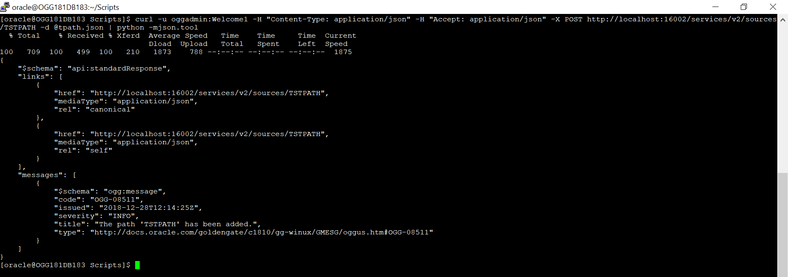

Update January 14, 2019

## Working with REST API
## Introduction

In this lab, will contains two parts and covers how to pull a list of services from Oracle GoldenGate using the REST APIs. 
# Part 1: Initail Load by Automated Script

Steps:
-	Once you login into the ***Remote desktop***,traverse to **applications** and open up the **Terminal**.

-   Then, change current directory to the **Lab5** directory.

		cd ~/OGG181_WHKSHP/Lab5

-   Then, run the **Lab5_Intail_load_Automatated_Script.sh** script:

-   Once the scripted is completes the execuation. Source and Target will be in synch.

# Part 2: Initail Load by Manual Script
Steps:
1. Open a command window (Right mouse click – Open Terminal)

2. Create a json file for building an integrated   extract .

3. Start the change-capture extract using the Curl Command, which would start the extract with begin-now option.

4. After the command is executed successfully, the command output looks like this:

5. On the Goldengate Microservices Console, under the Admin Server you can see the Extract has been started and running .

6. A path needs to be  created to send the transaction of data from the Extract to the Replicat. You can create a new path by adding configuration  in JSON file.

7. You can execute the following curl command to add the PATH to send data from Extract to replicat.

8. Once the command is executed successfully, you can check on Goldengate Microservices Web Console under Distribution Server for the PATH created  and its Running Status.

9. Next Step is to configure replicat on target which can be done by specifying the various configuration parameters for the Replicat in a JSON file as shown below:

10. In this Step, You just need to configure and create the Replicat and do not start it (we will Start it at specific CSN after the export/import Job is done). Using the curl command we can add the replicat.

11. Now it is time to get the current scn of the source database .So that all the  transactions after this particular CSN are only captured & Replicated (i.e we have to capture only those transactions that occur after the export Job)

SQL> select current_scn from v$database;

12. We need to create a JSON file to alter the Change-Capture Replicat at a particular CSN.

13. We finally need to start the replicat after the Export/import Job has finished successfully on target.We use the following Curl command to start the replicat, which refers to the JSON file created in last step.

14. Once the command is executed successfully you can crosscheck the status of the Replicat on Goldengate Microservices Web Console under the Admin Server of the Target.

Now, you want to just setup a few new tables, but do not want to take the day or two it would take to configure, export, import, apply and then catch up.

Using Oracle GoldenGate Microservices architecture, this initial load process can be simplied and done very quickly. Below is a link to a script to perform an File-Based Initial Load within Oracle GoldenGate Microservices.

https://dbasolved.com/2018/05/14/loading-tables-with-oracle-goldengate-and-rest-apis/

The link has a script that would simplify the initial-load process, the script contains certain functions those get called when needed.After the tables have been loaded, then they can be merged into the existing replication stream.

You have completed lab 500!   **Great Job!**

 

