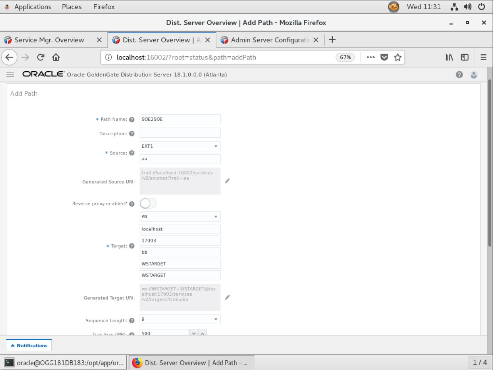
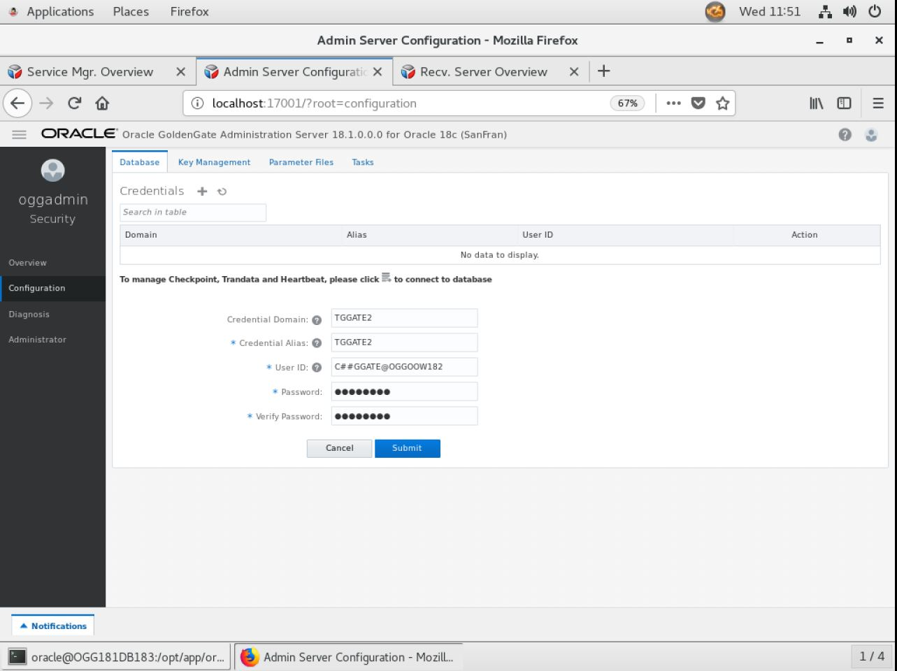
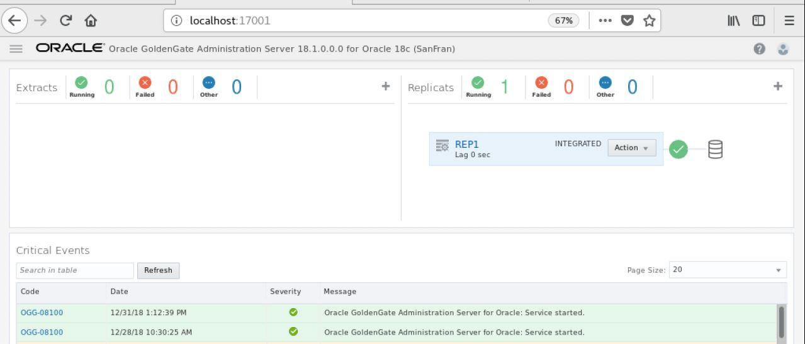
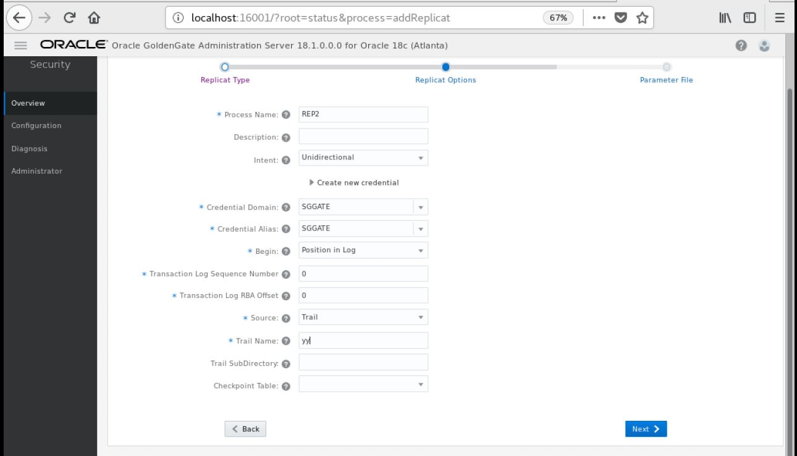

Update December 28, 2018

## Bi-Directional and Auto CDR
## Introduction

This lab walk you through bidirectional and auto CDR between two database schemas using Goldengate 18.1 micro services web interface in a Ravello environment.

This lab supports the following use cases:
-	Seting up bidirection goldengate replication between two databases.
-	Setting up auto conflict detection and resolution.

## Objectives

-   Set up bidirection replication between two databases i.e. OGGOOW181 DB and OGGOOW182 DB
-   Set up auto conflict detaction and resolution. And to set up we need to log in to both the databases and run the below PL/SQL
for all the tables - 

    EXEC DBMS_GOLDENGATE_ADM.ADD_AUTO_CDR(schema_name => 'xxxxxx',table_name  => 'xxxxxxx');

## Required Artifacts

Lab A: Configure Uni-Directional Replication from OGGOOW181 DB to OGGOOW182 DB (Integrated Extract)

Objective:

This lab is in two parts.  The first part will setup the Integrated Extract for Oracle GoldenGate 12c Service Architecture for a uni-directional configuration using the SOE schema in OGGOOW181 and OGGOOW182. 

Time: 25 minutes

Steps:

1.	Open Firefox and login to the Service Manager using the Administrator account you setup during deployment (Figure A-1). Port number will vary depending on what you used during setup.

For Ravello Environment - 
http://dns url:16000 or
http://localhost:16000 or
http://Private IP:16000

Figure A-1:

 
 

2.	After logging in, find and open the Administration Server for your deployment.  In this example, the deployment is OGGOOW181 (Figure A-2).  When the page is completely open, you should be at a page where you can see Extracts/Replicats clearly.
Note: You will be required to login again.  Use the same Administrator account that was used with the Service Manager.

Figure A-2:

 
 

3.	Before you can create an Extract, you need to setup a credential alias for the GoldenGate user (C##GGATE).  This is done from the Configuration menu option in the grey bar on the left of the screen (Figure A-3).

Figure A-3:

 

 
 

4.	On the Configuration page, select the plus ( + ) sign to begin adding a credential. At this point, you will be able to add a Credential Alias (Figure 7a-4). You will need to add the alias for a user that will connect to CDB (ORCL) and PDB (OGGOOW181). The CDB alias will be used to connect to the database to read the required files for extraction operations, and the PDB1 user will be used to add TRANDATA to the schemas used in replication.

Figure A-4:

 
 

You will notice that a Domain name and Credential Alias were added along with the User ID and Password. After adding the user to the credential store, you will reference it via its domain name and credential alias.

You will need to create two (2) credential aliases for your Atlanta deployment. The first credential will be for the CDB(ORCL) database and the second will be for the PDB(OGGOOW181) database. The table below shows what needs to be added:

Credential Domain	Credential Alias	UserID	Password SGGATE	SGGATE	C##GGATE@OGGOOW181	ggate CDBGGATE CDBGGATE	C##GGATE@ORCL	ggate 

5.  Verify that the credentials you just created work.  There is a little man icon under Action in the table.  Click on this for each Credential Alias and you should be able to login to the database (Figure A-5).

Figure A-5:

 
 

6.	Add SCHEMATRANDATA to the SOE schema using the SGGATE Credential Alias.  
After logging into the database as described in step 5 for the OGGOOW181 DB, find the Trandata section.  Click on the plus ( + ) sign and make sure that the radio button for Schema is selected (Figure A-6).  At this point, you provide the Schema Name, enable All Columns and Scheduling Columns, and click Submit.

Figure A-6:

 
 

You will notice that after you click Submit, there is no return message that states the operation was successful.  You can verify that SCHEMATRANDATA has been added by looking searching by Schema (Figure A-7).  To do this, click on the magnifying glass and provide the Schema name.

Figure A-7:

 
 

7.	Add the Protocol user.
Since we are on the Credential screen, let’s go ahead and add a Protocol user.  A Protocol user is the user that the Distribution Server will use to communicate with the Receiver Server over an unsecure connection.
As you did in Step 4, click the plus sign ( + ) next to the word Credentials.  Then provide the connection information needed (Figure A-8), notice that you will be using the Service Manager login in this credential.

Figure A-8:

 
 

For now, just leave this login alone.  It will be used in a later step. 

8.	Add the Integrated Extract.
Navigate back to the Overview page of the Administration Server (Figure A-9).  Then click on the plus sign ( + ) in the box for Extracts.

Figure A-9:

 

After clicking the plus sign ( + ), you are taken to the Add Extract page (Figure A-10).  Here you can choose from three different types of Extracts.  You will be installing an Integrated Extract.  Click Next.

Figure A-10:

 

The next page of the Add Extract process, is to provide the basic information for the Extract. Items required have a star ( * ) next to them. Provide the required information and then click Next (Figure 7a-11). Keep in mind that the credentials needed to register the Extract need to be against the CDB (ORCL). Use the CDB domain and alias that you setup previously.

When using the CDB credential, at the bottom of the page, you will be presented with a box where you can select the PDB that will be used. This will only appear when you have a valid credential for the CDB. Once you see this box, make sure you select OGGOOW181.

Figure A-11:

 
 
 

On the last page of the Add Extract process, you are presented with a parameter file (Figure A-12).  The parameter file is partially filled out, but missing the TABLE parameters. Insert the following list of TABLE parameter values into the parameter file.

SOURCECATALOG OGGOOW181 

TRANLOGOPTIONS EXCLUDEUSER OGGOOW181.C##GGATE

TABLE SOE.ADDRESSES; 

TABLE SOE.CUSTOMERS; 

TABLE SOE.ORDERS; 

TABLE SOE.ORDER_ITEMS; 

TABLE SOE.CARD_DETAILS; 

TABLE SOE.LOGON; 

TABLE SOE.PRODUCT_INFORMATION; 

TABLE SOE.INVENTORIES; 

TABLE SOE.PRODUCT_DESCRIPTIONS; 

TABLE SOE.WAREHOUSES; 

TABLE SOE.ORDERENTRY_METADATA; 

Notes: ~/Desktop/Software/extract.prm has these contents for copying.
Once the TABLE statements are added, click Create and Run at the bottom of the page.

Figure A-12:
 
 

The Administration Server page will refresh when the process is done registering the Extract with the database, and will show that the Extract is up and running (Figure A-13).

Figure A-13:
 
 

Lab B: Configure Uni-Directional Replication (Distribution Server)

Objective:
This lab will walk you through how to setup a Path within the Distribution Server.

Time: 10 minutes

Steps:
1.	Start from the Service Manager page (Figure B-1).

Figure B-1:

 

2.	Open the Distribution Server page for your first deployment (Figure B-2).

Figure B-2:

 

3.	Click the plus sign ( + ) to add a new Distribution Path (Figure B-3).

Figure B-3:

 

4.	On the Add Path page, fill in the required information (Figure B-4).  Make note that the default protocol for distribution service is secure websockets (wss).  You will need to change this to websockets (ws).

Figure B-4:

 
 

Notice the drop down with the values WS, WSS, UDT and OGG. These are the protocols you can select to use for transport. Since you are setting up an unsecure uni-directional replication, make sure you select WS, then provide the following target information: Hostname: localhost Port: <2nd deployment’s receiver server port> Trail File: Domain: Alias: After filling out the form, click Create and Run at the bottom of the page

After filling out the form, click Create and Run at the bottom of the page.

5.	If everything works as expected, your Distribution Path should be up and running.  You should be able to see clearly the source and target on this page (Figure B-5).

Figure B-5:
 
 

Lab C: Configure Uni-Directional Replication (Receiver Server)

Objective:
In this lab, you will configure the Receiver Server for the target database, which will receive the trail from the Distribution Path that you created on the source deployment.

Time: 5 minutes

Steps:
1.	Start from the Service Manager page for your second deployment (Figure C-1).

Figure C-1:
 
 

2.	Click on the Receiver Server link to open the Receiver Server page (Figure C-2).  Verify that everything is configured.

Figure C-2:

 

Lab D: Configure Uni-Directional Replication (Parallel Replicat)

Object:
In this lab you will configure the Parallel Replicat for the second deployment.

Time: 25 minutes

Steps:
1.	Starting from the Service Manager page (Figure D-1).

Figure D-1:
 
 
 
2.	Open the Administration Server for the second deployment by clicking on the link (Figure D-2).

Figure D-2:

 

3.	Open the Configuration option to add your credentials needed to connect to PDB2 (OGGOOW182) (Figure 7d-3). After creating the credential, login and verify that it works. You will need to create 1 credential for the user to connect to PDB2. We will use the same common user as before, C##GGATE@OGGOOW182, with password ggate. Click Submit when finished.

Figure D-3:
 
 

4.	Navigate back to the Overview page on the Administration Server.  Here you will begin to create your Integrated Replicat (Figure D-4).  Click the plus sign ( + ) to open the Add Replicat process.

Figure D-4:
 
 

5.	With the Add Replicat page open, you want to create a Nonintegrated Parallel Replicat.  Make sure the radio button is selected and click Next (Figure D-5).

Figure D-5:
 
 

6.	Fill in the Replicat options form with the required information (Figure D-6).  Your trail name should match the trail name you saw in the Receiver Server.  Once you are done filling everything out, click the Next button at the bottom of the screen.

Figure D-6:
 
 

7.	You are next taken to the Parameter File page.  On this page, you will notice that a sample parameter file is provided (Figure D-7).  You will have to remove the MAP statement and replace it with the information below:

MAPINVISIBLECOLUMNS

MAP OGGOOW181.SOE.*, TARGET OGGOOW182.SOE.*;

Notes: ~/Desktop/Software/replicat.prm has these contents for copying.
Once the parameter file has been updated, click the Create and Run button at the bottom.

Figure D-7:
 
 

At this point, you should have a fully functional uni-directional replication environment.

Lab E: Configure Uni-Directional Replication from OGGOOW182 DB to OGGOOW181 DB (Integrated Extract)

Objective:

This is the second part and will setup the Integrated Extract for Oracle GoldenGate 18c Service Architecture for a uni-directional configuration using the SOE schema in OGGOOW182 and OGGOOW181. 

Time: 25 minutes

Steps:

1.	Open Firefox and login to the Service Manager using the Administrator account you setup during deployment (Figure E-1). Port number will vary depending on what you used during setup.

For Ravello Environment - 
http://dns url:16000 or
http://localhost:16000 or
http://Private IP:16000

Figure E-1:

 
 

2.	After logging in, find and open the Administration Server for your deployment.  In this example, the deployment is OGGOOW182 (Figure E-2).  When the page is completely open, you should be at a page where you can see Extracts/Replicats clearly.
Note: You will be required to login again.  Use the same Administrator account that was used with the Service Manager.

Figure E-2:

 
 

3.	Before you can create an Extract, you need to setup a credential alias for the GoldenGate user (C##GGATE).  This is done from the Configuration menu option in the grey bar on the left of the screen (Figure E-3).

Figure E-3:

 

4.	On the Configuration page, select the plus ( + ) sign to begin adding a credential. At this point, you will be able to add a Credential Alias (Figure 7a-4). You will need to add the alias for a user that will connect to CDB (ORCL) and PDB (OGGOOW181). The CDB alias will be used to connect to the database to read the required files for extraction operations, and the PDB1 user will be used to add TRANDATA to the schemas used in replication.

Figure E-4:

 

You will notice that a Domain name and Credential Alias were added along with the User ID and Password. After adding the user to the credential store, you will reference it via its domain name and credential alias.

You will need to create two (2) credential aliases for your Atlanta deployment. The first credential will be for the CDB(ORCL) database and the second will be for the PDB(OGGOOW182) database. The table below shows what needs to be added:

Credential Domain	Credential Alias	UserID	Password TGGATE2 TGGATE2 C##GGATE@OGGOOW182	ggate CDBGGATE CDBGGATE	C##GGATE@ORCL	ggate 
 

5.	Verify that the credentials you just created work.  There is a little man icon under Action in the table.  Click on this for each Credential Alias and you should be able to login to the database (Figure E-5).

Figure E-5:

 
 

6.	Add SCHEMATRANDATA to the SOE schema using the TGGATE2 Credential Alias. After logging into the database as described in step 5 for the DB, find the Trandata section.  Click on the plus ( + ) sign and make sure that the radio button for Schema is selected (Figure E-6).  At this point, you provide the Schema Name, enable All Columns and Scheduling Columns, and click Submit.

Figure E-6:

 
 

You will notice that after you click Submit, there is no return message that states the operation was successful.  You can verify that SCHEMATRANDATA has been added by looking searching by Schema (Figure E-7).  To do this, click on the magnifying glass and provide the Schema name.

Figure E-7:

 
 

7.	Add the Protocol user.Since we are on the Credential screen, let’s go ahead and add a Protocol user.  A Protocol user is the user that the Distribution Server will use to communicate with the Receiver Server over an unsecure connection.
As you did in Step 4, click the plus sign ( + ) next to the word Credentials.  Then provide the connection information needed (Figure E-8), notice that you will be using the Service Manager login in this credential.

Figure E-8:

 
 

For now, just leave this login alone.  It will be used in a later step. 

8.	Add the Integrated Extract.Navigate back to the Overview page of the Administration Server (Figure E-9).  Then click on the plus sign ( + ) in the box for Extracts.

Figure E-9:

 

After clicking the plus sign ( + ), you are taken to the Add Extract page (Figure E-10).  Here you can choose from three different types of Extracts.  You will be installing an Integrated Extract.  Click Next.

Figure E-10:

 

The next page of the Add Extract process, is to provide the basic information for the Extract. Items required have a star ( * ) next to them.  Provide the required information and then click Next (Figure E-11).Keep in mind that the credentials needed to register the Extract need to be against the CDB (ORCL). Use the CDB domain and alias that you setup previously.

When using the CDB credential, at the bottom of the page, you will be presented with a box where you can select the PDB that will be used. This will only appear when you have a valid credential for the CDB. Once you see this box, make sure you select OGGOOW182. 

Figure E-11:

 
 

On the last page of the Add Extract process, you are presented with a parameter file (Figure E-12).  The parameter file is partially filled out, but missing the TABLE parameters. Insert the following list of TABLE parameter values into the parameter file.

SOURCECATALOG OGGOOW182 
TRANLOGOPTIONS EXCLUDEUSER OGGOOW182.C##GGATE

TABLE SOE.ADDRESSES; 
TABLE SOE.CUSTOMERS; 
TABLE SOE.ORDERS; 
TABLE SOE.ORDER_ITEMS; 
TABLE SOE.CARD_DETAILS; 
TABLE SOE.LOGON; 
TABLE SOE.PRODUCT_INFORMATION; 
TABLE SOE.INVENTORIES; 
TABLE SOE.PRODUCT_DESCRIPTIONS; 
TABLE SOE.WAREHOUSES; 
TABLE SOE.ORDERENTRY_METADATA;                                                                                                         

Notes: ~/Desktop/Software/extract.prm has these contents for copying.
Once the TABLE statements are added, click Create and Run at the bottom of the page.

Figure E-12:
 
 

The Administration Server page will refresh when the process is done registering the Extract with the database, and will show that the Extract is up and running (Figure E-13).

Figure E-13:
 
 

Lab F: Configure Uni-Directional Replication (Distribution Server)

Objective:
This lab will walk you through how to setup a Path within the Distribution Server.

Time: 10 minutes

Steps:
1.	Start from the Service Manager page (Figure F-1).

Figure F-1:

 

2.	Open the Distribution Server page for your first deployment (Figure F-2).

Figure F-2:

 

3.	Click the plus sign ( + ) to add a new Distribution Path (Figure F-3).

Figure F-3:

 

4.	On the Add Path page, fill in the required information (Figure F-4).  Make note that the default protocol for distribution service is secure websockets (wss).  You will need to change this to websockets (ws).

Figure F-4:

 

Notice the drop down with the values WS, WSS, UDT and OGG. These are the protocols you can select to use for transport. Since you are setting up an unsecure uni-directional replication, make sure you select WS, then provide the following target information: Hostname: localhost Port: <1st deployment’s receiver server port> Trail File: Domain: Alias: After filling out the form, click Create and Run at the bottom of the page.

5.	If everything works as expected, your Distribution Path should be up and running.  You should be able to see clearly the source and target on this page (Figure F-5).

Figure F-5:
 
 

Lab G: Configure Uni-Directional Replication (Receiver Server)

Objective:
In this lab, you will configure the Receiver Server for the target database, which will receive the trail from the Distribution Path that you created on the source deployment.

Time: 5 minutes

Steps:

1.	Start from the Service Manager page for your first deployment (Figure G-1).

Figure G-1:
 
 

2.	Click on the Receiver Server link to open the Receiver Server page (Figure G-2).  Verify that everything is configured.

Figure G-2:

 

Lab H: Configure Uni-Directional Replication (Integrated Replicat)

Object:
In this lab you will configure the Integrated Replicat for the OGGOOW181 deployment.

Time: 25 minutes

Steps:

1.	Starting from the Service Manager page (Figure H-1).

Figure H-1:
 
 
 
2.	Open the Administration Server for the first deployment by clicking on the link (Figure H-2).

Figure H-2:

 

3.	Navigate back to the Overview page on the Administration Server.  Here you will begin to create your integrated Replicat (Figure H-3).  Click the plus sign ( + ) to open the Add Replicat process.

Figure H-3:
 
 

4.	With the Add Replicat page open, you want to create a integrated Replicat.  Make sure the radio button is selected and click Next (Figure H-4).

Figure H-6:
 
 

5.	Fill in the Replicat options form with the required information (Figure H-5).  Your trail name should match the trail name you saw in the Receiver Server.  Once you are done filling everything out, click the Next button at the bottom of the screen.

Figure H-5:
 
 

6.	You are next taken to the Parameter File page.  On this page, you will notice that a sample parameter file is provided (Figure H-6).  You will have to remove the MAP statement and replace it with the information below:

MAPINVISIBLECOLUMNS

MAP OGGOOW182.SOE.*, TARGET OGGOOW181.SOE.*;                                                                                                           
Notes: ~/Desktop/Software/replicat.prm has these contents for copying.
Once the parameter file has been updated, click the Create and Run button at the bottom.

Figure H-6:
 
 

At this point, you should have a fully functional bi-directional replication environment. You can start testing.

Lab I: Testing the Auto CDR with data

Object:
In this lab we will load few records in SRC_CUSTOMER table and test AUTO CDR.

Time: 15 minutes

Steps:

1.	In this lab we inserted 1 record each on SRC_CUSTOMER table from OGGOOW181 DB and OGGOOW182 DB. We can see the stats in (Figure I-1) & (Figure I-2)

Figure I-1:
 
 

Figure I-2:
 
 

2.	After this we will try to insert the same record on both OGGOOW181 DB and OGGOOW182 DB to test the AUTO CDR. Here we are using a DB-Link and a procedure to load same records on both the DB's. 

Figure I-3:

 

