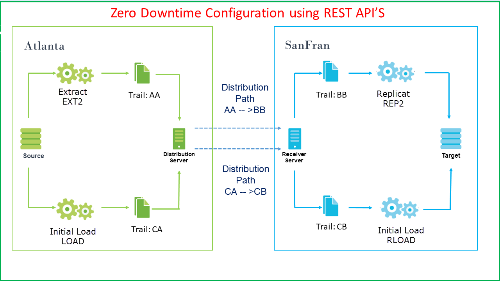

Update January 14, 2019

## Zero Downtime Lab using REST API
## Introduction

This lab, will contains three parts and covers how access the services from Oracle GoldenGate MicroServices using the REST APIs. 
# Part 1: Initial Load by Automated Script

### **STEP 1**: Run a script to delete the current data in the target database.

Before we begin we want to make sure the target database is empty.

-	If you don't have a terminal window opened yet, right click on the Desktop of the VNC session and select **Open Terminal**

-   Change directory to Lab5 and run script **del_target_182.sh**.  This will take a few minutes.

		[oracle@OGG181DB183 Lab5]$ ./del_target_182.sh 
		/opt/app/oracle/product/18.3.0/dbhome_1
		Delete Data From Target Database OGGOOW182

		SQL*Plus: Release 18.0.0.0.0 - Production on Fri Feb 8 19:03:08 2019
		Version 18.3.0.0.0

		Copyright (c) 1982, 2018, Oracle.  All rights reserved.

		Connected to:
		Oracle Database 18c Enterprise Edition Release 18.0.0.0.0 - Production
		Version 18.3.0.0.0
		.
		.
		.
		SQL> SQL> Disconnected from Oracle Database 18c Enterprise Edition Release 18.0.0.0.0 - Production
		Version 18.3.0.0.0

		Done Deleting Data From Target Database OGGOOW182

		[oracle@OGG181DB183 Lab5]$ 

### **STEP 2**: Run a script to perform an initial load to the target database.

-   Change directory to Lab5 and review script **Initial_load_Automated.sh**.

        [oracle@OGG181DB183 ~]$ cd ~/OGG181_WHKSHP/Lab5
		[oracle@OGG181DB183 Lab5]$ ls
		Initial_load_Automated.sh
		[oracle@OGG181DB183 Lab5]$ less Initial_load_Automated.sh

-   Then, run the **Initial_load_Automated.sh** script:

		[oracle@OGG181DB183 Lab5]$ ./Initial_load_Automated.sh 

-   Once the script completes the execution. Source and Target will be in sync.

<<<<<<< HEAD
# Part 2: Initial Load by Manual Script
=======

Initail Load by Automated Script has been completed successfully 
=============================================================================================

# Part 2: Initail Load by Manual Script
>>>>>>> 0dfe2009cea95638f719dd6d2134739490dad359
Steps:
1. Open a command window (Right mouse click – Open Terminal)

2. Create a json file for building an integrated extract.

3. Start the change-capture extract using the Curl Command, which would start the extract with begin-now option.

4. After the command is executed successfully, the command output looks like this:

5. On the Goldengate Microservices Console, under the Admin Server you can see the Extract has been started and running .

6. A path needs to be  created to send the transaction of data from the Extract to the Replicat. You can create a new path by adding configuration  in JSON file.

7. You can execute the following curl command to add the PATH to send data from Extract to replicat.

8. Once the command is executed successfully, you can check on Goldengate Microservices Web Console under Distribution Server for the PATH created  and its Running Status.

9. Next Step is to configure replicat on target which can be done by specifying the various configuration parameters for the Replicat in a JSON file as shown below:

10. In this Step, You just need to configure and create the Replicat and do not start it (we will Start it at specific CSN after the export/import Job is done). Using the curl command we can add the replicat.

11. Now it is time to get the current scn of the source database .So that all the  transactions after this particular CSN are only captured & Replicated (i.e we have to capture only those transactions that occur after the export Job)

SQL> select current_scn from v$database;

12. We need to create a JSON file to alter the Change-Capture Replicat at a particular CSN.

13. We finally need to start the replicat after the Export/import Job has finished successfully on target.We use the following Curl command to start the replicat, which refers to the JSON file created in last step.

14. Once the command is executed successfully you can crosscheck the status of the Replicat on Goldengate Microservices Web Console under the Admin Server of the Target.

You have completed lab 500!   **Great Job!**