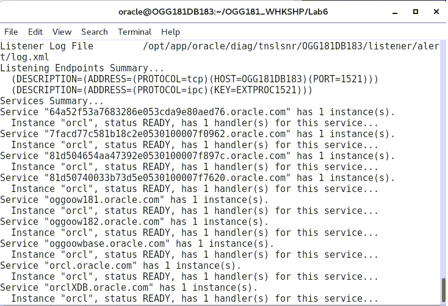
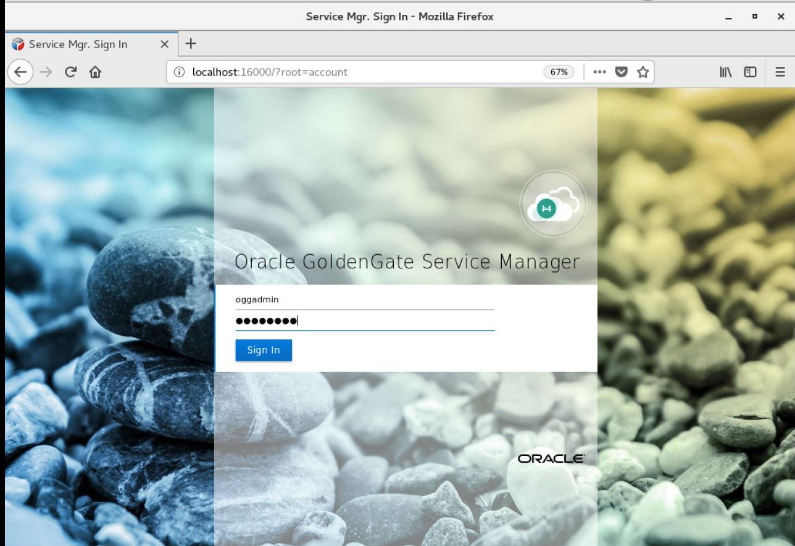

Update December 28, 2018

## Bi-Directional Replication, AutoCDR, Rapid Deployment and Intro to the Admin Client
## Introduction

Since we’ve already done multiple labs, this one will take what we used so far to script this using DB container reset scripts, SQL scripts to setup AutoCDR in the database, OGGCA silent deployment scripts and GG REST API scripts to do a rapid deployment.

## Objectives

- Rapid Deployment using:
  - OGGCA silent deployment scripts (remove and recreate deployments).
  - REST API to setup bi-directional GoldenGate replication between two databases.
  - SQL Scripts to setup up auto conflict detection and resolution in the database.

## Required Artifacts

- VNC Client for the deployment.
- Browser to check the deployment.
- Swingbench to apply transactions.

### **STEP 1**: Run a script to perform a rapid deployment.

- Open up a terminal window and change directory to Lab6 and Review script build_all_bi_di.sh.

                [oracle@OGG181DB183 ~]$ cd ~/OGG181_WHKSHP/Lab6
                [oracle@OGG181DB183 Lab6]$ cat build_all_bi_di.sh 

- This script performs the following:

                1.	Drops the existing container databases.

                2.	Clones two container databases from a base container.

                3.	Deletes the two deployments (Atlanta and SanFran).  This will remove any current lab setups.

                4.	Creates the two deployments again.

                5.	Creates new credentials for both deployments.

                6.	Adds Schema supplemental logging to both container databases for the SOE schema.

                7.	Adds checkpoint tables on both container databases.

                8.	Adds the Extract, Distribution Path and Replicat for both deployments.  This includes the correct 
                parameters for the Extract and Replicats.

- Run the **build_all_bi_di.sh** script

                [oracle@OGG181DB183 Lab6]$ ./build_all_bi_di.sh 

While it's running note the messages displayed that informs what has been added to the services.You should see the below message to be sure that all the steps are completed.

 
 

### **STEP 2**: Check the deployment using the AdminClient
This step will be a short introduction to the AdminClient.  If you’re familiar with Classic GoldenGate, this would be like using GGSCI.  However, the advantage with the AdminClient is that you can connect to separate GG deployments from this one interface.  With GGSCI you would need to execute it in each server environment where GG is installed.  
In this step we will use the AdminClient to check the deployment instead of the web interface.

- Change directory to OGG_HOME/bin.

                [oracle@OGG181DB183 Lab6]$ cd $OGG_HOME/bin
                [oracle@OGG181DB183 bin]$ pwd
                /opt/app/oracle/product/18.1.0_RC2/bin

- Run adminclient

                [oracle@OGG181DB183 bin]$ ./adminclient 

                Oracle GoldenGate Administration Client for Oracle
                Version 18.1.0.0.0 OGGCORE_18.1.0.0.0_PLATFORMS_180928.0432

                Copyright (C) 1995, 2018, Oracle and/or its affiliates. All rights reserved.

                Linux, x64, 64bit (optimized) on Sep 28 2018 16:57:51
                Operating system character set identified as UTF-8.

                OGG (not connected) 1>

- Use connect command

                OGG (not connected) 1> connect http://localhost:16000 as oggadmin password Welcome1

                ERROR: Deployment name must be specified
                Available deployments are:
                - Atlanta
                - SanFran

You’ll see an error that you have to specify the deployment name and it will give you a list of deployments.

- Connect again using the deployment name of Atlanta.

                OGG (not connected) 2> connect http://localhost:16000 deployment Atlanta as oggadmin password Welcome1

                OGG (http://localhost:16000 Atlanta) 3> 

- Type in **“help”**.  You can scroll up and down the list.  For classic GG users you’ll see some familiar commands.

                OGG (http://localhost:16000 Atlanta) 3> help

                Admin Client Command Summary:

                !                          - Executes the previous command without modifications.
                ADD AUTORESTART            - Create an autorestart rule.
                ADD CHECKPOINTTABLE        - Creates a checkpoint table in a database.
                ADD CREDENTIALSTORE        - (Deprecated) Creates a credentials store (wallet) that stores encrypted database user credentials.
                .
                .
                .
                VIEW PARAMS                - Displays the contents of a parameter file in read-only mode on-screen.
                VIEW REPORT                - Displays the process report that is generated by Extract or Replicat.

                OGG (http://localhost:16000 Atlanta) 4> 

- Type in **“info all”**. You’ll see the services for the Atlanta deployment we added and their status and the replication processes and their status.

                OGG (http://localhost:16000 Atlanta) 4> info all
                Program     Status      Group       Lag at Chkpt  Time Since Chkpt

                ADMINSRVR   RUNNING   
                DISTSRVR    RUNNING   
                PMSRVR      RUNNING   
                RECVSRVR    RUNNING   
                EXTRACT     STOPPED     EXTSOE1     00:00:00      00:13:01    
                REPLICAT    STOPPED     IREP1       00:00:00      00:12:28    

- Type in **"set debug on"**

                OGG (http://localhost:16000 Atlanta) 5> set debug on
                Command 5 succeeded: 'set debug on'

- Type in "info all" again.  This time you'll see the JSON generated that you can use for the REST API.

                OGG (http://localhost:16000 Atlanta) 6> info all
                --------------------------------------------------------------------------------
                > GET /services/v2/deployments/Atlanta/services
                < Status 200
                {
                "$schema" : "api:standardResponse",
                "links" : [
                {
                        "href" : "http://localhost:16000/services/v2/deployments/Atlanta/services",
                        "mediaType" : "application/json",
                        "rel" : "canonical"
                .
                .
                .
                "messages" : [],
                "response" : {
                "$schema" : "ogg:replicatStatus",
                "lag" : 0,
                "lastStarted" : null,
                "position" : {
                        "name" : "ba",
                        "offset" : 0,
                        "path" : "/opt/app/oracle/gg_deployments/Atlanta/var/lib/data/",
                        "sequence" : 0
                },
                "sinceLagReported" : 865,
                "status" : "stopped"
                }
                }
                --------------------------------------------------------------------------------
                REPLICAT    STOPPED     IREP1       00:00:00      00:14:25    
                Command 6 succeeded: 'info all'

                OGG (http://localhost:16000 Atlanta) 7> 

- Type in **"set debug off"**

                OGG (http://localhost:16000 Atlanta) 7> set debug off

- Let’s type in a command that isn’t in classic GG.  Type in **“health deployment Atlanta”**.  You’ll get more info on the services than just the info all command gives.

                OGG (http://localhost:16000 Atlanta) 27> health deployment Atlanta

                Deployment: Atlanta
                Service: adminsrvr
                Status: running
                Started: 2019-02-07T22:17:21.925Z
                Health: OK
                Resources: Name                              Type        Status      Health
                        --------------------------------  ----------  ----------  ------

                Deployment: Atlanta
                Service: distsrvr
                Status: running
                Started: 2019-02-07T22:17:22.026Z
                Health: OK
                Resources: Name                              Type        Status      Health
                        --------------------------------  ----------  ----------  ------

                Deployment: Atlanta
                Service: recvsrvr
                Status: running
                Started: 2019-02-07T22:17:21.920Z
                Health: OK
                Resources: Name                              Type        Status      Health
                        --------------------------------  ----------  ----------  ------

- Connect to the SanFran deployment to do a quick check on the status.  You can type in **"history"** to get a list of the previous commands.

- The connect to the Atlanta deployment is there so you can check the syntax.  Enter the same command and change **"Atlanta"** to **"SanFran"**

                OGG (http://localhost:16000 Atlanta) 28> history
                1: connect http://localhost:16000 as oggadmin password Welcome1
                2: connect http://localhost:16000 deployment Atlanta as oggadmin password Welcome1

                OGG (http://localhost:16000 Atlanta) 29> connect http://localhost:16000 deployment SanFran as oggadmin password Welcome1

                OGG (http://localhost:16000 SanFran) 30> 

- Type in **“info all”**.  You’ll see the services for the SanFran deployment we added and their status and the replication processes and their status.

                OGG (http://localhost:16000 SanFran) 30> info all
                Program     Status      Group       Lag at Chkpt  Time Since Chkpt

                ADMINSRVR   RUNNING   
                DISTSRVR    RUNNING   
                PMSRVR      RUNNING   
                RECVSRVR    RUNNING   
                EXTRACT     STOPPED     EXTSOE2     00:00:00      00:23:02    
                REPLICAT    STOPPED     IREP2       00:00:00      00:22:29    

- Exit the AdminClient by typing in **"exit"**.

                OGG (http://localhost:16000 SanFran) 31> exit
                [oracle@OGG181DB183 bin]$ 

### **STEP 3**: Add AutoCDR to tables in the database.

When more than one replica of a table allows changes to the table, a conflict can occur when a change is made to the same row in two different databases at nearly the same time. Oracle GoldenGate replicates changes using the row LCRs. 
It detects a conflict by comparing the old values in the row LCR for the initial change from the origin database with the current values of the corresponding table row at the destination database identified by the key columns. 
If any column value does not match, then there is a conflict.
After a conflict is detected, Oracle GoldenGate can resolve the conflict by overwriting values in the row with some values from the row LCR, ignoring the values in the row LCR, or computing a delta to update the row values.

Automatic conflict detection and resolution does not require application changes for the following reasons:

    •	Oracle Database automatically creates and maintains invisible timestamp columns.

    •	Inserts, updates, and deletes use the delete tombstone log table to determine if a row was deleted.

    •	LOB column conflicts can be detected.

    •	Oracle Database automatically configures supplemental logging on required columns.

This step runs the ADD_AUTO_CDR procedure in the DBMS_GOLDENGATE_ADM package in the database.

- In the terminal window change directory to Lab6 and Review script **setup_autocdr.sh**.

                [oracle@OGG181DB183 bin]$ cd ~/OGG181_WHKSHP/Lab6
                [oracle@OGG181DB183 Lab6]$ cat setup_autocdr.sh 

This script performs the following:

    1.	Logs into the database.

    2.	Changes session to a container.

    3.	Executes the ADD_AUTO_CDR procedure in the DBMS_GOLDENGATE_ADM package.  This sets up the timestamp conflict detection and resolution.  You have to do this for any table you want to enable for CDR.  That’s why it’s best to have this scripted for multiple tables.

- Run the script setup_autocdr.sh.

                [oracle@OGG181DB183 Lab6]$ ./setup_autocdr.sh 

                Setup AutoCDR tables in database

                SQL*Plus: Release 18.0.0.0.0 - Production on Thu Feb 7 22:44:15 2019
                Version 18.3.0.0.0

                Copyright (c) 1982, 2018, Oracle.  All rights reserved.

                Connected to:
                Oracle Database 18c Enterprise Edition Release 18.0.0.0.0 - Production
                Version 18.3.0.0.0

                SQL> 
                Session altered.

                SQL> 
                PL/SQL procedure successfully completed.
                .
                .
                .
                SQL> 
                PL/SQL procedure successfully completed.

                SQL> Disconnected from Oracle Database 18c Enterprise Edition Release 18.0.0.0.0 - Production
                Version 18.3.0.0.0

                Done setting up AutoCDR

                [oracle@OGG181DB183 Lab6]$ 

### **STEP 4**: Start Replication

- Run the start_replication.sh script to start the replication processes for the Atlanta capture and the SanFran delivery.

                [oracle@OGG181DB183 Lab6]$ ./start_replication.sh Welcome1 16001 EXTSOE1 16002 SOE2SOE1 17001 IREP2
                % Total    % Received % Xferd  Average Speed   Time    Time     Time  Current
                                                Dload  Upload   Total   Spent    Left  Speed
                100   853  100   702  100   151   8865   1907 --:--:-- --:--:-- --:--:--  9000
                {
                .
                .
                .
                        {
                        "$schema": "ogg:message",
                        "code": "OGG-15426",
                        "issued": "2019-02-07T22:51:05Z",
                        "severity": "INFO",
                        "title": "EXTRACT EXTSOE1 started",
                        "type": "http://docs.oracle.com/goldengate/c1810/gg-winux/GMESG/oggus.htm#OGG-15426"
                        }
                ]
                }
                [oracle@OGG181DB183 Lab6]$ 

- Next, run the start_replication.sh script again to start the replication processes for the SanFran capture and the Atlanta delivery.  Use the CREATE SCN value from OGGOOW182 as the last value of the script (See example above).  This is for the startup of the Replicat on the Atlanta deployment.

                [oracle@OGG181DB183 Lab6]$ ./start_replication.sh Welcome1 17001 EXTSOE2 17002 SOE2SOE2 16001 IREP1
                % Total    % Received % Xferd  Average Speed   Time    Time     Time  Current
                                                Dload  Upload   Total   Spent    Left  Speed
                100   853  100   702  100   151   8354   1797 --:--:-- --:--:-- --:--:--  8357
                {
                .
                .
                .
                        {
                        "$schema": "ogg:message",
                        "code": "OGG-15426",
                        "issued": "2019-02-07T22:53:42Z",
                        "severity": "INFO",
                        "title": "EXTRACT EXTSOE2 started",
                        "type": "http://docs.oracle.com/goldengate/c1810/gg-winux/GMESG/oggus.htm#OGG-15426"
                        }
                ]
                }
                [oracle@OGG181DB183 Lab6]$ 

### **STEP 5**: Run transactions and check conflicts with Performance Metric Service

In this step we’ll use a script to invoke Swingbench to apply data to both databases at the same time and then check them using the Performance Metric Service.

- In the terminal window review script start_swingbench.sh.

                [oracle@OGG181DB183 Lab6]$ cat start_swingbench.sh 
                #!/bin/bash
                cd ~/OGG181_WHKSHP/Lab6/Build
                ./start_swingbench_181.sh &
                ./start_swingbench_182.sh &
                [oracle@OGG181DB183 Lab6]$ 

This script runs the swingbench jobs you ran in the other labs, but this time it will run two jobs in the background and each job applies data to one or the other databases.

- Run start_swingbench.sh.  It will take a few seconds to start up and run for 10 mins.

                [oracle@OGG181DB183 Lab6]$ ./start_swingbench.sh 
                [oracle@OGG181DB183 Lab6]$ Author  :	 Dominic Giles
                Author  :	 Dominic Giles
                Version :	 2.6.0.1046

                Version :	 2.6.0.1046
                Results will be written to results.xml.

                Results will be written to results.xml.
                Hit Return to Terminate Run...
                Hit Return to Terminate Run...

                Time		Users

                Time		Users
                00:10:47	[0/2]
                00:10:47	[0/2]

- From the browser, log in to the Service Manager using the Administrator account **"oggadmin"** the password should be **"Welcome1"**.

 

- Next click on the link to the Performance Metrics Server for Atlanta.

 

- Click on the Replicat icon.

 

- We’ll take a longer look at the Metric Service in another lab, so for now just click on the “Database Statistics” tab.

 

On this screen you’ll see the number of operations performed and their types and also the number of conflicts detected, and the number of conflicts resolved.  This is done automatically by the AutoCDR configuration.

 

If you want, you can check the Replicat of the other deployment and you’ll see a similar display.

You have completed lab 600! Great Job!
