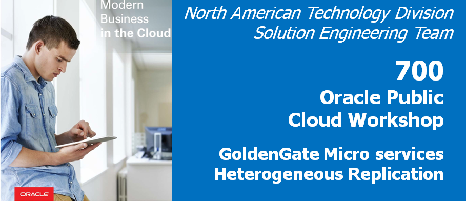
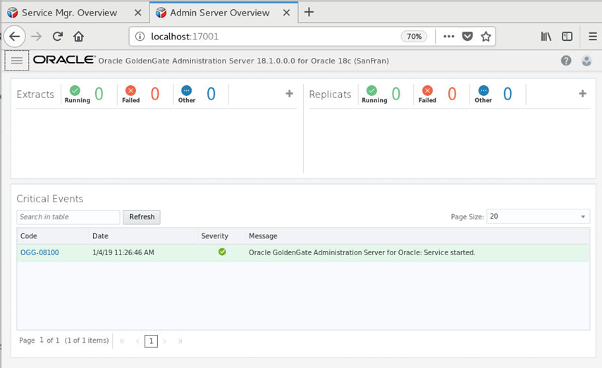
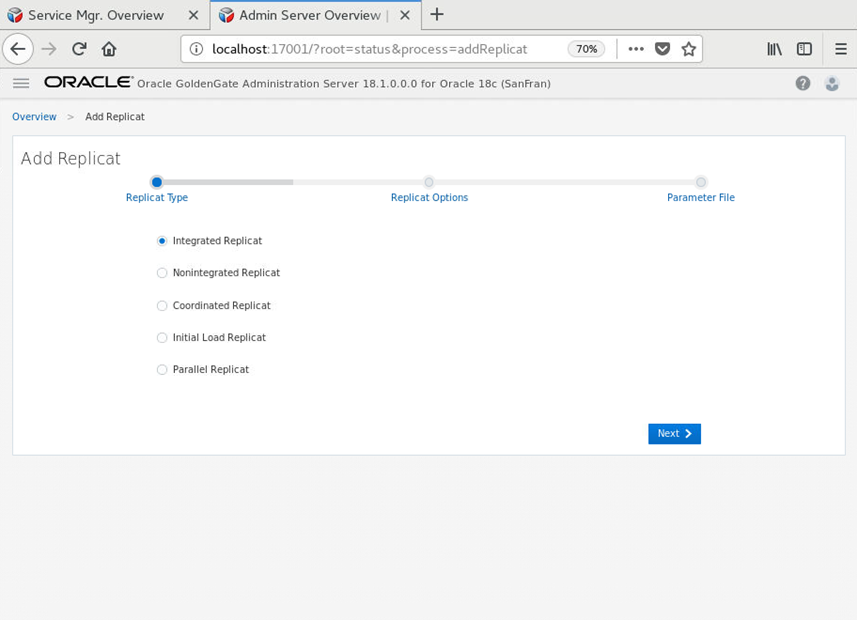
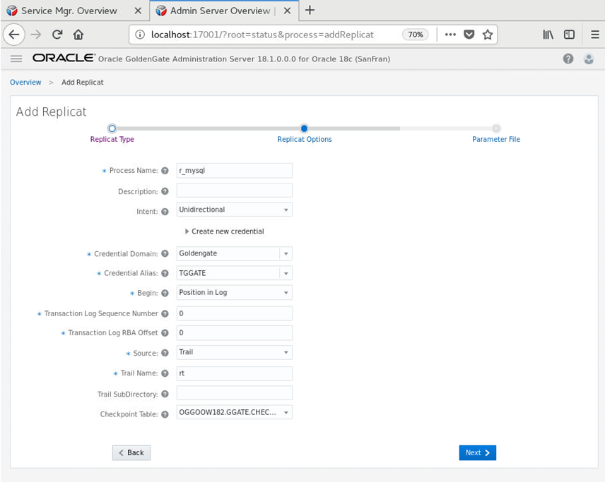
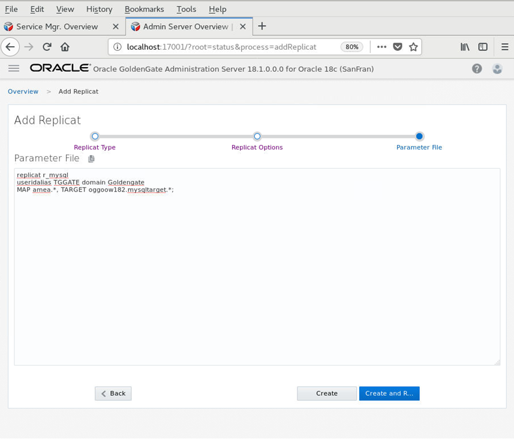
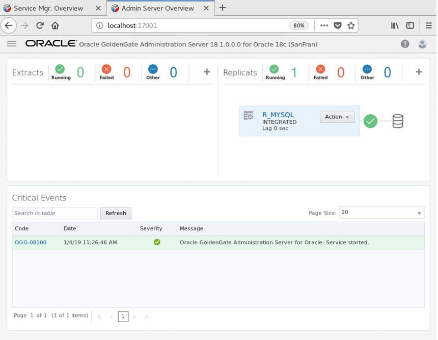
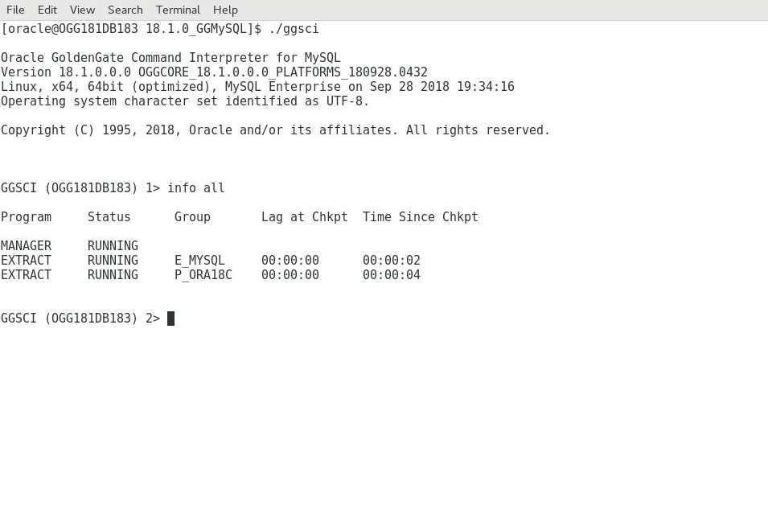
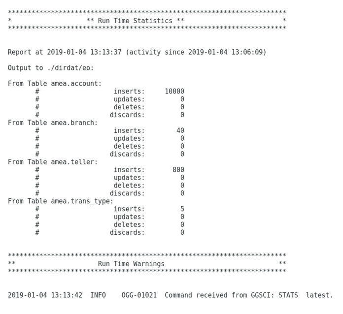
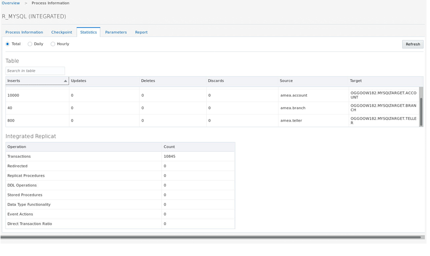

Update January 04, 2019

## GoldenGate Micro services Heterogeneous Replication
## Introduction

In this lab, you will take a look at how to set up replication from MySQL DB to Oracle Database using Classic Goldengate for MySQL and Goldengate Microservices architecture.

This lab supports the following use cases:

- Setting up GoldenGate for MySQL.
- Setting up Replication in GoldenGate Microservices architecture for Oracle PDB ( OGGOOW182 ).

## Objectives

Create a classic GoldenGate architecture capture process (Extract) for MySQL and a Microservices delivery process (Replicat) to receive the data.  While MySQL isn’t supported as a deployment option for Microservices yet, you can still connect to existing Classic GoldenGate instances to replicate data.

## Required Artifacts

### **STEP 1**: Create Replication Environment
This step sets up a clean GoldenGate Microservices target deployment.  This script will take a couple of minutes to complete.

- Open up a terminal window and change directory to Lab7 and run the script **build_target.sh**.
                [oracle@OGG181DB183 Lab7]$ ./build_target.sh 

- This script performs the following:

                1.	Deletes any existing deployments, which will remove any current lab setups.

                2.	Creates the target deployments for this lab (SanFran).

                3.	Creates new credentials for the deployment.

                4.	Adds checkpoint table for the database. 

### **STEP 2**: MySQL Setup

GoldenGate for MySQL is already installed on the Ravello image.  You will be using another terminal session to run the MySQL transactions and GoldenGate processes

- Open a new Terminal window from the VNC Console.

- Sudo into the root user and when Prompted use the password 'Welcome1'

                $ sudo su - root
      
      
      [oracle@OGG181DB183 ~]$ sudo su - root
      [sudo] password for oracle: 
      Last login: Thu Feb 14 18:10:24 UTC 2019 on pts/1
      Last failed login: Thu Feb 14 18:12:02 UTC 2019 from 73.163.148.213 on ssh:notty
      There were 6 failed login attempts since the last successful login. 
      
- Change to the MySQL GG home.
      
      [root@OGG181DB183 ~]# cd /opt/app/oracle/product/18.1.0_GGMySQL
    
- Run the GoldenGate command interpreter (GGSCI).

      [root@OGG181DB183 18.1.0_GGMySQL]# ./ggsci

      Oracle GoldenGate Command Interpreter for MySQL
      Version 18.1.0.0.0 OGGCORE_18.1.0.0.0_PLATFORMS_180928.0432
      Linux, x64, 64bit (optimized), MySQL Enterprise on Sep 28 2018 19:34:16
      Operating system character set identified as UTF-8.

      Copyright (C) 1995, 2018, Oracle and/or its affiliates. All rights reserved.

- Start the manager and check with info all command

      GGSCI (OGG181DB183) 1> start mgr
      Manager started.

      GGSCI (OGG181DB183) 2> info all

      Program     Status      Group       Lag at Chkpt  Time Since Chkpt

      MANAGER     RUNNING                                           

      GGSCI (OGG181DB183) 2> info all
      
      Program     Status      Group       Lag at Chkpt  Time Since Chkpt

      MANAGER     RUNNING                                           

- Run the OGG obey script to create the replication processes and check with info all command

                
      GGSCI (OGG181DB183) 3> obey ./dirprm/setup_mysql.oby

      GGSCI (OGG181DB183) 4> -- This is a script(oby) file that executes GGSCI commands to initialize the GoldenGate environment. These commands can be run individually directly via the GGSCI interface.

      GGSCI (OGG181DB183) 5> 

      GGSCI (OGG181DB183) 5> -- CREATE THE CHANGE DATA CAPTURE EXTRACT,  AND LOCAL EXTRACT TRAIL OF 50MB

      GGSCI (OGG181DB183) 6> 

      GGSCI (OGG181DB183) 6> -- -- Add the E_MYSQL extract. This reads the mysql binary transaction logs directly. This command creates the extract checkpoint file. VAM indicates use of a Vendor Access Module to interface with the logs. BEGIN NOW captures any transactions from the redo log that are opened after this command is issued

      GGSCI (OGG181DB183) 7> 

      GGSCI (OGG181DB183) 7> ADD EXTRACT E_MYSQL, VAM, BEGIN NOW

      EXTRACT added.

      GGSCI (OGG181DB183) 8> 

      GGSCI (OGG181DB183) 8> ADD EXTTRAIL ./dirdat/eo, EXTRACT E_MYSQL, MEGABYTES 50

      EXTTRAIL added.

      GGSCI (OGG181DB183) 9> 

      GGSCI (OGG181DB183) 9> ADD EXTRACT P_ORA18C, EXTTRAILSOURCE ./dirdat/eo

      EXTRACT added.

      GGSCI (OGG181DB183) 10> 

      GGSCI (OGG181DB183) 10> ADD RMTTRAIL rt, EXTRACT P_ORA18C, MEGABYTES 50

      RMTTRAIL added.

      GGSCI (OGG181DB183) 11> info all

      Program     Status      Group       Lag at Chkpt  Time Since Chkpt

      MANAGER     RUNNING                                           
      EXTRACT     STOPPED     E_MYSQL     00:00:00      00:02:57    
      EXTRACT     STOPPED     P_ORA18C    00:00:00      00:02:55    

### **STEP 3**: Setup Microservices Target 

We will use the web UI for the Administration Service of the SanFran Deployment (http://hostname:17001).

- Open a new browser tab and connect to http://hostname:17001 

- Login with the following oggadmin/Welcome1

- On the Overview page click the plus sign (+) opposite the Replicat status.

- On the next page click “Next” to create an Integrated Replicat.

- Fill in the required parameters (See Screenshot).  Then click “Next”.

- The next page will show the parameter file.  Add the following information:
                MAP amea.*, TARGET oggoow182.mysqltarget.*;

- Click **“Create and Run”**.

- The replicat will be running , It might fail if you have not started the Pump process on the MySQL side

### **STEP 4**: Loading Data and validating the setup

-  Start MySQL Goldengate Process

      [root@OGG181DB183 18.1.0_GGMySQL]# pwd
      /opt/app/oracle/product/18.1.0_GGMySQL
      [root@OGG181DB183 18.1.0_GGMySQL]# ./ggsci

      Oracle GoldenGate Command Interpreter for MySQL
      Version 18.1.0.0.0 OGGCORE_18.1.0.0.0_PLATFORMS_180928.0432
      Linux, x64, 64bit (optimized), MySQL Enterprise on Sep 28 2018 19:34:16
      Operating system character set identified as UTF-8.

      Copyright (C) 1995, 2018, Oracle and/or its affiliates. All rights reserved.

      GGSCI (OGG181DB183) 1> info all

      Program     Status      Group       Lag at Chkpt  Time Since Chkpt

      MANAGER     RUNNING                                           
      EXTRACT     RUNNING     E_MYSQL     00:00:01      00:00:06    
      EXTRACT     RUNNING     P_ORA18C    00:00:00      00:00:06    

            GGSCI (OGG181DB183) 2> 

-  Log in into mysql database 

       [oracle@OGG181DB183 ~]$ cd  /home/oracle/OGG181_WHKSHP/Lab7/MySQL/dirsql
       [oracle@OGG181DB183 dirsql]$ ls
       counts.sql  drop_database.sql  seed_database.sql  source_database.sql
       [oracle@OGG181DB183 dirsql]$ mysql -u root -p
       Enter password: 
       Welcome to the MySQL monitor.  Commands end with ; or \g.
       Your MySQL connection id is 10
       Server version: 8.0.13 MySQL Community Server - GPL

       Copyright (c) 2000, 2018, Oracle and/or its affiliates. All rights reserved.

       Oracle is a registered trademark of Oracle Corporation and/or its
       affiliates. Other names may be trademarks of their respective
       owners.

       Type 'help;' or '\h' for help. Type '\c' to clear the current input statement.

       mysql> use amea
       Reading table information for completion of table and column names
       You can turn off this feature to get a quicker startup with -A
       Database changed

- Load the data in MySQL DB with the script present at /home/oracle/OGG181_WHKSHP/Lab7/MySQL/dirsql

                
      mysql> source /home/oracle/OGG181_WHKSHP/Lab7/MySQL/dirsql/seed_database.sql
      Database changed
      Query OK, 0 rows affected (0.00 sec)
      Query OK, 0 rows affected (0.25 sec)
      Query OK, 0 rows affected (0.15 sec)
      Query OK, 0 rows affected (0.14 sec)
      Query OK, 0 rows affected (0.16 sec)
      Query OK, 0 rows affected (0.16 sec)
      Query OK, 0 rows affected (0.24 sec)
      Query OK, 0 rows affected (0.20 sec)
      Query OK, 1 row affected (0.02 sec)
      Query OK, 1 row affected (0.02 sec)
      Query OK, 1 row affected (0.02 sec)
      Query OK, 1 row affected (0.03 sec)
      Query OK, 1 row affected (0.02 sec)
      Query OK, 0 rows affected (0.00 sec)
      Query OK, 0 rows affected (0.06 sec)
      Query OK, 0 rows affected (0.10 sec)
      Query OK, 0 rows affected (3 min 22.93 sec)
      mysql> 

-  It will take couple minutes to load the data. After that We can see the statstics in the extract report file

-  Below is the statstics in the Replicat side

- To do record count of the tables MySQL DB. Go to directory "/home/oracle/OGG181_WHKSHP/Lab7/MySQL/dirsql" and login into mySQL using password "Welcome1".
- enter "source counts.sql" in mysql client

      [oracle@OGG181DB183 ~]$ cd  /home/oracle/OGG181_WHKSHP/Lab7/MySQL/dirsql
      [oracle@OGG181DB183 dirsql]$ mysql -u root -p
      Enter password: 
      Welcome to the MySQL monitor.  Commands end with ; or \g.
      Your MySQL connection id is 13
      Server version: 8.0.13 MySQL Community Server - GPL

      Copyright (c) 2000, 2018, Oracle and/or its affiliates. All rights reserved.

      Oracle is a registered trademark of Oracle Corporation and/or its
      affiliates. Other names may be trademarks of their respective
      owners.

      Type 'help;' or '\h' for help. Type '\c' to clear the current input statement.

      mysql> source counts.sql
      \Reading table information for completion of table and column names
      You can turn off this feature to get a quicker startup with -A

      Database changed
      +---------+
      | account |
      +---------+
      |   10000 |
      +---------+
      1 row in set (0.00 sec)

      +---------------+
      | account_trans |
      +---------------+
      |             0 |
      +---------------+
      1 row in set (0.00 sec)

      +--------------+
      | teller_trans |
      +--------------+
      |            0 |
      +--------------+
      1 row in set (0.00 sec)

      +------------+
      | branch_atm |
      +------------+
      |          0 |
      +------------+
      1 row in set (0.00 sec)

      +--------+
      | branch |
      +--------+
      |     40 |
      +--------+
      1 row in set (0.00 sec)

      +--------+
      | teller |
      +--------+
      |    800 |
      +--------+
      1 row in set (0.00 sec)

      +------------+
      | trans_type |
      +------------+
      |          5 |
      +------------+
      1 row in set (0.00 sec)

      mysql> 

- To do record count of the tables in Oracle DB. Go to directory "/home/oracle/OGG181_WHKSHP/Lab7/Oracle/dirsql" and login into Oracle using password "Welcome1".
- enter "@counts" in Oracle client

      [oracle@OGG181DB183 ~]$ cd /home/oracle/OGG181_WHKSHP/Lab7/Oracle/dirsql
      [oracle@OGG181DB183 dirsql]$ sqlplus mysqltarget/Welcome1@oggoow182

      SQL*Plus: Release 18.0.0.0.0 - Production on Fri Feb 15 00:24:55 2019
      Version 18.3.0.0.0

      Copyright (c) 1982, 2018, Oracle.  All rights reserved.

      Connected to:
      Oracle Database 18c Enterprise Edition Release 18.0.0.0.0 - Production
      Version 18.3.0.0.0

      SQL> @counts
      SQL> select count(*) from ACCOUNT;

        COUNT(*)
      ----------
           10000

      SQL> select count(*) from ACCOUNT_TRANS;

        COUNT(*)
      ----------
         0

      SQL> select count(*) from TELLER_TRANS;

        COUNT(*)
      ----------
         0

      SQL> select count(*) from BRANCH_ATM;

        COUNT(*)
      ----------
         0

      SQL> select count(*) from BRANCH;

        COUNT(*)
      ----------
        40

      SQL> select count(*) from TELLER;

        COUNT(*)
      ----------
             800

      SQL> select count(*) from TRANS_TYPE;

        COUNT(*)
      ----------
         5

      SQL> 

You have completed lab 700!   **Great Job!**
