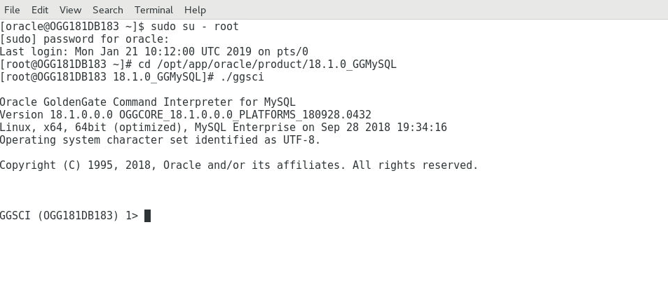

Update January 04, 2019

## GoldenGate Micro services Heterogeneous Replication
## Introduction

In this lab, you will take a look at how to set up replication from MySQL DB to Oracle Database using Classic Goldengate for MySQL and Goldengate Microservices architecture.

This lab supports the following use cases:

-       Setting up GoldenGate for MySQL.
-       Setting up Replication in GoldenGate Microservices architecture for Oracle PDB ( OGGOOW182 ).

## Objectives

Create a classic GoldenGate architecture capture process (Extract) for MySQL and a Microservices delivery process (Replicat) to receive the data.  While MySQL isn’t supported as a deployment option for Microservices yet, you can still connect to existing Classic GoldenGate instances to replicate data.

## Required Artifacts

### **STEP 1**: Create Replication Environment
This step sets up a clean GoldenGate Microservices target deployment.  This script will take a couple of minutes to complete.

-       Open up a terminal window and change directory to Lab7 and run the script **build_target.sh**.
                [oracle@OGG181DB183 Lab7]$ ./build_target.sh 

-       This script performs the following:

                1.	Deletes any existing deployments, which will remove any current lab setups.

                2.	Creates the target deployments for this lab (SanFran).

                3.	Creates new credentials for the deployment.

                4.	Adds checkpoint table for the database. 

### **STEP 2**: MySQL Setup

GoldenGate for MySQL is already installed on the Ravello image.  You will be using another terminal session to run the MySQL transactions and GoldenGate processes

-       Open a new Terminal window from the VNC Console.

-       Sudo into the root user and when Prompted use the password 'Welcome1'

                $ sudo su - root

 

-       Change to the MySQL GG home.

                $ cd /opt/app/oracle/product/18.1.0_GGMySQL

-       Run the GoldenGate command interpreter (GGSCI).

                $./ggsci

-       Start the manager and check with info all command

                $GGSCI> start MGR

                $GGSCI> info all

-       Run the OGG obey script to create the replication processes and check with info all command

                $GGSCI> obey ./dirprm/setup_mysql.oby

### **STEP 3**: Setup Microservices Target 

We will use the web UI for the Administration Service of the SanFran Deployment (http://<hostname>:17001).

-       Open a new browser tab and connect to http://<hostname>:17001 

-       Login with the following oggadmin/Welcome1

-       On the Overview page click the plus sign (+) opposite the Replicat status.

-       On the next page click “Next” to create an Integrated Replicat.

-       Fill in the required parameters (See Screenshot).  Then click “Next”.

-       The next page will show the parameter file.  Keep the default for now and click “Create”.

-       The replicat will be running , It might fail if you have not started the Pump process on the Mysql side

### **STEP 4**: Loading Data and validating the setup

-       Start MySql Goldengate Process

-       Load the data in Mysql DB with the script present at /home/oracle/OGG181_WHKSHP/Lab7/MySQL/dirsql

It will take couple minutes to load the data. After that We can see the statstics in the extract report file

Below is the statstics in the Replicat side

Record count of the tables of Mysql DB

Record count of the tables of Oracle DB

You have completed lab 700!   **Great Job!**