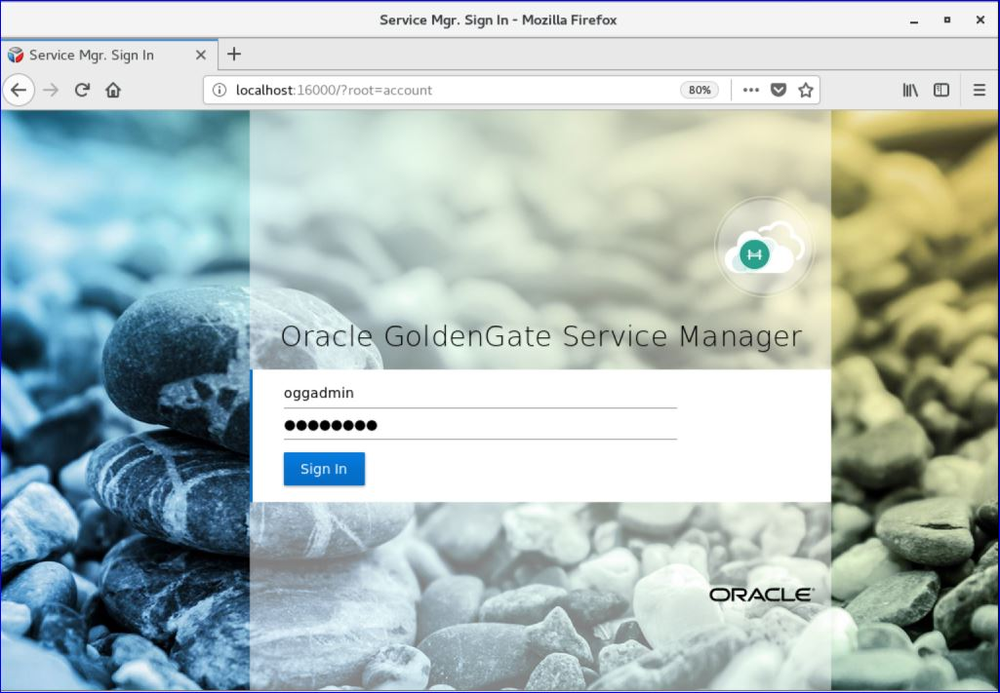
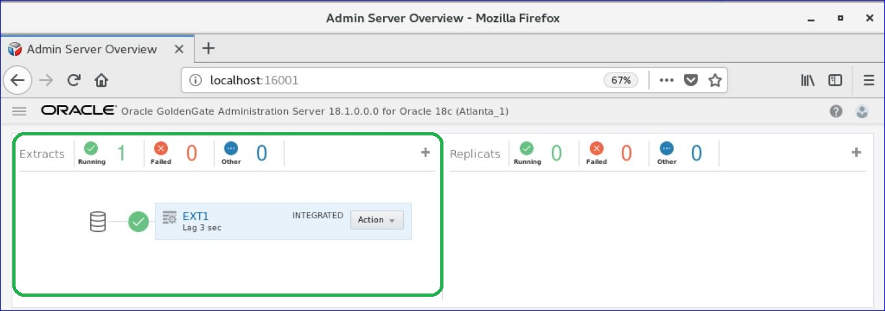
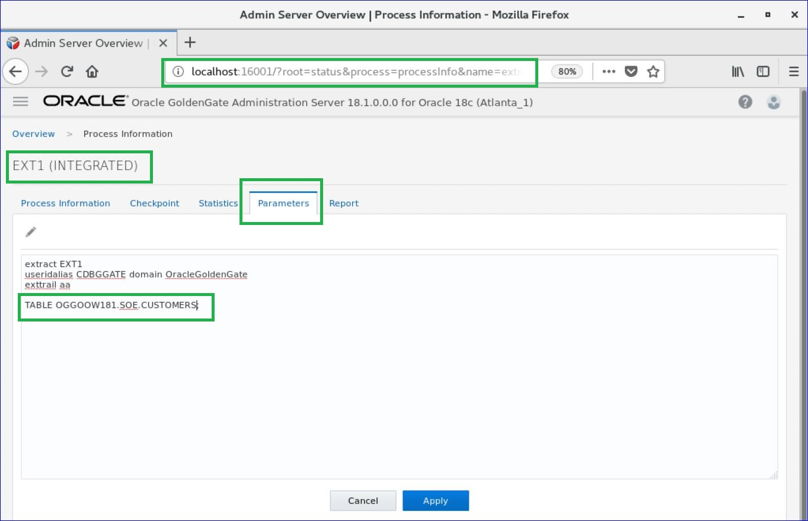
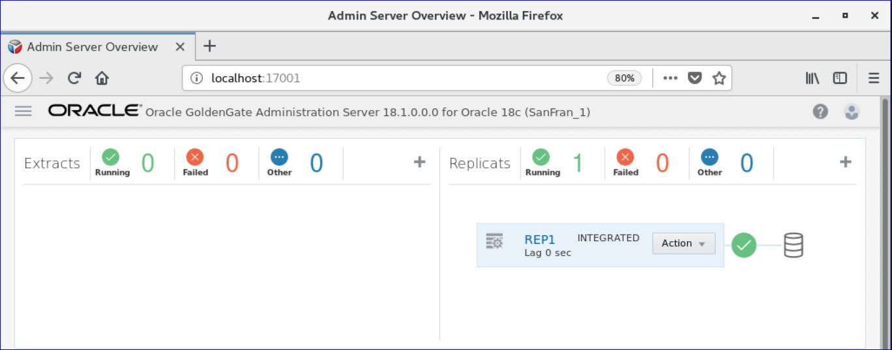
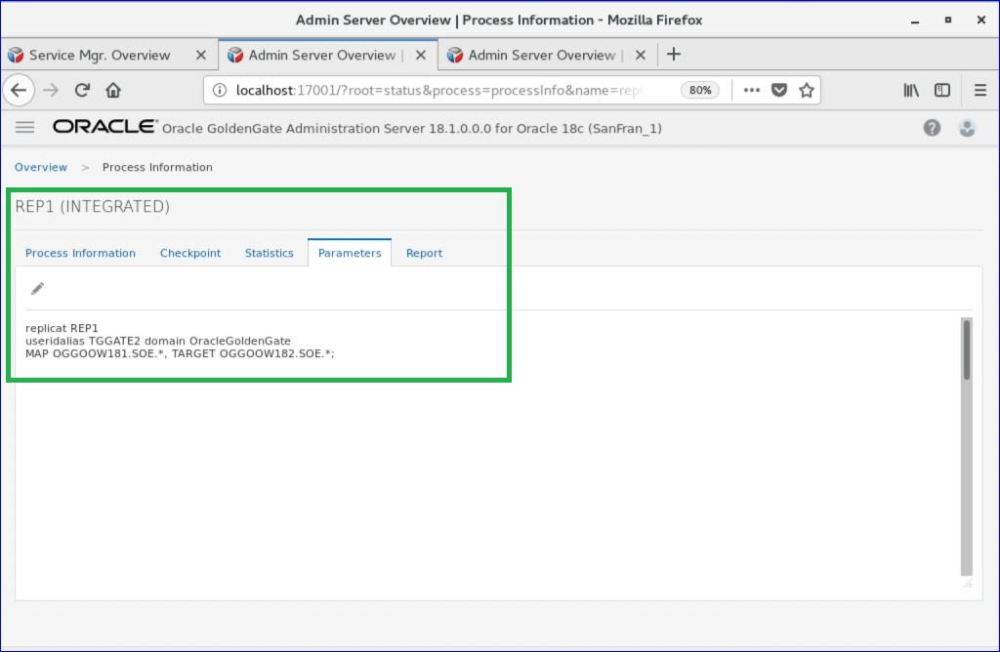

Update August 21, 2018

## Data Transformation
## Introduction

This lab walk you through ***Data Transformation*** of the **Oracle Goldengate 12.3 Micro Services Web Interface** in a Ravello environment.

This lab supports the following use cases:
-	Concatenating the source '***m***'column into target single '***n***' column.
-	Masking the Source Crucial email-id's into a dummy email in the target.
-	Use of Tokens.
- To log issues and view the Lab Guide source, go to the [github oracle](https://github.com/oracle/learning-library/tree/master/workshops/dbcs) repository.

## Objectives

-   Manipulating Numbers and Character Strings.
-   Configuring Table-level Column Mapping.
-   Using Tokens.

Steps:

1.	Open Firefox and login to the Service Manager using the Administrator account you setup during deployment (Figure 8a-1). Port number will vary depending on what you used during setup.

For Ravello Environment

http://localhost:16000

Figure 8a-1:

 
 

2.	After logging in, find and open the Administration Server of the Source deployment is Atlanta (Figure 8a-2).  When the page is completely open, you should be at a page where you can see Extracts ***EXT1***.
Note: You will be required to login again.  Use the same Administrator account that was used with the Service Manager.

Figure 8a-2:

 

-	parameter details of the extract ***EXT1***.

 
 

3.	Again logging in the ***Service Manager*** , find and open the Administration Server of the Target deployment is Sanfran (Figure 8a-3).  When the page is completely open, you should be at a page where you can see Extracts ***REP1***.
Note: You will be required to login again.  Use the same Administrator account that was used with the Service Manager.

Figure 8a-3:
 

-	parameter details of the extract ***REP1***.

 
 

### Scenario : Concatenating the source '***m***'column into target single '***n***' column.

You will need to create two (2) credential aliases for your Atlanta_1 deployment. The first credential will be for the CDB database and the second will be for the PDB1 database. The table below shows what needs to be added:

Credential Domain	Credential Alias	UserID	Password
SGGATE	SGGATE	C##GGATE@PDB1	ggate
CDBGGATE	CDBGGATE	C##GGATE@CDB	ggate
 

5.	Verify that the credentials you just created work.  There is a little man icon under Action in the table.  Click on this for each Credential Alias and you should be able to login to the database (Figure 7a-5).

Figure 7a-5:

 
 

6.	Add SCHEMATRANDATA to the SOE schema using the SGGATE Credential Alias.  
After logging into the database as described in step 5 for PDB1, find the Trandata section.  Click on the plus ( + ) sign and make sure that the radio button for Schema is selected (Figure 7a-6).  At this point, you provide the Schema Name, enable All Columns and Scheduling Columns, and click Submit.

Figure 7a-6:

 
 

You will notice that after you click Submit, there is no return message that states the operation was successful.  You can verify that SCHEMATRANDATA has been added by looking searching by Schema (Figure 7a-7).  To do this, click on the magnifying glass and provide the Schema name.

Figure 7a-7:

 
 

7.	Add the Protocol user.
Since we are on the Credential screen, let’s go ahead and add a Protocol user.  A Protocol user is the user that the Distribution Server will use to communicate with the Receiver Server over an unsecure connection.
As you did in Step 4, click the plus sign ( + ) next to the word Credentials.  Then provide the connection information needed (Figure 7a-8), notice that you will be using the Service Manager login in this credential.

Figure 7a-8:

 
 

For now, just leave this login alone.  It will be used in a later step. 

8.	Add the Integrated Extract.
Navigate back to the Overview page of the Administration Server (Figure 7a-9).  Then click on the plus sign ( + ) in the box for Extracts.

Figure 7a-9:

 

After clicking the plus sign ( + ), you are taken to the Add Extract page (Figure 7a-10).  Here you can choose from three different types of Extracts.  You will be installing an Integrated Extract.  Click Next.

Figure 7a-10:

 

The next page of the Add Extract process, is to provide the basic information for the Extract. Items required have a star ( * ) next to them.  Provide the required information and then click Next (Figure 7a-11).  Keep in mind that the credentials needed to register the Extract need to be against the CDB. Use the CDB domain and alias that you setup previously.

When using the CDB credential, at the bottom of the page, you will be presented with a box where you can select the PDB that will be used. This will only appear when you have a valid credential for the CDB.  Once you see this box, make sure you select PDB1. 

Figure 7a-11:

 
 

On the last page of the Add Extract process, you are presented with a parameter file (Figure 7a-12).  The parameter file is partially filled out, but missing the TABLE parameters. Insert the following list of TABLE parameter values into the parameter file.
SOURCECATALOG PDB1
TABLE SOE.ADDRESSES;
TABLE SOE.CUSTOMERS;
TABLE SOE.ORDERS;
TABLE SOE.ORDER_ITEMS;
TABLE SOE.CARD_DETAILS;
TABLE SOE.LOGON;
TABLE SOE.PRODUCT_INFORMATION;
TABLE SOE.INVENTORIES;
TABLE SOE.PRODUCT_DESCRIPTIONS;
TABLE SOE.WAREHOUSES;
TABLE SOE.ORDERENTRY_METADATA;

Notes: ~/Desktop/Software/extract.prm has these contents for copying.
Once the TABLE statements are added, click Create and Run at the bottom of the page.

Figure 7a-12:
 
 

The Administration Server page will refresh when the process is done registering the Extract with the database, and will show that the Extract is up and running (Figure 7a-13).

Figure 7a-13:
 
 

Lab 7b: Configure Uni-Directional Replication (Distribution Server)

Objective:
This lab will walk you through how to setup a Path within the Distribution Server.

Time: 10 minutes

Steps:
1.	Start from the Service Manager page (Figure 7b-1).

Figure 7b-1:

 

2.	Open the Distribution Server page for your first deployment (Figure 7b-2).

Figure 7b-2:

 

3.	Click the plus sign ( + ) to add a new Distribution Path (Figure 7b-3).

Figure 7b-3:

 

4.	On the Add Path page, fill in the required information (Figure 7b-4).  Make note that the default protocol for distribution service is secure websockets (wss).  You will need to change this to websockets (ws).

Figure 7b-4:

 

Notice the drop down with the values WS, WSS, UDT and OGG.  These are the protocols you can select to use for transport.  Since you are setting up an unsecure uni-directional replication, make sure you select WS, then provide the following target information:
Hostname: ogg123rs
Port: <2nd deployment’s receiver server port>
Trail File: <any two letter value>
Domain: <credential you created in the Admin Server for WS>
Alias: <credential you created in the Admin Server for WS>
After filling out the form, click Create and Run at the bottom of the page.

5.	If everything works as expected, your Distribution Path should be up and running.  You should be able to see clearly the source and target on this page (Figure 7b-5).

Figure 7b-5:
 
 

Lab 7c: Configure Uni-Directional Replication (Receiver Server)

Objective:
In this lab, you will configure the Receiver Server for the target database, which will receive the trail from the Distribution Path that you created on the source deployment.

Time: 5 minutes

Steps:
1.	Start from the Service Manager page for your second deployment (Figure 7c-1).

Figure 7c-1:
 
 

2.	Click on the Receiver Server link to open the Receiver Server page (Figure 7c-2).  Verify that everything is configured.

Figure 7c-2:

 

Lab 7d: Configure Uni-Directional Replication (Integrated Replicat)

Object:
In this lab you will configure the Integrated Replicat for the second deployment.

Time: 25 minutes

Steps:
1.	Starting from the Service Manager page (Figure 7d-1).

Figure 7d-1:
 
 
 
2.	Open the Administration Server for the second deployment by clicking on the link (Figure 7d-2).

Figure 7d-2:

 

3.	Open the Configuration option to add your credentials needed to connect to PDB2 (Figure 7d-3).  After creating the credential, login and verify that it works.
You will need to create 1 credential for the user to connect to PDB2.  We will use the same common user as before, C##GGATE@PDB2, with password ggate.  Click Submit when finished.

Figure 7d-3:
 
 

4.	Navigate back to the Overview page on the Administration Server.  Here you will begin to create your Integrated Replicat (Figure 7d-4).  Click the plus sign ( + ) to open the Add Replicat process.

Figure 7d-4:
 
 

5.	With the Add Replicat page open, you want to create an Integrated Replicat.  Make sure the radio button is selected and click Next (Figure 7d-5).

Figure 7d-5:
 
 

6.	Fill in the Replicat options form with the required information (Figure 7d-6).  Your trail name should match the trail name you saw in the Receiver Server.  Once you are done filling everything out, click the Next button at the bottom of the screen.

Figure 7d-6:
 
 

7.	You are next taken to the Parameter File page.  On this page, you will notice that a sample parameter file is provided (Figure 7d-7).  You will have to remove the MAP statement and replace it with the information below:

INSERTMISSINGUPDATES
MAP PDB1.SOE.CUSTOMERS, TARGET SOE.CUSTOMERS, KEYCOLS (CUSTOMER_ID);
MAP PDB1.SOE.ADDRESSES, TARGET SOE.ADDRESSES, KEYCOLS (ADDRESS_ID);  
MAP PDB1.SOE.ORDERS, TARGET SOE.ORDERS, KEYCOLS (ORDER_ID);
MAP PDB1.SOE.ORDER_ITEMS, TARGET SOE.ORDER_ITEMS, KEYCOLS (ORDER_ID, LINE_ITEM_ID);
MAP PDB1.SOE.CARD_DETAILS, TARGET SOE.CARD_DETAILS, KEYCOLS (CARD_ID);
MAP PDB1.SOE.LOGON, TARGET SOE.LOGON;
MAP PDB1.SOE.PRODUCT_INFORMATION, TARGET SOE.PRODUCT_INFORMATION;
MAP PDB1.SOE.INVENTORIES, TARGET SOE.INVENTORIES, KEYCOLS (PRODUCT_ID, WAREHOUSE_ID);
MAP PDB1.SOE.PRODUCT_DESCRIPTIONS, TARGET SOE.PRODUCT_DESCRIPTIONS;
MAP PDB1.SOE.WAREHOUSES, TARGET SOE.WAREHOUSES;
MAP PDB1.SOE.ORDERENTRY_METADATA, TARGET SOE.ORDERENTRY_METADATA;
Notes: ~/Desktop/Software/replicat.prm has these contents for copying.
Once the parameter file has been updated, click the Create and Run button at the bottom.

Figure 7d-7:
 
 

At this point, you should have a fully functional uni-directional replication environment. You can start Swingbench and begin testing.  See Appendix A for further instructions.
