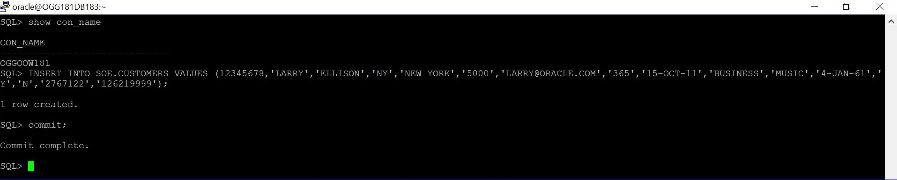
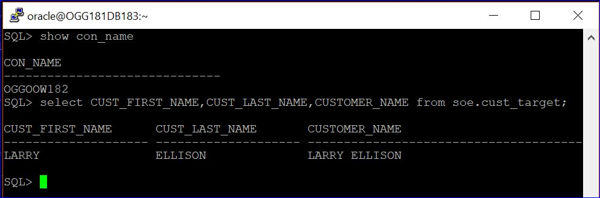
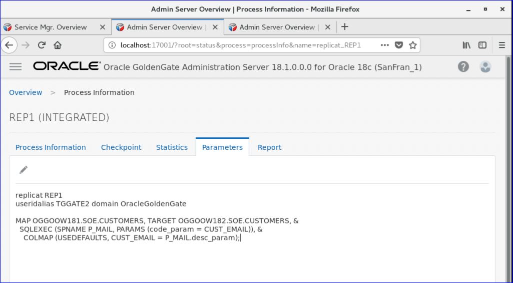
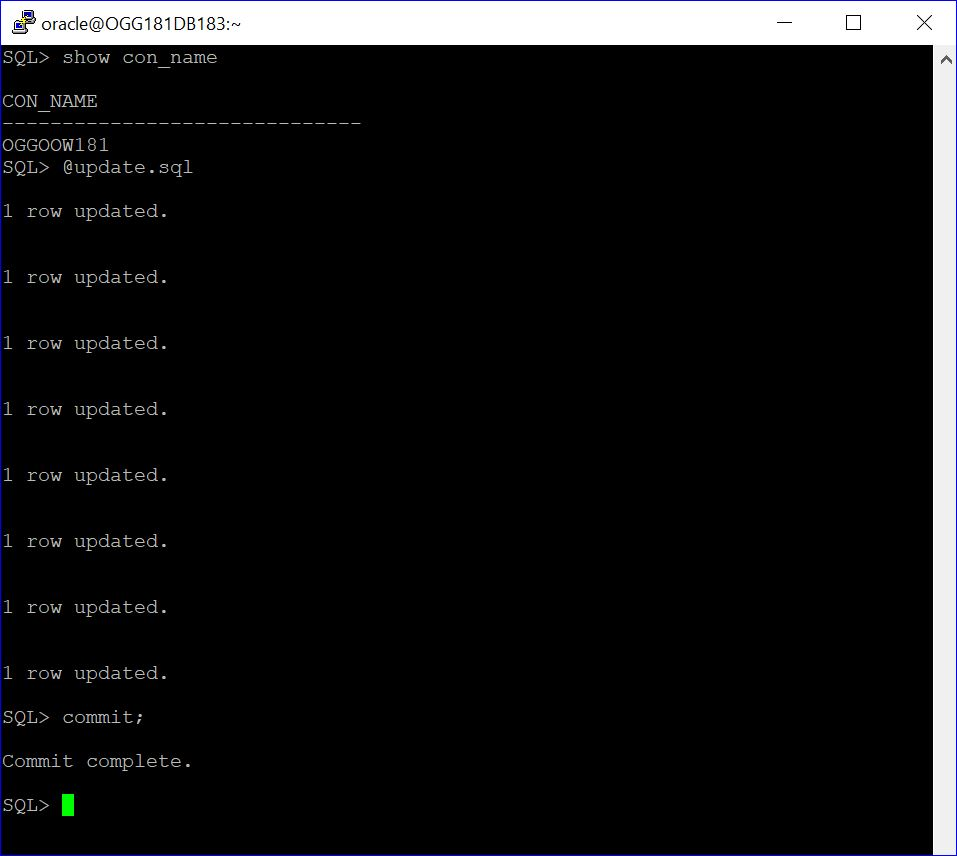
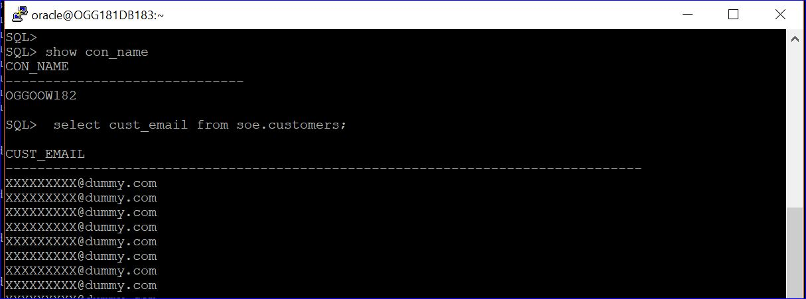
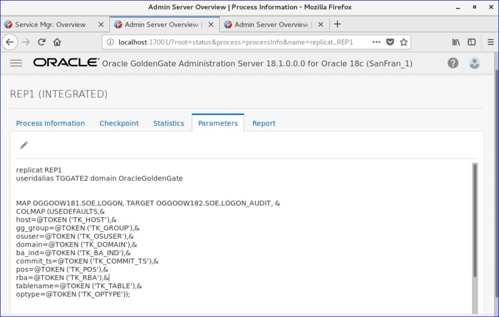
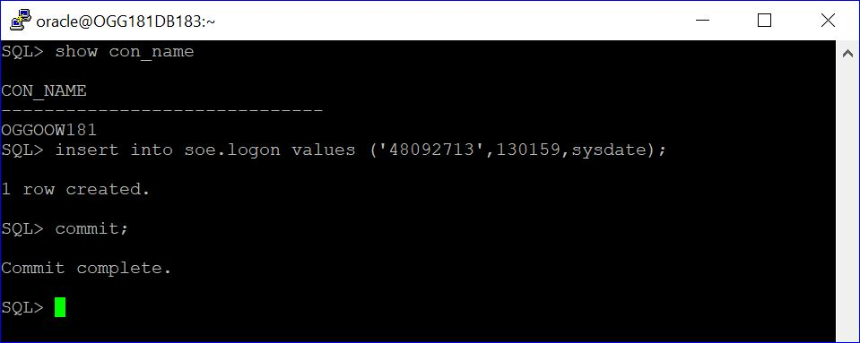
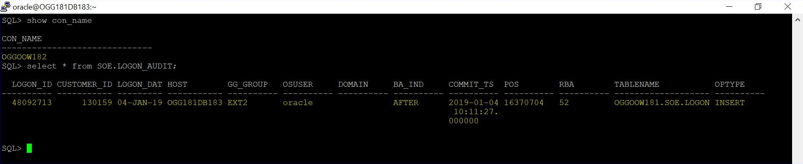

Update January 08, 2019

## Data Transformation
## Introduction

This lab walk you through ***Data Transformation*** of the **Oracle Goldengate Micro Services Web Interface** in a Ravello environment.

This lab supports the following use cases:
-	Concatenating the source '***m***'columns into target single '***n***' columns.
-	Masking the Source Crucial email-id's into a dummy email-id in the target.
-	Use of Tokens.
- To log issues and view the Lab Guide source, go to the [github oracle](https://github.com/oracle/learning-library/tree/master/workshops/dbcs) repository.

## Objectives

-   Manipulating Numbers and Character Strings.
-   Configuring Table-level Column Mapping.
-   Using Tokens.

1.	Open Firefox and login to the Service Manager using the Administrator account you setup during deployment (Figure 8a-1). Port number will vary depending on what you used during setup.

For Ravello Environment

http://localhost:16000

Figure 8a-1:

 
 

2.	After logging in, find and open the Administration Server of the Source deployment is Atlanta (Figure 8a-2).  When the page is completely open, you should be at a page where you can see Extracts ***EXT1***.
Note: You will be required to login again.  Use the same Administrator account that was used with the Service Manager.

Figure 8a-2:

 

-	parameter details of the extract ***EXT1***.

 
 

3.	Again logging in the ***Service Manager*** , find and open the Administration Server of the Target deployment is Sanfran (Figure 8a-3).  When the page is completely open, you should be at a page where you can see Extracts ***REP1***.
Note: You will be required to login again.  Use the same Administrator account that was used with the Service Manager.

Figure 8a-3:
 

-	parameter details of the extract ***REP1***.

 
 

### Scenario : Concatenating the source '***m***'columns into target single '***n***' columns.

 
 
1. Edit the parameter of the REPLICAT ***REP1*** to concatenate the string.

 

        REPLICAT REP1 param file :
        - - - - - - - - - - - - -
        MAP OGGOOW181.SOE.CUSTOMERS, TARGET OGGOOW182.SOE.CUST_TARGET, &
        COLMAP (USEDEFAULTS,CUSTOMER_NAME =@STRCAT(CUST_FIRST_NAME,' ',CUST_LAST_NAME));

2. Do the transcation on the table **CUSTOMER**

 

        Query :
        INSERT INTO SOE.CUSTOMERS VALUES (12345678,'LARRY','ELLISON','NY','NEW YORK','5000','LARRY@ORACLE.COM','365','15-OCT-11','BUSINESS','MUSIC','4-JAN-61','Y','N','2767122','126219999');

3. After the transcation on the TARGET table  **CUSTOMER**

 

        Query :
        select CUST_FIRST_NAME,CUST_LAST_NAME,CUSTOMER_NAME from SOE.CUSTOMERS;

### Scenario : Masking the Source Crucial email-id's into a dummy email in the target.

 
 
1. Edit the parameter of the REPLICAT ***REP1*** to concatenate the string.

 

        Note :
        Kindly create a required Stored procedure under C##GGATE users.

        CREATE  OR REPLACE FUNCTION F_MAIL(CODE_PARAM IN VARCHAR2) 
        RETURN VARCHAR2 
        IS DESC_PARAM VARCHAR2(100);
        BEGIN 
        RETURN 'XXXXXXXXX@dummy.com'; 
        END;
        /

        select F_MAIL('MADHU') from dual;

        CREATE OR REPLACE PROCEDURE  P_MAIL (CODE_PARAM IN VARCHAR2,DESC_PARAM  OUT VARCHAR2)
        IS 
        begin
        select F_MAIL('CODE_PARAM')
            into DESC_PARAM
            from dual;
        end;
        /
        
        REPLICAT REP1 param file :
        MAP OGGOOW181.SOE.CUSTOMERS, TARGET OGGOOW182.SOE.CUSTOMERS_1, &
        COLMAP (USEDEFAULTS,CUSTOMER_NAME =@STRCAT(CUST_FIRST_NAME,CUST_LAST_NAME));
        MAP OGGOOW181.SOE.CUSTOMERS, TARGET OGGOOW182.SOE.CUSTOMERS, &
        SQLEXEC (SPNAME P_MAIL, PARAMS (code_param = CUST_EMAIL)), &
        COLMAP (USEDEFAULTS, CUST_EMAIL = P_MAIL.desc_param);

2. Do the transcation on the table **CUSTOMER**

 

3. After the transcation on the TARGET table  **CUST_TARGET**

 

### Scenario : Use of Tokens.

 
 
1. Edit the parameter of the REPLICAT ***REP1*** to concatenate the string.

 

        EXtract EXT1 param file :
        extract EXT1
        useridalias CDBGGATE domain OracleGoldenGate
        exttrail aa
        TABLE OGGOOW181.SOE.LOGON,TOKENS ( TK_HOST = @GETENV('GGENVIRONMENT','HOSTNAME'),&
        TK_OSUSER = @GETENV ('GGENVIRONMENT','OSUSERNAME'),&
        TK_DBNAME = @GETENV('DBENVIRONMENT','DBNAME' ),&
        TK_GROUP =@GETENV ('GGENVIRONMENT','GROUPNAME'),&
        TK_COMMIT_TS =@GETENV ('GGHEADER','COMMITTIMESTAMP'),&
        TK_POS =@GETENV ('GGHEADER','LOGPOSITION'),&
        TK_RBA =@GETENV ('GGHEADER','LOGRBA'),&
        TK_TABLE =@GETENV ('GGHEADER','TABLENAME'),&
        TK_OPTYPE =@GETENV ('GGHEADER','OPTYPE'),&
        TK_BA_IND =@GETENV ('GGHEADER','BEFOREAFTERINDICATOR'));
- - - - - - - - - - - - - - 
        REPLICAT REP1 param file :
        MAP OGGOOW181.SOE.LOGON, TARGET OGGOOW182.SOE.LOGON_AUDIT, &
        COLMAP (USEDEFAULTS,&
        host=@TOKEN ('TK_HOST'),&
        gg_group=@TOKEN ('TK_GROUP'),&
        osuser=@TOKEN ('TK_OSUSER'),&
        domain=@TOKEN ('TK_DOMAIN'),&
        ba_ind=@TOKEN ('TK_BA_IND'),&
        commit_ts=@TOKEN ('TK_COMMIT_TS'),&
        pos=@TOKEN ('TK_POS'),&
        rba=@TOKEN ('TK_RBA'),&
        tablename=@TOKEN ('TK_TABLE'),&
        optype=@TOKEN ('TK_OPTYPE'));

2. Do the transcation on the table **LOGON**

 

         Query ;
         insert into soe.logon values ('48092713',130159,sysdate);
         commit;

3. After the transcation on the TARGET table  **LOGON_AUDIT**

 

        Query ;
         select * from SOE.LOGON_AUDIT

You have completed lab 800! Great Job!