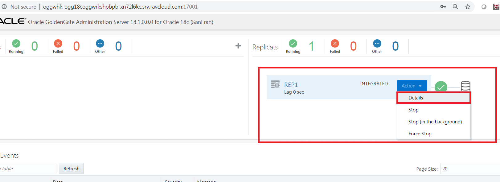
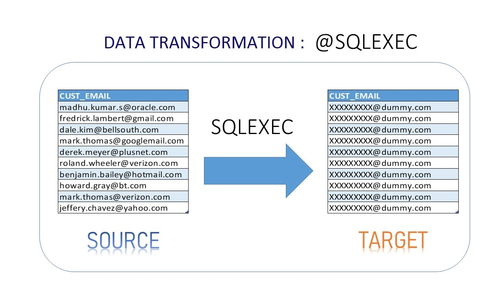

Update January 08, 2019

## Data Transformation
## Introduction

This lab walk you through some simple examples of doing ***Data Transformations*** in the **Oracle GoldenGate Microservices Web Interface**.

This lab supports the following use cases:
-	Concatenating the source '***m***'columns into target single '***n***' columns.
-	Masking the Source Crucial email-id's into a dummy email-id in the target.
-	Use of Tokens.

## Objectives

-       Manipulating Numbers and Character Strings.
-       Configuring Table-level Column Mapping.
-       Using Tokens.

### **STEP 1**: Log into VNC client and prepare environment for the data transformation lab.

In this step you will use VNC client to connect with Oracle 18c database environment(Ravello image), to get started with the installation of Oracle GoldenGate Mircoservices Architecture.

-	Log in to the Ravello image of your assigned host, using TigerVNC.
-	In the VNC server field, enter the hostname assigned to you by the hands-on lab staff and port 5901 e.g. {hostname or IP}:5901 , then press Connect.

-	Sign on with the following password: Welcome1

-	Once the VNC client has connected, you should see a console that looks similar to this:

### **STEP 2**: Open up a terminal window and start the database.

-	On the desktop, right-click and select “Open Terminal”.

-	From the terminal screen change to the OGG181_WHKSHP/Lab8 directory and log into SQLPLUS using the following credentials :

        [oracle@OGG181DB183 ~]$ cd OGG181_WHKSHP/Lab8
        [oracle@OGG181DB183 Lab8]$ sqlplus ggate/ggate@oggoow182

-       Execute the SQL Script to modify and create target tables required for the lab

        
        [oracle@OGG181DB183 Lab8]$ sqlplus ggate/ggate@oggoow182
        SQL*Plus: Release 18.0.0.0.0 - Production on Tue Feb 19 04:42:57 2019
        Version 18.3.0.0.0
        
        Copyright (c) 1982, 2018, Oracle.  All rights reserved.
        
        Last Successful login time: Tue Feb 19 2019 04:42:45 +00:00
        
        Connected to:
        Oracle Database 18c Enterprise Edition Release 18.0.0.0.0 - Production
        Version 18.3.0.0.0
        
        SQL> @alter_schema.sql
        
        Table altered.
        
        Table created.
        SQL> 

### **STEP 3**: Open up a terminal window and reset the deployment/replication.

-       From the terminal screen change to the OGG181_WHKSHP/Lab8 directory and execute ./build_all_bi_di.sh. This will reset the database and create uni-directional replication as in Lab 400.

                [oracle@OGG181DB183 ~]$ cd OGG181_WHKSHP/Lab8
                [oracle@OGG181DB183 Lab8]$ ./build_all_bi_di.sh 

### **STEP 4**: Log into the web client and check current replication processes.

-       Open up a browser window in your client VM environment in Ravello or on your laptop using a browser (like Chrome or Firefox) and enter the following URL and port: **http://localhost:16000** .  
-       If you're using the browser on your laptop, change **localhost** to the **Ravello URL or IP Address** your instructor gave out at the beginning of the workshop **same one you used for the VNC Session**.
-       You should get a sign on page.   Sign in using the username: **"oggadmin"** and password **"Welcome1"**. 

-       After logging in, find and open the Administration Server of the Source deployment **Atlanta**.  When the page is completely open, you should be at a page where you can see Extracts ***EXT1***.

Note: You will be required to login again.  Use the same Administrator account that was used with the Service Manager.

 
-       Look at the parameter details of the extract ***EXT1***. We are capturing changes from all the tables in SOE Schema

 
 
-       Again log in the ***Service Manager*** at **http://localhost:16000**, find and open the Administration Server of the Target deployment is **SanFran** at **http://localhost:17001**.  When the page is completely open, you should be at a page where you can see Extracts ***REP1***.
Note: You will be required to login again.  Use the same Administrator account that was used with the Service Manager.

 

-       Click on parameter details of the extract ***REP1***.

 
### **STEP 2**: Concatenating the source '***m***'columns into target single '***n***' columns.

 
 
-       Edit the parameter of the REPLICAT ***REP1*** to concatenate the string.

        REPLICAT REP1 param file :
        - - - - - - - - - - - - -
        MAP OGGOOW181.SOE.CUSTOMERS, TARGET OGGOOW182.SOE.CUST_TARGET, KEYCOLS(address_id),&
        COLMAP (USEDEFAULTS,CUSTOMER_NAME =@STRCAT(CUST_FIRST_NAME,' ',CUST_LAST_NAME));

-       Do the transaction on the table **CUSTOMER**

 

        Query :
        INSERT INTO SOE.CUSTOMERS VALUES (12345678,'LARRY','ELLISON','NY','NEW YORK','5000','LARRY@ORACLE.COM','365','15-OCT-11','BUSINESS','MUSIC','4-JAN-61','Y','N','2767122','126219999');

3. After the transcation on the TARGET table  **CUSTOMER**

 

        Query :
        select CUST_FIRST_NAME,CUST_LAST_NAME,CUSTOMER_NAME from SOE.CUSTOMERS;

### **STEP 3**: Masking the Source Crucial email-id's into a dummy email in the target.

 
 
-       Edit the parameter of the REPLICAT ***REP1*** to concatenate the string.

 

-       Create a required Stored procedure under C##GGATE users.  This will be used in the SQLEXEC call in the mapping statement.

        CREATE  OR REPLACE FUNCTION F_MAIL(CODE_PARAM IN VARCHAR2) 
        RETURN VARCHAR2 
        IS DESC_PARAM VARCHAR2(100);
        BEGIN 
        RETURN 'XXXXXXXXX@dummy.com'; 
        END;
        /

        select F_MAIL('MADHU') from dual;

        CREATE OR REPLACE PROCEDURE  P_MAIL (CODE_PARAM IN VARCHAR2,DESC_PARAM  OUT VARCHAR2)
        IS 
        begin
        select F_MAIL('CODE_PARAM')
            into DESC_PARAM
            from dual;
        end;
        /
        
        REPLICAT REP1 param file :

        MAP OGGOOW181.SOE.CUSTOMERS, TARGET OGGOOW182.SOE.CUSTOMERS_1, &
        COLMAP (USEDEFAULTS,CUSTOMER_NAME =@STRCAT(CUST_FIRST_NAME,CUST_LAST_NAME));
        MAP OGGOOW181.SOE.CUSTOMERS, TARGET OGGOOW182.SOE.CUSTOMERS, &
        SQLEXEC (SPNAME P_MAIL, PARAMS (code_param = CUST_EMAIL)), &
        COLMAP (USEDEFAULTS, CUST_EMAIL = P_MAIL.desc_param);

-       Do the transcation on the table **CUSTOMER**

 

-       After the transcation on the TARGET table  **CUST_TARGET**

 

### **STEP 3**: Using Tokens.

 
 
-       Edit the parameter of the REPLICAT ***REP1*** to concatenate the string.

 

        Extract EXT1 param file :

        extract EXT1
        useridalias CDBGGATE domain OracleGoldenGate
        exttrail aa
        TABLE OGGOOW181.SOE.LOGON,TOKENS ( TK_HOST = @GETENV('GGENVIRONMENT','HOSTNAME'),&
        TK_OSUSER = @GETENV ('GGENVIRONMENT','OSUSERNAME'),&
        TK_DBNAME = @GETENV('DBENVIRONMENT','DBNAME' ),&
        TK_GROUP =@GETENV ('GGENVIRONMENT','GROUPNAME'),&
        TK_COMMIT_TS =@GETENV ('GGHEADER','COMMITTIMESTAMP'),&
        TK_POS =@GETENV ('GGHEADER','LOGPOSITION'),&
        TK_RBA =@GETENV ('GGHEADER','LOGRBA'),&
        TK_TABLE =@GETENV ('GGHEADER','TABLENAME'),&
        TK_OPTYPE =@GETENV ('GGHEADER','OPTYPE'),&
        TK_BA_IND =@GETENV ('GGHEADER','BEFOREAFTERINDICATOR'));
- - - - - - - - - - - - - - 
        REPLICAT REP1 param file :

        MAP OGGOOW181.SOE.LOGON, TARGET OGGOOW182.SOE.LOGON_AUDIT, &
        COLMAP (USEDEFAULTS,&
        host=@TOKEN ('TK_HOST'),&
        gg_group=@TOKEN ('TK_GROUP'),&
        osuser=@TOKEN ('TK_OSUSER'),&
        domain=@TOKEN ('TK_DOMAIN'),&
        ba_ind=@TOKEN ('TK_BA_IND'),&
        commit_ts=@TOKEN ('TK_COMMIT_TS'),&
        pos=@TOKEN ('TK_POS'),&
        rba=@TOKEN ('TK_RBA'),&
        tablename=@TOKEN ('TK_TABLE'),&
        optype=@TOKEN ('TK_OPTYPE'));

-       Do the transcation on the table **LOGON**

 

         Query :

         insert into soe.logon values ('48092713',130159,sysdate);
         commit;

-       After the transcation on the TARGET table **LOGON**

 

        Query :

         select * from SOE.LOGON;

You have completed lab 800! Great Job!
