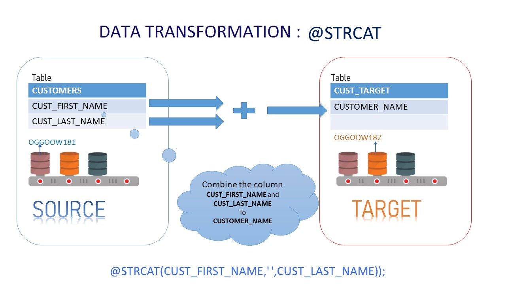

Update August 21, 2018

## Data Transformation
## Introduction

This lab walk you through ***Data Transformation*** of the **Oracle Goldengate 12.3 Micro Services Web Interface** in a Ravello environment.

This lab supports the following use cases:
-	Concatenating the source '***m***'column into target single '***n***' column.
-	Masking the Source Crucial email-id's into a dummy email in the target.
-	Use of Tokens.
- To log issues and view the Lab Guide source, go to the [github oracle](https://github.com/oracle/learning-library/tree/master/workshops/dbcs) repository.

## Objectives

-   Manipulating Numbers and Character Strings.
-   Configuring Table-level Column Mapping.
-   Using Tokens.

1.	Open Firefox and login to the Service Manager using the Administrator account you setup during deployment (Figure 8a-1). Port number will vary depending on what you used during setup.

For Ravello Environment

http://localhost:16000

Figure 8a-1:

 
 

2.	After logging in, find and open the Administration Server of the Source deployment is Atlanta (Figure 8a-2).  When the page is completely open, you should be at a page where you can see Extracts ***EXT1***.
Note: You will be required to login again.  Use the same Administrator account that was used with the Service Manager.

Figure 8a-2:

 

-	parameter details of the extract ***EXT1***.

 
 

3.	Again logging in the ***Service Manager*** , find and open the Administration Server of the Target deployment is Sanfran (Figure 8a-3).  When the page is completely open, you should be at a page where you can see Extracts ***REP1***.
Note: You will be required to login again.  Use the same Administrator account that was used with the Service Manager.

Figure 8a-3:
 

-	parameter details of the extract ***REP1***.

 
 

### Scenario : Concatenating the source '***m***'columns into target single '***n***' columns.

 
 
1. Edit the parameter of the REPLICAT ***REP1*** to concatenate the string.

 

2. Do the transcation on the table **CUSTOMER**

 

3. after the transcation on the TARGET table  **CUSTOMER**

 

### Scenario : Masking the Source Crucial email-id's into a dummy email in the target.

 
 
1. Edit the parameter of the REPLICAT ***REP1*** to concatenate the string.

 

2. Do the transcation on the table **CUSTOMER**

 

3. after the transcation on the TARGET table  **CUST_TARGET**

 