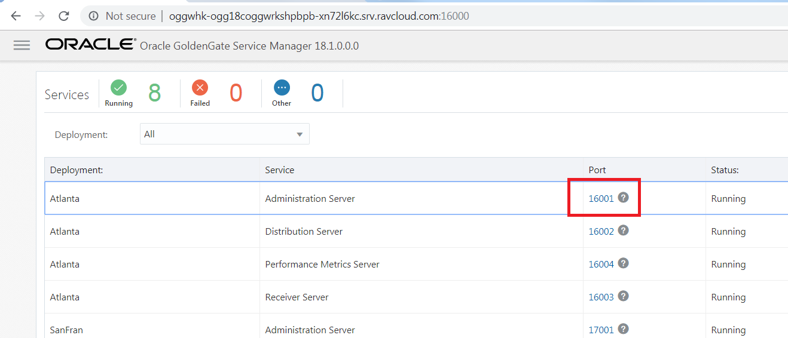
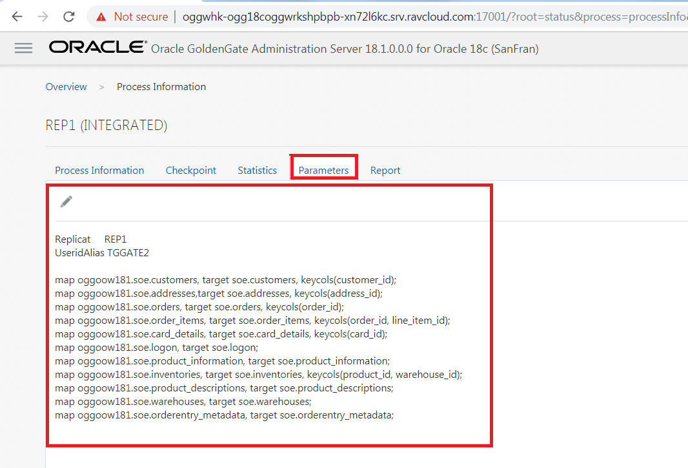
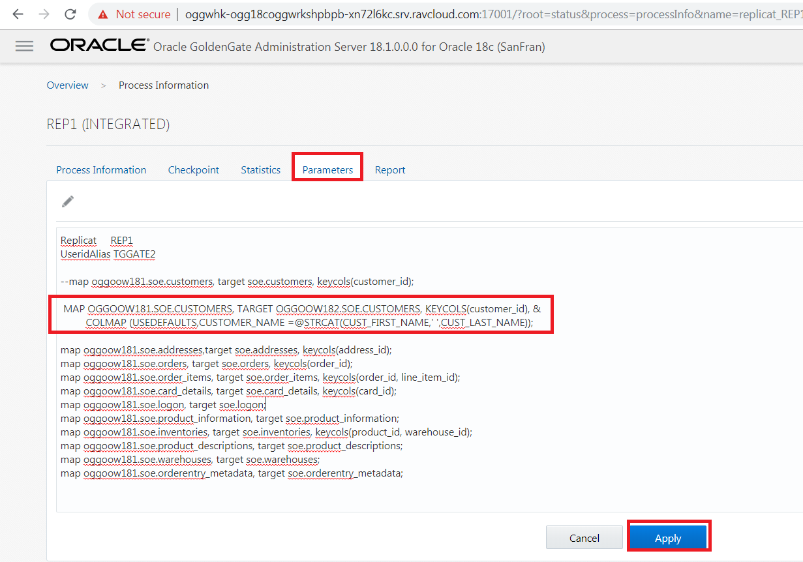
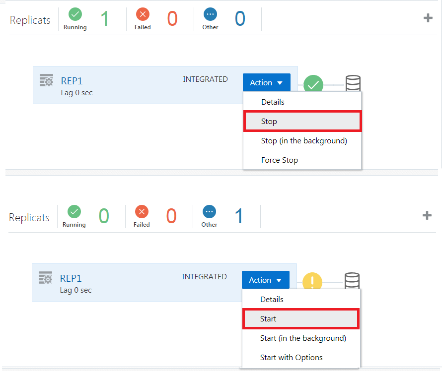

Update January 08, 2019

## Data Transformation
## Introduction

This lab walk you through some simple examples of doing ***Data Transformations*** in the **Oracle GoldenGate Microservices Web Interface**.

This lab supports the following use cases:
-	Concatenating the source '***m***'columns into target single '***n***' columns.
-	Masking the Source Crucial email-id's into a dummy email-id in the target.
-	Use of Tokens.

## Objectives

-       Manipulating Numbers and Character Strings.
-       Configuring Table-level Column Mapping.
-       Using Tokens.

### **STEP 1**: Log into VNC client and prepare environment for the data transformation lab.

In this step you will use VNC client to connect with Oracle 18c database environment(Ravello image), to get started with the installation of Oracle GoldenGate Mircoservices Architecture.

-  Log in to the Ravello image of your assigned host, using TigerVNC.
-  In the VNC server field, enter the hostname assigned to you by the hands-on lab staff and port 5901 e.g. {hostname or IP}:5901 , then press Connect.

-  Sign on with the following password: Welcome1

-  Once the VNC client has connected, you should see a console that looks similar to this:

### **STEP 2**: Open up a terminal window and reset the deployment/replication.

-	On the desktop, right-click and select “Open Terminal”.

-  From the terminal screen change to the OGG181_WHKSHP/Lab8 directory and execute ./build_all_bi_di.sh. This will reset the database and create uni-directional replication as in Lab 400.

                [oracle@OGG181DB183 ~]$ cd OGG181_WHKSHP/Lab8
                [oracle@OGG181DB183 Lab8]$ ./build_all_bi_di.sh 
                
**NOTE** : Please wait as this will take 5 mins. You should see the following message in the terminal :

-  From the terminal screen change to the OGG181_WHKSHP/Lab8 directory and log into SQLPLUS using the following credentials :

        [oracle@OGG181DB183 ~]$ cd OGG181_WHKSHP/Lab8
        [oracle@OGG181DB183 Lab8]$ sqlplus ggate/ggate@oggoow182

-  Execute the SQL Script to modify and create target tables required for the lab

        
        [oracle@OGG181DB183 Lab8]$ sqlplus ggate/ggate@oggoow182
        SQL*Plus: Release 18.0.0.0.0 - Production on Tue Feb 19 04:42:57 2019
        Version 18.3.0.0.0
        
        Copyright (c) 1982, 2018, Oracle.  All rights reserved.
        
        Last Successful login time: Tue Feb 19 2019 04:42:45 +00:00
        
        Connected to:
        Oracle Database 18c Enterprise Edition Release 18.0.0.0.0 - Production
        Version 18.3.0.0.0
        
        SQL> @alter_schema.sql
        
        Table altered.
        
        Table created.
        SQL> exit

### **STEP 4**: Log into the web client and check current replication processes.

-  Open up a browser window in your client VM environment in Ravello or on your laptop using a browser (like Chrome or Firefox) and enter the following URL and port: **http://localhost:16000** .  
-  If you're using the browser on your laptop, change **localhost** to the **Ravello URL or IP Address** your instructor gave out at the beginning of the workshop **same one you used for the VNC Session**.
-  You should get a sign on page.   Sign in using the username: **"oggadmin"** and password **"Welcome1"**. 

-  After logging in, find and open the Administration Server of the Source deployment **Atlanta**.  When the page is completely open, you should be at a page where you can see Extracts ***EXT1***.

Note: You will be required to login again.  Use the same Administrator account that was used with the Service Manager.

 
-  Look at the parameter details of the extract ***EXT1***. We are capturing changes from all the tables in SOE Schema

 
 
-  Again log in the ***Service Manager*** at **http://localhost:16000**, find and open the Administration Server of the Target deployment i.e. **SanFran** at **http://localhost:17001**.  When the page is completely open, you should see Extracts ***REP1***.
Note: You will be required to login again.  Use the same Administrator account that was used with the Service Manager.
 
 

-  Click on parameter details of the extract ***REP1***.

 
### **STEP 5**: Concatenating the source '***m***'columns into target single '***n***' columns.

 
 
-  Edit the parameter of the REPLICAT ***REP1*** with the attributes to concatenate the string from columns "CUST_FIRST_NAME" & "CUST_LAST_NAME" into "CUSTOMER_NAME".Add the following, after commenting the already existing map statement with **"--"**. 

                MAP OGGOOW181.SOE.CUSTOMERS, TARGET OGGOOW182.SOE.CUSTOMERS, KEYCOLS(customer_id), &
                COLMAP (USEDEFAULTS,CUSTOMER_NAME =@STRCAT(CUST_FIRST_NAME,' ',CUST_LAST_NAME));

-  Open the Administration Server of the Target deployment i.e. **SanFran** at **http://localhost:17001**.  When the page is completely open, you should be at a page where you can see Replicat ***REP1***. Please ***stop*** and ***start*** the ***REP1*** process.

-  Open a terminal window and execute "insert_customer.sql" script in SQLPLUS to insert data into customer table : 

                [oracle@OGG181DB183 ~]$ cd OGG181_WHKSHP/Lab8
                [oracle@OGG181DB183 Lab8]$ sqlplus ggate/ggate@oggoow181
                
                SQL*Plus: Release 18.0.0.0.0 - Production on Tue Feb 19 16:29:57 2019
                Version 18.3.0.0.0

                Copyright (c) 1982, 2018, Oracle.  All rights reserved.

                Last Successful login time: Tue Feb 19 2019 16:29:47 +00:00

                Connected to:
                Oracle Database 18c Enterprise Edition Release 18.0.0.0.0 - Production
                Version 18.3.0.0.0

                SQL> @insert_customer.sql

                1 row created.

                Commit complete.
                SQL>exit

Query in side the script for insert :
        INSERT INTO SOE.CUSTOMERS VALUES (12345678,'LARRY','ELLISON','NY','NEW YORK','5000','LARRY@ORACLE.COM','365','15-OCT-                   11','BUSINESS','MUSIC','4-JAN-61','Y','N','2767122','126219999');
        Commit;

-  After the insert transcation on the source table, query target **CUSTOMER** table as below in the terminal :
        
        [oracle@OGG181DB183 ~]$ cd OGG181_WHKSHP/Lab8
        [oracle@OGG181DB183 Lab8]$ sqlplus ggate/ggate@oggoow182

        SQL*Plus: Release 18.0.0.0.0 - Production on Tue Feb 19 23:06:39 2019
        Version 18.3.0.0.0

        Copyright (c) 1982, 2018, Oracle.  All rights reserved.

        Last Successful login time: Tue Feb 19 2019 23:05:39 +00:00

        Connected to:
        Oracle Database 18c Enterprise Edition Release 18.0.0.0.0 - Production
        Version 18.3.0.0.0

        SQL> select CUST_FIRST_NAME,CUST_LAST_NAME,CUSTOMER_NAME from SOE.CUSTOMERS where customer_id=12345678;

        CUST_FIRST_NAME
        ----------------------------------------
        CUST_LAST_NAME
        ----------------------------------------
        CUSTOMER_NAME
        ----------------------------------------
        LARRY
        ELLISON

        SQL> exit

### **STEP 6**: Masking the Source Crucial email-id's into a dummy email in the target.

 
 
-  Go to Admin Server console for deployment *SanFran* (http://localhost:17001) and edit the parameter of the REPLICAT ***REP1*** with the attributes to pass customer email to SQLEXEC() for execution of stored procedure and mapping it back to the target table.Add the following, after commenting the already existing map statement for CUSTOMERS table with **"--"**. 

          MAP OGGOOW181.SOE.CUSTOMERS, TARGET OGGOOW182.SOE.CUSTOMERS, keycols(customer_id), &
                  SQLEXEC (SPNAME P_MAIL, PARAMS (code_param = CUST_EMAIL)), &
                  COLMAP (USEDEFAULTS, CUST_EMAIL = P_MAIL.desc_param,CUSTOMER_NAME =@STRCAT(CUST_FIRST_NAME,CUST_LAST_NAME));
                  
                  
 

-  Open Terminal and SQLPLUS into Target Database (OGGOOW182).Create a required Stored procedure under GGATE users.  This will be used in the SQLEXEC call in the mapping statement.

        [oracle@OGG181DB183 Lab8]$ sqlplus ggate/ggate@oggoow182

        SQL*Plus: Release 18.0.0.0.0 - Production on Tue Feb 19 23:06:39 2019
        Version 18.3.0.0.0

        Copyright (c) 1982, 2018, Oracle.  All rights reserved.

        Last Successful login time: Tue Feb 19 2019 23:05:39 +00:00

        Connected to:
        Oracle Database 18c Enterprise Edition Release 18.0.0.0.0 - Production
        Version 18.3.0.0.0
        
        SQL> CREATE  OR REPLACE FUNCTION F_MAIL(CODE_PARAM IN VARCHAR2) 
         RETURN VARCHAR2 
         IS DESC_PARAM VARCHAR2(100);
         BEGIN 
         RETURN 'XXXXXXXXX@dummy.com'; 
         END;
         /  2    3    4    5    6    7  

        Function created.

        SQL> select F_MAIL('MADHU') from dual;

        F_MAIL('MADHU')
        --------------------------------------------------------------------------------
        XXXXXXXXX@dummy.com

        SQL>  CREATE OR REPLACE PROCEDURE  P_MAIL (CODE_PARAM IN VARCHAR2,DESC_PARAM  OUT VARCHAR2)
         IS 
         begin
         select F_MAIL('CODE_PARAM')
             into DESC_PARAM
             from dual;
         end;
         /  2    3    4    5    6    7    8  

        Procedure created.

        SQL> exit

-  Open the Administration Server of the Target deployment i.e. **SanFran** at **http://localhost:17001**.  When the page is completely open, you should be at a page where you can see Replicat ***REP1***. Please ***stop*** and ***start*** the ***REP1*** process.

            
-  Open Terminal and SQLPLUS into Source Database (OGGOOW181) and do the transcation on the table **CUSTOMER** by executing @update_email.sql script.

        [oracle@OGG181DB183 Lab8]$ sqlplus ggate/ggate@oggoow181

        SQL*Plus: Release 18.0.0.0.0 - Production on Tue Feb 19 23:39:28 2019
        Version 18.3.0.0.0

        Copyright (c) 1982, 2018, Oracle.  All rights reserved.

        Last Successful login time: Tue Feb 19 2019 23:03:25 +00:00

        Connected to:
        Oracle Database 18c Enterprise Edition Release 18.0.0.0.0 - Production
        Version 18.3.0.0.0

        SQL> @update_email.sql

        1 row updated.

        1 row updated.

        1 row updated.

        1 row updated.

        1 row updated.

        1 row updated.

        1 row updated.

        1 row updated.

        1 row updated.

        Commit complete.
        
        SQL> exit

-  Check the Target tables is stored procedure was executed for static masking of the emails. Open Terminal and SQLPLUS into Target Database (OGGOOW182). Excute "select CUST_EMAIL from soe.customers where customer_ID between 562 and 570;" in SQLPLUS.

        [oracle@OGG181DB183 Lab8]$ sqlplus ggate/ggate@oggoow182

        SQL*Plus: Release 18.0.0.0.0 - Production on Tue Feb 19 23:06:39 2019
        Version 18.3.0.0.0

        Copyright (c) 1982, 2018, Oracle.  All rights reserved.

        Last Successful login time: Tue Feb 19 2019 23:05:39 +00:00

        Connected to:
        Oracle Database 18c Enterprise Edition Release 18.0.0.0.0 - Production
        Version 18.3.0.0.0
  
        SQL> select CUST_EMAIL from soe.customers where customer_ID between 562 and 570;
        
        CUST_EMAIL
        --------------------------------------------------------------------------------
        XXXXXXXXX@dummy.com
        XXXXXXXXX@dummy.com
        XXXXXXXXX@dummy.com
        XXXXXXXXX@dummy.com
        XXXXXXXXX@dummy.com
        XXXXXXXXX@dummy.com
        XXXXXXXXX@dummy.com
        XXXXXXXXX@dummy.com
        XXXXXXXXX@dummy.com

        9 rows selected.

        SQL> 

### **STEP 7**: Using Tokens.

 
 
-  Go to Admin Server console for deployment *SanFran* (http://localhost:17001) and edit the parameter of the REPLICAT ***REP1*** with the attributes to map the Tokens to the audit table. Add the following after ***useridalias** command :

        MAP OGGOOW181.SOE.LOGON, TARGET OGGOOW182.SOE.LOGON_AUDIT, KEYCOLS(LOGON_ID), &
        COLMAP (USEDEFAULTS,&
        host=@GETENV('GGENVIRONMENT','HOSTNAME'),&
        gg_group=@GETENV ('GGENVIRONMENT','GROUPNAME'),&
        osuser=@GETENV ('GGENVIRONMENT','OSUSERNAME'),&
        domain=@GETENV ('GGENVIRONMENT','DOMAINNAME'),&
        ba_ind=@GETENV ('GGHEADER','BEFOREAFTERINDICATOR'),&
        commit=@GETENV ('GGHEADER','COMMITTIMESTAMP'),&
        pos=@GETENV ('GGHEADER','LOGPOSITION'),&
        rba=@GETENV ('GGHEADER','LOGRBA'),&
        tablename=@GETENV ('GGHEADER','TABLENAME'),&
        optype=@GETENV ('GGHEADER','OPTYPE'));

 

      
 REPLICAT REP1 param file will look like :

        Replicat     REP1
        UseridAlias TGGATE2

        MAP OGGOOW181.SOE.LOGON, TARGET OGGOOW182.SOE.LOGON_AUDIT, KEYCOLS(LOGON_ID), &
                COLMAP (USEDEFAULTS,&
                host=@GETENV('GGENVIRONMENT','HOSTNAME'),&
                gg_group=@GETENV ('GGENVIRONMENT','GROUPNAME'),&
                osuser=@GETENV ('GGENVIRONMENT','OSUSERNAME'),&
                domain=@GETENV ('GGENVIRONMENT','DOMAINNAME'),&
                ba_ind=@GETENV ('GGHEADER','BEFOREAFTERINDICATOR'),&
                commit=@GETENV ('GGHEADER','COMMITTIMESTAMP'),&
                pos=@GETENV ('GGHEADER','LOGPOSITION'),&
                rba=@GETENV ('GGHEADER','LOGRBA'),&
                tablename=@GETENV ('GGHEADER','TABLENAME'),&
                optype=@GETENV ('GGHEADER','OPTYPE'));

        --map oggoow181.soe.customers, target soe.customers, keycols(customer_id);
        --MAP OGGOOW181.SOE.CUSTOMERS, TARGET OGGOOW182.SOE.CUSTOMERS, KEYCOLS(customer_id), &
           --      COLMAP (USEDEFAULTS,CUSTOMER_NAME =@STRCAT(CUST_FIRST_NAME,' ',CUST_LAST_NAME));

        MAP OGGOOW181.SOE.CUSTOMERS, TARGET OGGOOW182.SOE.CUSTOMERS, keycols(customer_id), &
                   SQLEXEC (SPNAME P_MAIL, PARAMS (code_param = CUST_EMAIL)), &
                   COLMAP (USEDEFAULTS, CUST_EMAIL = P_MAIL.desc_param,CUSTOMER_NAME =@STRCAT(CUST_FIRST_NAME,CUST_LAST_NAME));

        map oggoow181.soe.addresses,target soe.addresses, keycols(address_id);
        map oggoow181.soe.orders, target soe.orders, keycols(order_id);
        map oggoow181.soe.order_items, target soe.order_items, keycols(order_id, line_item_id);
        map oggoow181.soe.card_details, target soe.card_details, keycols(card_id);
        map oggoow181.soe.logon, target soe.logon;
        map oggoow181.soe.product_information, target soe.product_information;
        map oggoow181.soe.inventories, target soe.inventories, keycols(product_id, warehouse_id);
        map oggoow181.soe.product_descriptions, target soe.product_descriptions;
        map oggoow181.soe.warehouses, target soe.warehouses;
        map oggoow181.soe.orderentry_metadata, target soe.orderentry_metadata;

-  Open the Administration Server of the Target deployment i.e. **SanFran** at **http://localhost:17001**.  When the page is completely open, you should be at a page where you can see Replicat ***REP1***. Please ***stop*** and ***start*** the ***REP1*** process.

-  Open the terminal and log into SQLPLUS to do transaction on source DB (OGGOOW181) in table **LOGON**

        [oracle@OGG181DB183 Lab8]$ sqlplus ggate/ggate@oggoow181

        SQL*Plus: Release 18.0.0.0.0 - Production on Thu Feb 21 00:27:45 2019
        Version 18.3.0.0.0

        Copyright (c) 1982, 2018, Oracle.  All rights reserved.

        Last Successful login time: Thu Feb 21 2019 00:25:54 +00:00

        Connected to:
        Oracle Database 18c Enterprise Edition Release 18.0.0.0.0 - Production
        Version 18.3.0.0.0

        SQL> @insert_logon.sql

        1 row created.

        1 row created.

        1 row created.

        Commit complete.

        SQL> exit

-  Open the terminal and log into SQLPLUS to do look at the transactions replicated on target DB (OGGOOW182) in table **LOGON_AUDIT*

          [oracle@OGG181DB183 Lab8]$ sqlplus ggate/ggate@oggoow182

          SQL*Plus: Release 18.0.0.0.0 - Production on Thu Feb 21 00:41:03 2019
          Version 18.3.0.0.0

          Copyright (c) 1982, 2018, Oracle.  All rights reserved.

          Last Successful login time: Thu Feb 21 2019 00:31:09 +00:00

          Connected to:
          Oracle Database 18c Enterprise Edition Release 18.0.0.0.0 - Production
          Version 18.3.0.0.0

          SQL> select * from SOE.LOGON_AUDIT;
            LOGON_ID CUSTOMER_ID LOGON_DAT HOST                                     GG_GROUP                                 OSUSER                                   DOMAIN                                   BA_IND
          ---------- ----------- --------- ---------------------------------------- ---------------------------------------- ---------------------------------------- ---------------------------------------- ----------------------------------------
          COMMIT                                   POS                                      RBA                                      TABLENAME                                OPTYPE
          ---------------------------------------- ---------------------------------------- ---------------------------------------- ---------------------------------------- ----------------------------------------
            48092713      130159 21-FEB-19 OGG181DB183                              REP1                                     oracle                                                                            AFTER
          2019-02-21 00:27:52.980714               107680860                                124                                      OGGOOW181.SOE.LOGON                      INSERT

            48092714      130160 21-FEB-19 OGG181DB183                              REP1                                     oracle                                                                            AFTER
          2019-02-21 00:27:52.980714               107681384                                124                                      OGGOOW181.SOE.LOGON                      INSERT

            48092715      130161 21-FEB-19 OGG181DB183                              REP1                                     oracle                                                                            AFTER
          2019-02-21 00:27:52.980714               107681684                                124                                      OGGOOW181.SOE.LOGON                      INSERT

          SQL> exit
          Disconnected from Oracle Database 18c Enterprise Edition Release 18.0.0.0.0 - Production
          Version 18.3.0.0.0

You have completed lab 800! Great Job!
