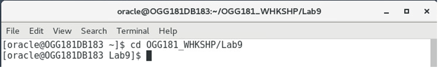
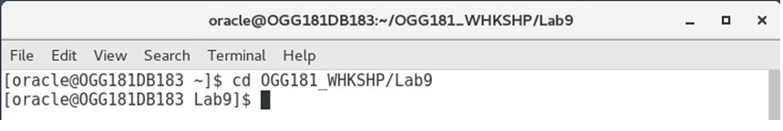

Update January 10, 2019

## GoldenGate Micro Services Performance Metrics

## Introduction

## Objective:

In this lab we will setup replication to be used to load data using Swingbench and also to view the replication in real time with the Metric Service.

We already have credentials setup for the two databases, but we don’t have transactional data setup for the Swingbench schema (SOE).  We will do that now:

## Required Artifacts

Lab 9a:  

1. From the Terminal window in the VNC Console, navigate to the Lab9 directory under ~/OGG181_WHKSHP.

        $ cd ~/OGG181_WHKSHP/Lab9

2. From here you will run the script to add transactional data (trandata) to the schema which we want to replicate.  In order to do this, you will need to run the add_SchemaTrandata.sh script.  To run this script, you need to execute the following at the command line:

        $ sh ./add_SchemaTrandata.sh Welcome1 16001

Once the script is executed, you will see a statement saying that the “schematrandata” has been added to the setup.

3. u can check to see if trandata has been added from the Administration Service Configuration page as well.  Simply login to the SGGATE alias.

Then under “Trandata”, make sure that the magnifying glass is selected, the radio button for Schema selected.  Then enter “oggoow181.soe” into the text box.  Select the magnifying glass in the text box to perform the search.

After the search is performed, you will see a table that provides a number of tables have trandata enabled on them for that schema.

You have now completed configuring the schema that will be used in the replication process.

Lab 9b:

1. Now you will create an Extract and Distribution Path to be used for replication.  We will create these using scripts to use the RESTful API.

You will use the following two scripts to configure these processes:

        $ Add_Extract.sh
        $ Add_DistroPath.sh

After you build the Extract and Distribution Path, you will be able to see them in the Administration Service of the Atlanta Deployment. They will be down (not running), which is to be expected.

To begin this Task, follow the below steps:

2. From the Terminal Window in the VNC Console, navigate to the Lab9 directory under ~/OGG181_WHKSHP.

        $ cd ~/OGG181_WHKSHP/Lab9

 

3. Next, to create the Extract you will run the add_Extract.sh script as follows:

    $ sh ./add_Extract.sh Welcome1 16001 EXTSOE

After the script has ran, you will see that the output for the script reports that the Extract was successfully created and can now view the new Extract from the Administration Service > Overview page.

 

 

4. Now you will create the Distribution Path that will be used to ship trail files from the Atlanta Deployment to the Boston Deployment. In order to do this, you will need to run the add_DistroPath.sh script.

The values used in the script correspond to the following:

“Welcome1” = OGGADMIN user password
“16002” = Atlanta Deployment’s Distribution Service port
“SOE2SOE” = Distribution Path name
“aa” = Atlanta Deployment’s source trail file name prefix
“17003” = Boston Deployment’s Receiver Service port
“ab” = Boston Deployment’s remote trail file prefix

        $ sh ./add_DistroPath.sh Welcome1 16002 SOE2SOE aa 17003 ab

When the Distribution Path has been added, you will see a message on the command line stating that it was added.

 

5. You will also see the path that is created in the Distribution Service.

From the ServiceManager webpage, you can click the link for the Atlanta Deployment’s Distribution Service or enter http://<hostname>:16002 from within the browser.

 

Lab 9c:

In this Task, you will be cloning the source pluggable database (oggoow181) to create the target pluggable database (oggoow182). This is a closed clone of the pluggable database; hence it will have all the data that is in the database prior to starting the Extract and Replicat.

To handle all the cloning tasks, you will use the following script:

    $ clone_pdb.sh

1. From the Terminal Window in the VNC Console, navigate to the Lab9 directory under ~/OGG181_WHKSHP.

        $ cd ~/OGG181_WHKSHP/Lab9

2. While in the Lab9 directory, you will need to run the clone_pdb.sh script. This script will create a clone copy of the source pluggable database (oggoow181). When the script completes, you will have two identical pluggable databases: oggoow181 & oggoow182

        $ sh ./clone_pdb.sh

3. Notice the CREATE_SCN values in the generated output (scroll up from the bottom), you need to ensure that the CREATE_SCN for oggoow182 is copied. This will be the SCN that you will start the Replicat with in a next lab. Proceed to the next Task after the script completes.

Lab 9d:

In this Task, you will install the Replicat within the Boston Deployment.  Credentials and a Checkpoint table have already been created from previous labs.

To begin this Task, follow the below steps:

1. From the Terminal window in the VNC Console, navigate to the Lab9 directory under ~/OGG181_WHKSHP.

        $ cd ~/OGG181_WHKSHP/Lab9

2. While in the Lab9 directory, you will create the Replicat again with a script using the RESTful API.  The following is the script that you will run.

        $ add_Replicat.sh

3. Enter the following command to run the script:

    $  sh ./add_Replicat.sh Welcome1 17001 IREP

Once the script has completed, you should see output saying that the Replicat was added.

4. After adding the Replicat, you can view it from the Boston Deployment’s Administration Service > Overview page.

Lab 9e:

In this Task, you will start all the processes that we created in the previous Tasks and generate data load with the Swingbench utility. The scripts that will be used in this Task are called start_replication.sh and start_swingbench.sh.

The start_replication.sh script takes the following command line parameters. Eight (8) in total:

Password = Password to login as OGGADMIN

AdminService Port = Port number of the Administration Service for Deployment 1

Extract Name = Name of the Extract in Deployment 1

DistroService Port = Port number of the Distribution Service in Deployment 1

Path Name = Name of the path that was created in the Distribution Service in Deployment 1

AdminService Port = Port number of the Administration Service for Deployment 2

Replicat Name = Name of the Replicat in Deployment 2

System Change Number = Creating SCN number from when the Pluggable database was cloned

To begin this Task, follow the below steps:

1. From the Terminal window in the VNC Console, navigate to the Lab9 directory under ~/OGG181_WHKSHP.

        $ cd ~/OGG181_WHKSHP/Lab9

2. To run the script the following command should be ran:

        $ sh ./start_replication.sh Welcome1 16001 EXTSOE 16002 SOE2SOE 17001 IREP 2175217

3. The script will start the replication processes in reverse order as follows:

Replicat
Distribution Path
Extract

You can check to see if these processes are up and running by navigating to the associated HTML5 web pages for the processes:

4. To test the replication environment, you will use Swingbench.  Swingbench has already been installed in the Script directory and you will use the command line to execute the Swingbench workload.

From the Lab9 directory, run the following script:

        $ sh ./start_swingbench.sh

For the final task we will view both Deployment’s Performance Metric Service to view transactions metrics within the Oracle GoldenGate configuration.

Click on the link to the Performance Metric Service for the Atlanta deployment from the ServiceManager page, or connect directly via the browser to http://<hostname>:16004, then click on the EXTSOE Extract process, and view the details about it.  

Click on the Database Statistics tab and we can view details on the transactions being captured.

5. Now click on the link to the Performance Metric Service for the Boston deployment from the ServiceManager page, or connect directly via the browser to http://<hostname>:17004, then click on the IREP Replicat process, and view the details about it.  

You have completed lab 900!   **Great Job!**
