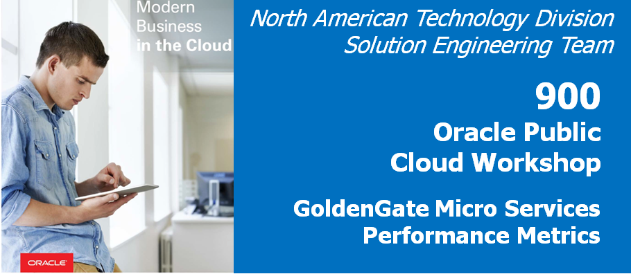
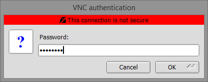

Update January 10, 2019

## GoldenGate Micro Services Performance Metrics

## Introduction

## Objective:

In this lab we will setup replication to be used to load data using Swingbench and also to view the replication in real time with the Metric Service.

We already have credentials setup for the two databases, but we don’t have replication setup for the Swingbench schema (SOE)We will do that now:

### **STEP 1**: Refresh the databases & delpoyments.

You will use VNC client to connect with Oracle 18c database environment(Ravello image), to get started with the Lab.

-  Log in to the Ravello image of your assigned host, using TigerVNC.
-  In the VNC server field, enter the hostname assigned to you by the hands-on lab staff and port 5901 e.g. {hostname or IP}:5901 , then press Connect.

-  Sign on with the following password: Welcome1

-  Once the VNC client has connected, you should see a console that looks similar to this:

In this step you will run script to create a uni-directional replication from ***ATLANTA** to ***SANFRAN*** deployments via pre-configured script.

-	On the desktop, right-click and select “Open Terminal”.

-  From the terminal screen change to the OGG181_WHKSHP/Lab9 directory and execute ./build_all_bi_di.sh. This will reset the database and create uni-directional replication as in Lab 900.

                [oracle@OGG181DB183 ~]$ cd OGG181_WHKSHP/Lab9
                [oracle@OGG181DB183 Lab9]$ ./build_all_bi_di.sh 
                
**NOTE** : Please wait as this will take 5 mins. You should see the following message in the terminal :

### **STEP 2**: Run the Swingbench transactions.

You can check to see if these processes are up and running. Open up a browser window in your client VM environment in Ravello or on your laptop using a browser (like Chrome or Firefox) and enter the following URL and port: **http://localhost:16000** .  
-  If you're using the browser on your laptop, change **localhost** to the **Ravello URL or IP Address** your instructor gave out at the beginning of the workshop **same one you used for the VNC Session**.
-  You should get a sign on page.   Sign in using the username: **"oggadmin"** and password **"Welcome1"**. 

-  After logging in, find and open the Administration Server of the Source/Target deployments i.e. **Atlanta** & **SANFRAN**. Verify the extract(**EXT1**) and replicat(**REP1**) are running.

To test the replication environment, you will use Swingbench.  Swingbench has already been installed in the Script directory and you will use the command line to execute the Swingbench workload.

From the Lab9 directory, run the following script:

        $ ./start_swingbench.sh

For the final task we will view both Deployment’s Performance Metric Service to view transactions metrics within the Oracle GoldenGate configuration.

-  Click on the link to the Performance Metric Service for the Atlanta deployment from the ServiceManager page, or connect directly via the browser to http://<hostname>:16004, then click on the EXT1 Extract process, and view the details about it.  

-  Explore the different tables for information on replication and database Statistics.

-  Now click on the link to the Performance Metric Service for the **SANFRAN** deployment from the ServiceManager page, or connect directly via the browser to http://<hostname>:17004, then click on the IREP Replicat process, and view the details about it.  

You have completed lab 900!   **Great Job!**
