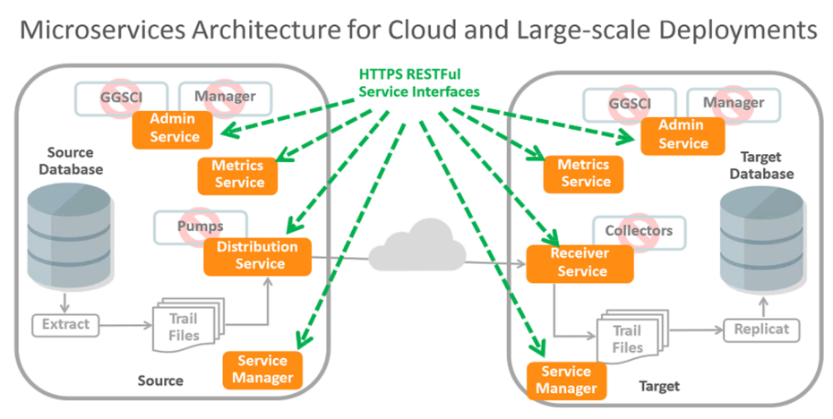

# GoldenGate 12.3 Micro Services

Update July 25, 2018

-   Oracle Golden Gate 12.3 Micro Services Architecture

	

# INTRO	Introduction	1 hour 

- Presentation (3 presentations combined)

# Lab 1	Install GG (Classic Architecture & Micro services Architecture)	

- 12.2 will be available in Ravello to share, and just 12.3 install

# Lab 2	Uni Directional and DDL Replication

- Using Web interface (HTML5 Pages)

		
# Lab 3	Zero Downtime Configuration

- thru RESTful APIs
		

# Lab 4	Auto CDR

- Use DB 12.2
		
# Lab 5	Heterogenous Replication

- MySQL - Classic Architecture
- Oracle - Microservices Architecture
- Kafka - Possible option for replication
		
# Lab 6	Data Transformations	

- Using the web interface (change the parameter files)
- using Admin Client (old way)
- using RESTful API & JSON file
		
# Lab 7	Performance Metrics	
		
- DEMO	Mobile/Chatbot / APIPCS (Demo)	API Exposure (GET)
- for first couple of iterations
- Deployment Status - Turn into lab later based on the feedback
- Stats (Performance Metric Server)
- Extract / Replicat Status
- CMD Start/Stop/Extract Replicat
- GET Report
